# 🎨 AI-LEY Workflow Builder

**Visual PlantUML workflow builder that makes automation accessible to everyone**

Transform complex workflows into beautiful, executable PlantUML diagrams through an intuitive drag-and-drop interface. Perfect for teams who want the power of automation with the clarity of visual documentation.


## ✨ Features

### 🎯 **For Everyone**

- **Visual Drag & Drop**: Build workflows without coding
- **Real-time Preview**: See your PlantUML update as you build
- **One-Click Execution**: Run workflows with instant feedback
- **Template Gallery**: Community-shared workflow patterns

### 🔧 **For Developers**

- **PlantUML Native**: Source files work with VS Code extensions
- **Git Friendly**: Human-readable, version-controllable workflow files
- **Extensible**: Plugin architecture for custom command types
- **API Ready**: RESTful API for integration with other tools

### 👥 **For Teams**

- **Collaborative Editing**: Real-time multi-user workflow building
- **Role-Based Access**: Control who can edit vs execute workflows
- **Audit Trail**: Complete history of workflow changes and executions
- **Integration Ready**: Works with GitHub, Slack, and other team tools

## 🚀 Quick Start

### Local Development

```bash
# Clone and setup
git clone <repository>
cd .ai-ley/builder
npm install

# Start development server
npm run dev
# Open http://localhost:3000
```

### Deploy to Vercel

```bash
# One-click deploy
npm run vercel:deploy

# Or connect your GitHub repo to Vercel for automatic deployments
```

## 📁 Project Structure

```
.ai-ley/
├── builder/                 # Main application
│   ├── components/         # React components
│   ├── pages/             # Next.js pages
│   ├── lib/               # Core workflow engine
│   ├── public/            # Static assets
│   └── styles/            # CSS styles
└── shared/
    └── uml-flows/         # PlantUML workflow storage
        ├── templates/     # Community templates
        ├── examples/      # Sample workflows
        └── user/          # User-created workflows
```

## 🎮 Usage Examples

### Creating Your First Workflow

1. **Visual Builder**: Drag command blocks onto the canvas
2. **Configure Actions**: Set up each step with parameters
3. **Preview**: Watch the PlantUML generate in real-time
4. **Save & Execute**: Save as `.puml` file and run
5. **Import/Export**: Load existing workflows or export for sharing

#### File Import/Export

The builder supports importing and exporting workflows in multiple formats:

- **PlantUML Files (`.puml`)**: Import existing PlantUML activity diagrams
- **JSON Workflows (`.json`)**: Native workflow format with full metadata
- **Export Options**: Download workflows as JSON or generate PlantUML

```javascript
// Import workflow via API
const response = await fetch('/api/workflows/import', {
  method: 'POST',
  headers: { 'Content-Type': 'application/json' },
  body: JSON.stringify({
    content: fileContent,
    fileName: 'my-workflow.puml',
  }),
});

// Export workflow client-side
const dataUri =
  'data:application/json;charset=utf-8,' + encodeURIComponent(JSON.stringify(workflow, null, 2));
```

### Example Workflow: Deployment Pipeline

```plantuml
@startuml DeploymentFlow
title "🚀 Automated Deployment Pipeline"

start
:📥 Pull code from Git;
note right
  Command: git pull origin main
  Directory: /project/root
end note

if (🧪 Tests pass?) then (yes)
  :📦 Build application;
  :🚀 Deploy to staging;
  if (✅ Health check OK?) then (yes)
    :🎉 Deploy to production;
    :📧 Notify team;
  else (no)
    :🔄 Rollback;
  endif
else (no)
  :❌ Report failures;
endif
stop
@enduml
```



## 🔌 API Reference

### Execute Workflow

```javascript
POST /api/workflows/execute
{
  "workflowPath": "deployment-pipeline.puml",
  "parameters": {
    "environment": "production",
    "branch": "main"
  }
}
```

### List Workflows

```javascript
GET /api/workflows/list
Response: {
  "workflows": [
    {
      "name": "deployment-pipeline",
      "path": "workflows/deployment-pipeline.puml",
      "lastModified": "2025-09-07T10:30:00Z",
      "tags": ["deployment", "automation"]
    }
  ]
}
```

## 🎨 Customization

### Adding Custom Command Types

```javascript
// lib/commands/custom-deploy.js
export class CustomDeployCommand {
  constructor(config) {
    this.config = config;
  }

  async execute() {
    // Your custom deployment logic
    return { success: true, message: 'Deployed successfully' };
  }

  toPlantUML() {
    return `:🚀 Deploy to ${this.config.environment};`;
  }
}
```

### Creating Workflow Templates

1. Build your workflow visually
2. Export as PlantUML
3. Add to `shared/uml-flows/templates/`
4. Share with the community!

## 🌐 Deployment Options

### Vercel (Recommended)

- Zero-configuration deployment
- Automatic HTTPS and global CDN
- Serverless functions for workflow execution
- Perfect for team collaboration

### Self-Hosted

- Full control over execution environment
- On-premises workflow execution
- Custom security policies
- Integration with existing infrastructure

## 🤝 Contributing

We believe in collaborative innovation! Here's how to contribute:

1. **Fork the repository**
2. **Create a feature branch**: `git checkout -b feature/amazing-feature`
3. **Make your changes**: Focus on user experience and accessibility
4. **Test thoroughly**: Ensure workflows execute correctly
5. **Submit a pull request**: Include examples and documentation

### Development Philosophy

- **Human-First**: Every feature should make automation more accessible
- **Balance**: Serve both technical and non-technical users equally
- **Win-Win**: Solutions should benefit the entire community
- **Quality**: Maintainable, secure, and performant code

## 📚 Resources

- **PlantUML Documentation**: [Official PlantUML Guide](https://plantuml.com/)
- **VS Code Extension**: [PlantUML Extension](https://marketplace.visualstudio.com/items?itemName=jebbs.plantuml)
- **Community Templates**: Browse `shared/uml-flows/templates/`
- **Video Tutorials**: [YouTube Playlist](https://youtube.com/playlist)

## 🐛 Troubleshooting

### Common Issues

**PlantUML Not Rendering?**

- Check Java installation: `java -version`
- Verify PlantUML server: `http://localhost:8080/plantuml`

**Workflow Execution Fails?**

- Check permissions on target directories
- Verify environment variables are set
- Review execution logs in the dashboard

**Template Not Loading?**

- Ensure `.puml` file syntax is valid
- Check file permissions in `shared/uml-flows/`
- Restart the development server

## 📈 Roadmap

### v1.1 - Enhanced Collaboration

- [ ] Real-time collaborative editing
- [ ] Comments and review system
- [ ] Team workspace management

### v1.2 - Advanced Integrations

- [ ] GitHub Actions integration
- [ ] Slack notifications
- [ ] Docker container execution

### v1.3 - AI-Powered Features

- [ ] Smart workflow suggestions
- [ ] Automatic optimization recommendations
- [ ] Natural language to PlantUML conversion

## 📄 License

MIT License - see [LICENSE](LICENSE) for details.

## 💖 Acknowledgments

Built with love by the AI-LEY community. Special thanks to:

- PlantUML creators for the amazing diagramming language
- Next.js team for the fantastic framework
- Vercel for seamless deployment experience
- All our contributors and beta testers!

---

**Ready to make automation accessible to everyone?** 🚀

[Get Started](docs/getting-started.md) | [Examples](docs/examples.md) | [API Docs](docs/api.md) | [Community](https://github.com/discussions)
