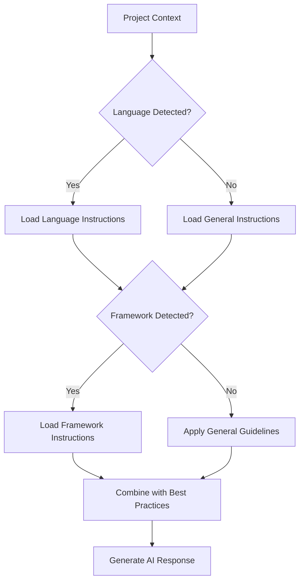

# AI-LEY Instructions Reference

This document provides comprehensive guidance on the instruction system within AI-LEY, covering specialized guidelines for languages, frameworks, tools, and methodologies.

## 📚 What are AI-LEY Instructions?

AI-LEY instructions are specialized guidance documents that provide AI agents with detailed, domain-specific knowledge for software development, system design, and project management. They serve as the technical knowledge base that informs AI decision-making and code generation across different technologies and methodologies.

### Key Characteristics

- **Domain-Specific**: Focused on particular languages, frameworks, or methodologies
- **AI-Optimized**: Structured for machine parsing and application
- **Actionable**: Provide concrete, implementable guidance rather than theoretical concepts
- **Current**: Regularly updated to reflect latest best practices and standards
- **Integrated**: Work seamlessly with AI-LEY personas and commands

## 🏗️ Instruction Categories

### 🌐 General Instructions

Universal guidance applicable across all technologies and projects.

### 💻 Language-Specific Instructions

Programming language expertise and best practices.

### 🔧 Framework Instructions

Framework-specific patterns, conventions, and optimizations.

### 🛠️ Tool Instructions

Development tools, build systems, and utility guidance.

### 📐 Best Practices Instructions

Methodology and process guidance for professional development.

### 🎨 Web Design Instructions

User interface, user experience, and web design standards.

---

## 🌐 General Instructions

### Core Development Principles

#### [Main Instructions](general/main.instructions.md)

**Purpose**: Language and framework agnostic development principles
**Key Topics**:

- Code readability and maintainability standards
- Reliability and error handling principles
- Continuous improvement practices
- Universal debugging and troubleshooting approaches

**Core Principles**:

- Code should tell a story of what it does
- Design for change - code will be modified
- Handle failures gracefully
- Stay updated with best practices in relevant technologies

#### [Design Instructions](general/design.instructions.md)

**Purpose**: Software architecture and system design guidance
**Key Topics**:

- Architectural patterns and design principles
- System design methodologies
- Component design and relationships
- Design pattern implementation

**Design Philosophy**:

- Requirements focus before technical solutions
- Simplicity first, complexity only when necessary
- Pattern application appropriate to context
- Future evolution and extensibility planning

#### [Documentation Instructions](general/documentation.instructions.md)

**Purpose**: Comprehensive documentation standards and practices
**Key Topics**:

- Technical writing standards
- API documentation best practices
- User guide creation
- Documentation-as-code workflows

**Documentation Standards**:

- Clear, concise writing style
- Practical examples for all features
- User-centered design approach
- Automated documentation maintenance

### Development Lifecycle

#### Project Management Integration

Instructions integrate with AI-LEY's project lifecycle:

1. **Requirements Phase**: Documentation instructions guide requirements capture
2. **Design Phase**: Design instructions inform architecture decisions
3. **Implementation Phase**: Language/framework instructions guide coding
4. **Testing Phase**: Best practices instructions ensure quality
5. **Deployment Phase**: Tool instructions guide deployment processes
6. **Maintenance Phase**: General instructions support ongoing maintenance

---

## 💻 Language-Specific Instructions

### Programming Languages

#### [Python Instructions](languages/python.instructions.md)

**Purpose**: Python development standards and patterns
**Key Topics**:

- Pythonic code patterns and idioms
- Package management and virtual environments
- Testing frameworks (pytest, unittest)
- Performance optimization techniques

**Python Excellence Framework**:

- Follow PEP 8 style guidelines
- Use type hints for better code documentation
- Implement comprehensive error handling
- Leverage Python's standard library effectively

#### [JavaScript/TypeScript Instructions](languages/javascript.instructions.md)

**Purpose**: Modern JavaScript and TypeScript development
**Key Topics**:

- ES6+ features and modern syntax
- TypeScript type system utilization
- Async/await patterns
- Node.js and browser compatibility

**Modern JavaScript Principles**:

- Use modern syntax and language features
- Implement proper error handling and validation
- Follow TypeScript best practices for type safety
- Optimize for both performance and maintainability

#### [Java Instructions](languages/java.instructions.md)

**Purpose**: Enterprise Java development standards
**Key Topics**:

- Spring Framework patterns
- Maven/Gradle build management
- JVM optimization and performance
- Enterprise integration patterns

#### Additional Language Coverage

- **C# Instructions**: .NET development and Azure integration
- **Go Instructions**: Concurrent programming and microservices
- **Rust Instructions**: Systems programming and memory safety
- **PHP Instructions**: Web development and framework patterns

---

## 🔧 Framework Instructions

### Web Frameworks

#### [React Instructions](frameworks/react.instructions.md)

**Purpose**: React ecosystem development standards
**Key Topics**:

- Component design patterns
- State management (Redux, Context)
- Performance optimization
- Testing strategies (Jest, Testing Library)

**React Excellence Framework**:

- Component-based architecture principles
- Effective state management patterns
- Performance optimization techniques
- Comprehensive testing approaches

#### [Next.js Instructions](frameworks/nextjs.instructions.md)

**Purpose**: Full-stack React development with Next.js
**Key Topics**:

- Server-side rendering optimization
- API route development
- Static site generation
- Performance and SEO optimization

#### [Vue.js Instructions](frameworks/vuejs.instructions.md)

**Purpose**: Vue.js ecosystem development
**Key Topics**:

- Vue composition API patterns
- Component architecture
- State management with Pinia/Vuex
- Build optimization

### Backend Frameworks

#### [Node.js/Express Instructions](frameworks/express.instructions.md)

**Purpose**: Node.js server development
**Key Topics**:

- RESTful API design
- Middleware patterns
- Database integration
- Security best practices

#### [Django Instructions](frameworks/django.instructions.md)

**Purpose**: Python web development with Django
**Key Topics**:

- Model-View-Template patterns
- Django ORM optimization
- Authentication and authorization
- API development with Django REST Framework

### Specialized Frameworks

#### [Gaming Framework Instructions](frameworks/gaming/)

- **Unity Instructions**: Game development with C#
- **Unreal Instructions**: C++ game development
- **Construct 3 Instructions**: Visual game development

---

## 🛠️ Tool Instructions

### Development Tools

#### [Git Instructions](tools/git.instructions.md)

**Purpose**: Version control best practices
**Key Topics**:

- Branching strategies
- Commit message standards
- Merge vs. rebase workflows
- Collaboration patterns

**Git Excellence Framework**:

- Meaningful commit messages and history
- Effective branching and merging strategies
- Collaborative development workflows
- Repository maintenance and organization

#### [Docker Instructions](tools/docker.instructions.md)

**Purpose**: Containerization and deployment
**Key Topics**:

- Dockerfile optimization
- Multi-stage builds
- Container orchestration
- Security best practices

#### [CI/CD Instructions](tools/cicd.instructions.md)

**Purpose**: Continuous integration and deployment
**Key Topics**:

- Pipeline design patterns
- Testing automation
- Deployment strategies
- Monitoring and observability

### Database Tools

#### [Database Instructions](tools/database.instructions.md)

**Purpose**: Database design and management
**Key Topics**:

- SQL optimization and performance
- NoSQL patterns and use cases
- Database migration strategies
- Backup and recovery planning

---

## 📐 Best Practices Instructions

### Development Methodologies

#### [Agile Instructions](best-practices/agile.instructions.md)

**Purpose**: Agile development methodology guidance
**Key Topics**:

- Scrum and Kanban implementation
- Sprint planning and retrospectives
- User story development
- Team collaboration patterns

#### [Code Review Instructions](best-practices/code-review.instructions.md)

**Purpose**: Effective code review processes
**Key Topics**:

- Review checklist and standards
- Feedback delivery techniques
- Automated review tools integration
- Review workflow optimization

#### [Testing Instructions](best-practices/testing.instructions.md)

**Purpose**: Comprehensive testing strategies
**Key Topics**:

- Test-driven development (TDD)
- Unit, integration, and end-to-end testing
- Test automation frameworks
- Performance and security testing

### Quality Assurance

#### [Security Instructions](best-practices/security.instructions.md)

**Purpose**: Security-first development practices
**Key Topics**:

- Secure coding standards
- Authentication and authorization patterns
- Vulnerability assessment and mitigation
- Security testing and monitoring

#### [Performance Instructions](best-practices/performance.instructions.md)

**Purpose**: Performance optimization strategies
**Key Topics**:

- Profiling and benchmarking
- Caching strategies
- Database optimization
- Frontend performance optimization

---

## 🎨 Web Design Instructions

### Design Systems

#### [UI/UX Instructions](web-design/ui-ux.instructions.md)

**Purpose**: User interface and experience design
**Key Topics**:

- Design system development
- Accessibility standards (WCAG)
- Responsive design patterns
- User research and testing

#### [CSS Instructions](web-design/css.instructions.md)

**Purpose**: Modern CSS development and architecture
**Key Topics**:

- CSS architecture patterns (BEM, SMACSS)
- Modern CSS features (Grid, Flexbox)
- CSS-in-JS patterns
- Performance optimization

### Frontend Standards

#### [Responsive Design Instructions](web-design/responsive.instructions.md)

**Purpose**: Multi-device design and development
**Key Topics**:

- Mobile-first design principles
- Breakpoint strategies
- Progressive enhancement
- Cross-browser compatibility

---

## 🔄 Instruction Template System

### Standardized Structure

All AI-LEY instructions follow a consistent template structure:

1. **Overview** - Clear scope and purpose definition
2. **Core Concepts** - Essential knowledge for the domain
3. **Implementation Guidelines** - Practical how-to guidance
4. **Common Use Cases** - Real-world application scenarios
5. **Anti-Patterns** - What to avoid and why
6. **AI Assistant Guidelines** - AI-specific guidance and decision frameworks
7. **Quality Enforcement** - Standards and validation rules
8. **Resources** - Official documentation and references

### Template Categories

#### [General Guidelines Template](../templates/instructions/general-guidelines.instructions.md)

For universal principles and cross-cutting concerns.

#### [Language Template](../templates/instructions/language.instructions.md)

For programming language-specific guidance.

#### [Framework Template](../templates/instructions/frameworks.instructions.md)

For framework-specific patterns and conventions.

#### [Best Practices Template](../templates/instructions/best-practices.instructions.md)

For methodology and process guidance.

### Shared Components

Instructions use [shared components](../templates/instructions/_shared-components.md) to ensure consistency:

- **AI Assistant Guidelines**: Standard decision-making frameworks
- **Quality Enforcement Rules**: Common validation patterns
- **Integration Templates**: Standard tool integration approaches
- **Troubleshooting Patterns**: Reusable problem-solving frameworks

---

## 🎯 AI Integration & Usage

### How AI Agents Use Instructions

1. **Context Loading**: AI agents load relevant instructions based on project context
2. **Decision Making**: Instructions provide frameworks for technical decisions
3. **Code Generation**: Specific patterns and examples guide code creation
4. **Quality Assurance**: Validation rules ensure output meets standards
5. **Best Practice Application**: Automated adherence to industry standards

### Instruction Selection Logic

AI agents select instructions based on:



### Multi-Instruction Integration

Complex projects often require multiple instruction sets:

- **Full-Stack Web App**: JavaScript + React + Node.js + Database + Security
- **AI/ML Project**: Python + Machine Learning + Data Science + Performance
- **Enterprise Application**: Java + Spring + Database + Security + Testing

---

## 📊 Quality Standards & Maintenance

### Instruction Quality Framework

#### Content Standards

- **Actionable**: Every guideline must be implementable
- **Current**: Regular updates to reflect latest best practices
- **Complete**: Comprehensive coverage of domain topics
- **Consistent**: Standardized structure and terminology

#### AI Optimization Standards

- **Parseable**: Structured for machine understanding
- **Contextual**: Provides decision-making frameworks
- **Specific**: Concrete examples and patterns
- **Integrated**: Works with personas and commands

### Maintenance Schedule

- **Weekly**: Monitor for technology updates and community changes
- **Monthly**: Review and update high-traffic instructions
- **Quarterly**: Comprehensive audit of all instruction categories
- **Annually**: Full framework review and template updates

### Quality Assurance Process

1. **Technical Review**: Domain experts validate accuracy and completeness
2. **AI Testing**: Test instructions with AI agents for effectiveness
3. **User Feedback**: Incorporate developer feedback and usage patterns
4. **Performance Monitoring**: Track instruction effectiveness and usage

---

## 🚀 Using Instructions in AI-LEY

### Command Integration

Instructions automatically integrate with AI-LEY commands:

```bash
# Python project automatically loads Python instructions
/new-feature "User authentication"  # Uses Python + security instructions

# React project loads React + JavaScript instructions
/build-architecture  # Applies React architectural patterns

# General guidance applies universal principles
/requirements  # Uses documentation and analysis instructions
```

### Persona Coordination

Instructions work with personas for expert guidance:

- **AI Engineer** + **Python Instructions** = Expert Python AI development
- **Security Expert** + **Security Instructions** = Comprehensive security guidance
- **Full Stack Developer** + **React Instructions** = Professional React development

### Custom Instruction Development

Organizations can extend AI-LEY with custom instructions:

1. **Use Templates**: Start with appropriate instruction template
2. **Follow Standards**: Maintain consistency with AI-LEY patterns
3. **Add AI Guidelines**: Include decision-making frameworks
4. **Test Integration**: Validate with AI agents and personas
5. **Maintain Currency**: Regular updates and quality assurance

---

## 📈 Impact & Benefits

### Development Quality Improvements

- **Consistency**: Standardized approaches across all projects
- **Best Practices**: Automatic adherence to industry standards
- **Reduced Errors**: Built-in validation and quality checks
- **Knowledge Transfer**: Institutional knowledge embedded in instructions

### Development Efficiency Gains

- **Faster Onboarding**: New team members get instant expert guidance
- **Reduced Research Time**: Pre-researched best practices and patterns
- **Automated Decision Making**: AI agents make informed technical decisions
- **Consistent Output**: Predictable, high-quality results across projects

### Knowledge Management

- **Centralized Expertise**: All technical knowledge in one system
- **Version Controlled**: Track changes and evolution of practices
- **Searchable**: Easy discovery of relevant guidance
- **Maintainable**: Structured updates and quality assurance

The AI-LEY instruction system transforms development from ad-hoc decision-making to systematic, expert-guided implementation across all technology domains.
