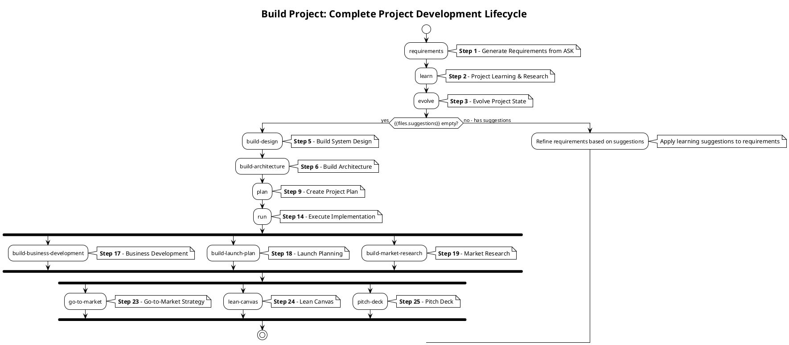
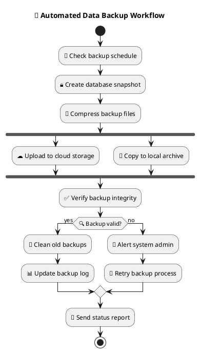
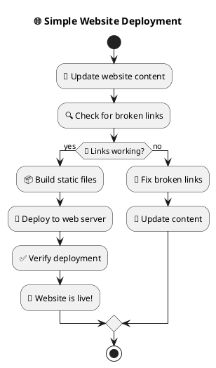
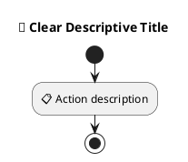

# AI-LEY UML Flows & Workflow Patterns

This document provides comprehensive guidance on UML flows and workflow automation patterns within the AI-LEY system, covering visual process modeling, workflow automation, and complex use case orchestration.

## 🎯 What are AI-LEY UML Flows?

AI-LEY UML flows are visual workflow representations using PlantUML syntax that define automated processes, decision trees, and complex operational procedures. They serve multiple purposes:

- **Visual Process Documentation**: Clear, visual representation of complex workflows
- **Automation Blueprints**: Executable specifications for automated processes
- **Decision Logic**: Complex decision trees and conditional logic
- **Integration Orchestration**: Multi-system integration patterns
- **Quality Assurance**: Standardized process validation and testing

## 📋 Flow Categories & Organization

### 🚀 User Workflows

Complete end-to-end project development processes.

### 📦 Templates

Reusable workflow patterns for common operations.

### 💡 Examples

Simple demonstration workflows for learning and reference.

---

## 🚀 User Workflows

### Complete Project Development Lifecycle

#### [Build Project Flow](../shared/uml-flows/user/build-project.puml)

The most comprehensive AI-LEY workflow that demonstrates the complete project development lifecycle from requirements through business launch.



**Key Features**:

- **Feedback Loops**: Returns to requirements when suggestions are generated
- **Parallel Execution**: Business development activities run in parallel
- **Decision Points**: Conditional logic based on project state
- **Complete Coverage**: From idea to market-ready product

**Usage Scenarios**:

- **New Product Development**: Complete product creation from concept to launch
- **Startup Launches**: End-to-end startup development and business planning
- **Enterprise Projects**: Large-scale project development with business integration
- **Innovation Projects**: Research and development with commercial validation

---

## 📦 Templates

### Deployment & CI/CD Templates

#### [Deployment Pipeline](../shared/uml-flows/templates/deployment-pipeline.puml)

**Purpose**: Complete CI/CD pipeline with testing, deployment, and rollback capabilities
**Use Cases**:

- Automated application deployment
- Multi-environment promotion (dev → staging → production)
- Rollback procedures for failed deployments

#### [Data Backup](../shared/uml-flows/templates/data-backup.puml)

**Purpose**: Automated data backup with validation and cleanup



**Features**:

- **Parallel Execution**: Cloud and local backups run simultaneously
- **Integrity Validation**: Automatic backup verification
- **Error Handling**: Alert and retry mechanisms
- **Cleanup Automation**: Automatic removal of old backups

### Development Workflow Templates

#### Code Review Flow

**Purpose**: Automated code review process with quality gates
**Components**:

- Static code analysis
- Security vulnerability scanning
- Test coverage validation
- Peer review coordination

#### Testing Pipeline

**Purpose**: Comprehensive testing workflow
**Components**:

- Unit test execution
- Integration testing
- End-to-end testing
- Performance testing
- Security testing

### Business Process Templates

#### Customer Onboarding Flow

**Purpose**: Automated customer onboarding process
**Components**:

- Account setup automation
- Welcome sequence coordination
- Training resource delivery
- Success metric tracking

#### Invoice Processing Flow

**Purpose**: Automated invoice processing and approval
**Components**:

- Invoice validation
- Approval workflow routing
- Payment processing integration
- Accounting system updates

---

## 💡 Examples

### Learning & Demonstration Flows

#### [Simple Website Deploy](../shared/uml-flows/examples/simple-website-deploy.puml)

**Purpose**: Basic website deployment for beginners



**Learning Objectives**:

- Basic workflow structure
- Conditional logic implementation
- Error handling patterns
- Simple automation concepts

#### Hello World Flow

**Purpose**: Minimal workflow demonstration
**Components**:

- Basic start/stop pattern
- Simple action execution
- Success confirmation

#### File Organization Flow

**Purpose**: Automated file organization and cleanup
**Components**:

- Directory scanning
- File categorization
- Automated organization
- Cleanup procedures

---

## 🔧 PlantUML Syntax & Patterns

### Core Workflow Elements

#### Basic Structure



#### Action Steps with Execution Details

```plantuml
:📦 Deploy application;
note right
  Command: npm run deploy
  Directory: /project/root
  Timeout: 300s
  Environment: NODE_ENV=production
end note
```

#### Decision Points

```plantuml
if (🔍 Condition check?) then (yes)
  :✅ Success action;
else (no)
  :❌ Handle failure;
  :🚨 Alert team;
endif
```

#### Parallel Execution

```plantuml
fork
  :🔧 Parallel task 1;
  note right: Runs simultaneously
fork again
  :📊 Parallel task 2;
  note right: Independent execution
fork again
  :🌐 Parallel task 3;
  note right: Can have different timeouts
end fork

:🔗 Synchronization point;
note right: Wait for all parallel tasks
```

#### Loop Structures

```plantuml
:📋 Initialize process;

repeat
  :🔄 Process item;
  :✅ Validate result;
repeat while (🔍 More items?) is (yes)
->no;

:📊 Complete processing;
```

### Advanced Patterns

#### Error Handling with Retry Logic

```plantuml
:🚀 Attempt operation;

repeat
  if (🔍 Operation successful?) then (yes)
    :✅ Continue workflow;
    break
  else (no)
    :⏱️ Wait before retry;
    :🔄 Increment retry count;
  endif
repeat while (🔢 Retry count < 3?) is (yes)
->no;

:🚨 Alert failure after max retries;
```

#### Multi-System Integration

```plantuml
:📡 Receive webhook;

fork
  :💾 Update database;
  note right
    API: PUT /api/records/{id}
    Timeout: 30s
  end note
fork again
  :📧 Send notification;
  note right
    API: POST /api/notifications
    Timeout: 15s
  end note
fork again
  :📊 Update analytics;
  note right
    API: POST /api/analytics/events
    Timeout: 10s
  end note
end fork

:✅ Confirm processing complete;
```

### Execution Metadata Patterns

#### Command Execution

```plantuml
:🔨 Build application;
note right
  Command: docker build -t myapp:latest .
  Directory: /project/root
  Timeout: 600s
  Environment: DOCKER_BUILDKIT=1
  Expected: exit code 0
end note
```

#### API Integration

```plantuml
:📡 Call external API;
note right
  API: POST /api/external/process
  Headers: Authorization: Bearer ${TOKEN}
  Payload: {"data": "processed"}
  Timeout: 120s
  Expected: 200-299 status codes
  Retry: 3 attempts with exponential backoff
end note
```

#### File Operations

```plantuml
:📁 Process files;
note right
  Action: file_operation
  Source: /input/*.csv
  Destination: /processed/
  Pattern: process and validate CSV files
  Cleanup: remove source files after processing
end note
```

---

## 🎨 Visual Design Standards

### Emoji Convention System

AI-LEY flows use a standardized emoji system for visual clarity:

#### Process Types

- 🚀 **Deployment/Launch**: Deployment, publishing, launching processes
- 📦 **Build/Package**: Building, compiling, packaging operations
- 🔍 **Validation/Check**: Testing, validation, verification steps
- 🔧 **Configuration**: Setup, configuration, environment preparation
- 📊 **Reporting**: Analytics, reporting, metrics collection
- 🔒 **Security**: Authentication, authorization, security operations

#### Status Indicators

- ✅ **Success**: Successful completion, positive outcomes
- ❌ **Failure**: Errors, failures, negative outcomes
- ⚠️ **Warning**: Warnings, cautions, potential issues
- 🔄 **Processing**: Ongoing operations, loops, retries
- ⏸️ **Waiting**: Delays, queues, manual intervention required
- 🎉 **Completion**: Final success, celebration, achievement

#### System Types

- 💾 **Database**: Database operations, data storage
- 🌐 **Network/Web**: Network operations, web requests
- 📧 **Communication**: Email, notifications, messaging
- 📁 **File System**: File operations, storage, archives
- 🤖 **Automation**: Automated processes, scheduled tasks
- 👥 **User Interaction**: Manual steps, user input required

### Flow Layout Standards

#### Vertical Flow Preference

```plantuml
start
:Step 1;
:Step 2;
:Step 3;
stop
```

#### Horizontal Flow for Parallel Operations

```plantuml
fork
  :Parallel A;
fork again
  :Parallel B;
fork again
  :Parallel C;
end fork
```

#### Clear Decision Point Formatting

```plantuml
if (Clear question with context?) then (yes)
  :Positive outcome;
else (no)
  :Alternative action;
endif
```

---

## 🔄 Complex Use Case Patterns

### Multi-Phase Project Development

Based on the `build-project.puml` model, complex use cases follow structured phases:

#### Phase 1: Discovery & Requirements

```plantuml
:ask "Define project goals";
:requirements "Generate detailed specs";
:learn "Research and analysis";
:evolve "Refine based on learning";
```

#### Phase 2: Design & Architecture

```plantuml
:build-design "Create system design";
:build-architecture "Define technical architecture";
:innovate "Identify opportunities";
:evolve "Integrate innovations";
```

#### Phase 3: Implementation & Testing

```plantuml
:plan "Create implementation roadmap";
:run "Execute development";
:build-test-plan "Quality assurance";
:document "Generate documentation";
```

#### Phase 4: Business Launch

```plantuml
fork
  :build-business-development;
  :build-marketing-strategy;
  :build-revenue-projections;
fork again
  :build-launch-plan;
  :go-to-market;
fork again
  :lean-canvas;
  :pitch-deck;
end fork
```

### Enterprise Integration Patterns

#### Service Orchestration

```plantuml
:📡 Receive request;

fork
  :🔐 Validate authentication;
fork again
  :📋 Load user context;
fork again
  :🔍 Check permissions;
end fork

if (🔒 Authorized?) then (yes)
  fork
    :💾 Update primary database;
  fork again
    :📊 Update analytics;
  fork again
    :🔄 Trigger downstream services;
  end fork

  :✅ Return success response;
else (no)
  :❌ Return unauthorized;
endif
```

#### Event-Driven Processing

```plantuml
:📨 Event received;

switch (Event type?)
case (user.created)
  :👥 Create user profile;
  :📧 Send welcome email;
case (order.placed)
  :📦 Process order;
  :📧 Send confirmation;
case (payment.completed)
  :💳 Update payment status;
  :📊 Update analytics;
endswitch

:📡 Publish completion event;
```

### Data Pipeline Patterns

#### ETL Processing

```plantuml
:📥 Extract data from sources;

fork
  :🗄️ Database extract;
fork again
  :📄 File system extract;
fork again
  :🌐 API extract;
end fork

:🔄 Transform data;
note right
  - Clean and validate
  - Apply business rules
  - Enrich with metadata
end note

:📊 Load to destination;

fork
  :💾 Load to data warehouse;
fork again
  :📈 Update dashboards;
fork again
  :🔔 Send completion notifications;
end fork
```

---

## 🚀 Using UML Flows in AI-LEY

### Command Integration

UML flows integrate seamlessly with AI-LEY commands:

#### Flow Generation Commands

```bash
# Generate workflow for current project context
/build-flow "User authentication process"

# Create deployment workflow
/build-flow "CI/CD pipeline with testing"

# Build business process flow
/build-flow "Customer onboarding automation"
```

#### Flow Execution Integration

```bash
# Execute workflow defined in UML
/run-flow build-project.puml

# Run specific workflow template
/run-flow templates/deployment-pipeline.puml

# Execute custom workflow
/run-flow user/my-custom-process.puml
```

### Persona Coordination

Different personas contribute to workflow design:

- **Process Analyst**: Designs business process flows
- **DevOps Engineer**: Creates deployment and infrastructure workflows
- **Software Architect**: Designs technical integration flows
- **Product Manager**: Creates user journey and feature workflows

### Multi-AI Platform Support

UML flows work consistently across AI platforms:

#### GitHub Copilot

- Visual flow editing in VS Code with PlantUML extension
- Integrated execution through VS Code tasks
- Git version control for workflow history

#### Claude & Other Platforms

- Natural language flow description and generation
- Flow analysis and optimization suggestions
- Automated workflow creation from requirements

---

## 📊 Flow Performance & Optimization

### Execution Monitoring

UML flows support comprehensive monitoring:

#### Performance Metrics

- **Step Execution Time**: Individual action timing
- **Total Flow Duration**: End-to-end execution time
- **Parallel Efficiency**: Parallel task coordination effectiveness
- **Error Rates**: Failure frequency and patterns

#### Flow Analytics

- **Bottleneck Identification**: Slowest steps and dependencies
- **Resource Utilization**: CPU, memory, network usage during execution
- **Success Rates**: Completion rates and failure points
- **Optimization Opportunities**: Performance improvement suggestions

### Flow Optimization Patterns

#### Parallel Optimization

```plantuml
' Before: Sequential execution
:Step A;
:Step B;
:Step C;

' After: Parallel execution where possible
fork
  :Step A (independent);
fork again
  :Step B (independent);
end fork
:Step C (depends on A & B);
```

#### Caching Integration

```plantuml
:🔍 Check cache for result;

if (📦 Cache hit?) then (yes)
  :✅ Return cached result;
else (no)
  :🔄 Execute expensive operation;
  :💾 Store result in cache;
  :✅ Return computed result;
endif
```

#### Early Termination Patterns

```plantuml
:🔍 Quick validation checks;

if (❌ Basic validation failed?) then (yes)
  :📝 Log validation error;
  :❌ Return error immediately;
  stop
else (no)
  :✅ Continue with expensive operations;
endif
```

---

## 📈 Advanced Flow Patterns

### State Management Flows

#### Workflow State Tracking

```plantuml
:🏁 Initialize workflow state;
note right: State: INITIALIZED

:📋 Process first phase;
note right: State: PROCESSING_PHASE_1

if (🔍 Phase 1 complete?) then (yes)
  note right: State: PHASE_1_COMPLETE
  :📋 Process second phase;
  note right: State: PROCESSING_PHASE_2
else (no)
  note right: State: PHASE_1_FAILED
  :🚨 Handle phase 1 failure;
  stop
endif

:✅ Complete workflow;
note right: State: COMPLETED
```

#### Resumable Workflows

```plantuml
:🔍 Check workflow checkpoint;

switch (Last completed step?)
case (none)
  :🏁 Start from beginning;
case (step_1)
  :▶️ Resume from step 2;
case (step_2)
  :▶️ Resume from step 3;
case (completed)
  :✅ Workflow already complete;
  stop
endswitch

:💾 Save checkpoint after each step;
```

### Integration Architecture Flows

#### Microservices Orchestration

```plantuml
:📨 Receive orchestration request;

fork
  :🔐 Auth Service;
  note right: Validate user token
fork again
  :👥 User Service;
  note right: Get user profile
fork again
  :📦 Product Service;
  note right: Validate products
end fork

:🔍 Aggregate results;

if (🔒 All services successful?) then (yes)
  :💳 Payment Service;
  note right: Process payment

  if (💰 Payment successful?) then (yes)
    fork
      :📧 Notification Service;
    fork again
      :📊 Analytics Service;
    fork again
      :📋 Audit Service;
    end fork

    :✅ Return success;
  else (no)
    :❌ Return payment failure;
  endif
else (no)
  :❌ Return validation failure;
endif
```

#### Event Sourcing Pattern

```plantuml
:📨 Receive command;

:📋 Load aggregate from events;
note right: Replay all historical events

:🔍 Validate business rules;

if (✅ Command valid?) then (yes)
  :📝 Generate domain events;

  fork
    :💾 Persist events to event store;
  fork again
    :📊 Update read models;
  fork again
    :📡 Publish events to message bus;
  end fork

  :✅ Return success;
else (no)
  :❌ Return validation error;
endif
```

The AI-LEY UML flow system provides comprehensive visual workflow modeling and execution capabilities, enabling teams to design, document, and automate complex processes with professional-grade tooling and patterns.
