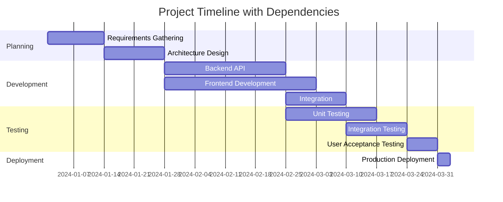

# Software Project Planning Instructions

## Overview
- **Domain**: Software Project Planning and Management
- **Purpose**: Guide systematic planning, estimation, and execution of software development projects
- **Applicable To**: All software development projects from small features to large systems
- **Integration Level**: Core project management methodology affecting all development phases

## Core Principles

### Fundamental Concepts
1. **Iterative Planning**: Plans evolve with understanding and changing requirements
2. **Evidence-Based Estimation**: Use historical data and multiple estimation techniques
3. **Risk-Driven Planning**: Identify and mitigate risks early in the planning process
4. **Stakeholder Alignment**: Ensure all stakeholders understand scope, timeline, and constraints

### Key Benefits
- Improved project predictability and delivery success rates
- Better resource allocation and team coordination
- Early identification and mitigation of project risks
- Clear communication of expectations and progress
- Enhanced ability to adapt to changing requirements

### Common Misconceptions
- **Myth**: Detailed upfront planning eliminates all uncertainty
  **Reality**: Planning reduces uncertainty but must accommodate change
- **Myth**: Agile projects don't need formal planning
  **Reality**: Agile requires different planning approaches, not less planning
- **Myth**: Plans are commitments that cannot change
  **Reality**: Plans are tools for coordination that should evolve with new information

## Implementation Framework

### Getting Started
#### Prerequisites
- Clear understanding of project objectives and success criteria
- Stakeholder identification and availability for planning sessions
- Access to historical project data for estimation
- Understanding of organizational constraints and processes

#### Initial Setup
1. **Project Charter**: Define purpose, scope, objectives, and high-level constraints
2. **Stakeholder Mapping**: Identify all stakeholders and their roles/responsibilities
3. **Planning Tools**: Select appropriate planning and tracking tools
4. **Team Formation**: Assemble planning team with appropriate skills and authority

### Core Methodologies
#### Work Breakdown Structure (WBS)
- **Purpose**: Decompose project scope into manageable, estimable components
- **When to Use**: All projects requiring detailed planning and resource allocation
- **Implementation Steps**:
  1. Start with high-level deliverables and major components
  2. Decompose each component into smaller, manageable work packages
  3. Continue until work packages are 8-80 hours of effort
  4. Validate completeness and eliminate overlaps
- **Success Metrics**: All work packages are estimable, assignable, and measurable

#### Three-Point Estimation
- **Purpose**: Provide realistic estimates that account for uncertainty
- **When to Use**: When uncertainty exists in scope, complexity, or dependencies
- **Implementation Steps**:
  1. Estimate optimistic (best case) duration/effort
  2. Estimate pessimistic (worst case) duration/effort
  3. Estimate most likely (realistic) duration/effort
  4. Calculate expected value: (Optimistic + 4×Most Likely + Pessimistic) ÷ 6
- **Success Metrics**: Estimates fall within confidence intervals on completed work

### Process Integration
#### Development Workflow Integration
```bash
# Example planning integration with development
git checkout -b planning/epic-user-management
# Create planning documents
mkdir -p docs/planning/epics/user-management
echo "# User Management Epic Planning" > docs/planning/epics/user-management/overview.md
echo "## Work Breakdown" > docs/planning/epics/user-management/wbs.md
echo "## Risk Assessment" > docs/planning/epics/user-management/risks.md

# Link planning to implementation
git commit -m "feat: add user management epic planning

- Defines scope and work breakdown structure
- Identifies technical risks and dependencies
- Provides estimation framework for development

Epic: USER-001"
```

#### Continuous Integration Integration
```yaml
# Planning validation in CI/CD
name: Planning Validation
on:
  push:
    paths: ['docs/planning/**', 'project-plan.md']

jobs:
  validate-planning:
    runs-on: ubuntu-latest
    steps:
      - uses: actions/checkout@v3
      
      - name: Validate Work Breakdown Structure
        run: |
          python scripts/validate-wbs.py docs/planning/
          
      - name: Check Estimation Consistency
        run: |
          python scripts/check-estimates.py project-plan.md
          
      - name: Risk Assessment Review
        run: |
          python scripts/risk-analysis.py docs/planning/risks/
          
      - name: Generate Planning Report
        run: |
          python scripts/generate-planning-report.py > planning-status.md
```

#### Documentation Requirements
- Project charter with clear objectives and constraints
- Work breakdown structure with effort estimates
- Risk register with mitigation strategies
- Resource allocation and timeline planning
- Definition of done and acceptance criteria

## Best Practices

### Project Scope and Requirements
#### Requirements Gathering Template
```markdown
# [Feature/Epic Name] Requirements

## Business Objectives
- **Primary Goal**: [What business problem does this solve?]
- **Success Metrics**: [How will success be measured?]
- **Stakeholders**: [Who are the key stakeholders?]

## Functional Requirements
### Core Features
- **REQ-001**: [Requirement description]
  - **Priority**: High/Medium/Low
  - **Acceptance Criteria**: [Specific, testable criteria]
  - **Dependencies**: [Other requirements or systems]

### User Stories
- **As a** [user type], **I want** [functionality] **so that** [benefit]
- **Acceptance Criteria**:
  - [ ] [Specific behavior or outcome]
  - [ ] [Another testable condition]

## Non-Functional Requirements
- **Performance**: [Response time, throughput requirements]
- **Security**: [Authentication, authorization, data protection]
- **Scalability**: [User load, data volume expectations]
- **Availability**: [Uptime requirements, maintenance windows]
- **Compatibility**: [Browser, device, OS requirements]

## Constraints and Assumptions
- **Technical Constraints**: [Technology limitations, integration requirements]
- **Business Constraints**: [Budget, timeline, resource limitations]
- **Assumptions**: [What we're assuming to be true]

## Out of Scope
- [Explicitly list what is NOT included in this scope]
```

#### Scope Management
```markdown
# Scope Change Control Process

## Change Request Template
- **Change ID**: [Unique identifier]
- **Requestor**: [Name and role]
- **Date**: [Request date]
- **Description**: [Detailed description of change]
- **Justification**: [Why this change is needed]
- **Impact Assessment**:
  - **Scope**: [How scope is affected]
  - **Schedule**: [Timeline impact]
  - **Resources**: [Additional resources needed]
  - **Quality**: [Quality implications]
  - **Risk**: [New risks introduced]

## Approval Process
1. **Initial Review**: Project manager evaluates feasibility
2. **Impact Analysis**: Team assesses technical and business impact
3. **Stakeholder Review**: Key stakeholders review and provide input
4. **Decision**: Approve, reject, or defer with rationale
5. **Implementation**: Update project plans and communicate changes
```

### Estimation and Timeline Planning
#### Story Point Estimation Framework
```javascript
// Story point estimation guidelines
const storyPointGuidelines = {
  1: {
    description: "Trivial change",
    examples: ["Update text content", "Simple CSS change", "Configuration update"],
    effort: "1-2 hours",
    complexity: "Minimal",
    unknowns: "None"
  },
  2: {
    description: "Minor feature or fix",
    examples: ["Add validation rule", "Simple API endpoint", "Basic UI component"],
    effort: "3-6 hours",
    complexity: "Low",
    unknowns: "Few"
  },
  3: {
    description: "Small feature",
    examples: ["CRUD operations", "Form with validation", "Simple integration"],
    effort: "1-2 days",
    complexity: "Low-Medium",
    unknowns: "Some"
  },
  5: {
    description: "Medium feature",
    examples: ["Complex form", "API with multiple endpoints", "Component library"],
    effort: "3-5 days",
    complexity: "Medium",
    unknowns: "Moderate"
  },
  8: {
    description: "Large feature",
    examples: ["Authentication system", "Reporting module", "Payment integration"],
    effort: "1-2 weeks",
    complexity: "High",
    unknowns: "Significant"
  },
  13: {
    description: "Very large feature",
    examples: ["User management system", "Real-time dashboard", "Mobile app"],
    effort: "2-3 weeks",
    complexity: "Very High",
    unknowns: "Many"
  },
  21: {
    description: "Epic or complex system",
    examples: ["E-commerce platform", "CMS system", "Analytics platform"],
    effort: "1+ months",
    complexity: "Extremely High",
    unknowns: "Should be broken down"
  }
};

// Estimation meeting structure
function planningPoker(storyItems) {
  const results = [];
  
  for (const story of storyItems) {
    console.log(`\n--- Estimating: ${story.title} ---`);
    console.log(`Description: ${story.description}`);
    console.log(`Acceptance Criteria:`);
    story.acceptanceCriteria.forEach((criteria, index) => {
      console.log(`  ${index + 1}. ${criteria}`);
    });
    
    // Team estimation process
    const estimates = collectTeamEstimates(story);
    const finalEstimate = resolveEstimateDiscrepancies(estimates);
    
    results.push({
      ...story,
      estimate: finalEstimate,
      confidence: calculateConfidence(estimates),
      risks: identifyEstimationRisks(story, estimates)
    });
  }
  
  return results;
}
```

#### Project Timeline Planning
```markdown
# Project Timeline Template

## Milestone Planning
| Milestone | Description | Target Date | Dependencies | Success Criteria |
|-----------|-------------|-------------|--------------|------------------|
| M1: Project Kickoff | Planning complete, team ready | Week 1 | Team formation, requirements | Approved project charter |
| M2: Architecture Complete | System design approved | Week 3 | Requirements analysis | Technical design document |
| M3: Core Features | MVP functionality complete | Week 8 | Architecture, development | All core user stories done |
| M4: Beta Release | Feature-complete for testing | Week 12 | Core features, testing | QA sign-off |
| M5: Production Release | Live system deployment | Week 16 | Beta testing, fixes | Stakeholder acceptance |

## Sprint Planning (2-week sprints)
### Sprint 1 (Weeks 1-2): Foundation
- [ ] Project setup and development environment
- [ ] Database schema design and setup
- [ ] Basic authentication framework
- [ ] CI/CD pipeline configuration

### Sprint 2 (Weeks 3-4): Core Infrastructure
- [ ] User management API endpoints
- [ ] Frontend application shell
- [ ] Basic routing and navigation
- [ ] Error handling framework

### Sprint 3 (Weeks 5-6): Feature Development
- [ ] User registration and login flows
- [ ] Dashboard interface
- [ ] Data visualization components
- [ ] API integration testing

## Risk and Dependency Timeline

```

### Risk Management
#### Risk Assessment Framework
```markdown
# Risk Assessment Template

## Risk Identification Matrix
| Risk ID | Risk Description | Category | Probability | Impact | Risk Score | Owner |
|---------|------------------|----------|-------------|--------|------------|--------|
| R001 | Third-party API changes | Technical | Medium | High | 15 | Tech Lead |
| R002 | Key developer unavailability | Resource | Low | High | 10 | PM |
| R003 | Scope creep from stakeholders | Scope | High | Medium | 12 | PM |
| R004 | Integration complexity underestimated | Technical | Medium | Medium | 9 | Architect |

## Risk Categories
- **Technical**: Technology, architecture, integration risks
- **Resource**: Team availability, skill gaps, budget constraints
- **Scope**: Requirement changes, feature creep, unclear requirements
- **Schedule**: Dependencies, unrealistic timelines, external factors
- **Quality**: Performance, security, usability concerns

## Risk Response Strategies
### Risk R001: Third-party API Changes
- **Strategy**: Mitigate
- **Actions**: 
  - Create abstraction layer for API integration
  - Monitor API versioning and deprecation notices
  - Implement comprehensive integration tests
  - Maintain fallback options where possible
- **Contingency**: Have alternative API providers identified
- **Review Date**: Every sprint

### Risk R003: Scope Creep
- **Strategy**: Avoid
- **Actions**:
  - Implement formal change control process
  - Regular stakeholder alignment meetings
  - Clear documentation of what's in/out of scope
  - Time-boxed exploration for new requirements
- **Contingency**: Defer non-critical features to future releases
- **Review Date**: Weekly stakeholder check-ins
```

## Common Patterns and Examples

### Pattern 1: Epic Breakdown Planning
**Scenario**: Breaking down large features into manageable development increments
**Implementation**:
```markdown
# Epic: User Management System

## Epic Overview
**Business Value**: Enable user registration, authentication, and profile management
**User Impact**: Users can create accounts and manage their information
**Technical Scope**: Frontend UI, backend API, database, authentication integration

## Feature Breakdown
### Feature 1: User Registration
**User Stories**:
- As a new user, I want to create an account with email/password
- As a user, I want to verify my email address
- As a user, I want to receive a welcome email after registration

**Technical Tasks**:
- [ ] Design user registration form UI
- [ ] Implement email validation
- [ ] Create user registration API endpoint
- [ ] Implement email verification system
- [ ] Add welcome email template and sending

**Acceptance Criteria**:
- Users can successfully register with valid email/password
- Email verification link is sent and functional
- Duplicate email registrations are prevented
- Password meets security requirements

### Feature 2: User Authentication
**User Stories**:
- As a registered user, I want to log in to my account
- As a user, I want to reset my password if forgotten
- As a user, I want to stay logged in across browser sessions

**Technical Tasks**:
- [ ] Design login form UI
- [ ] Implement authentication API endpoints
- [ ] Add session/token management
- [ ] Create password reset flow
- [ ] Implement "remember me" functionality

**Dependencies**: Requires User Registration to be complete

### Feature 3: Profile Management
**User Stories**:
- As a user, I want to view and edit my profile information
- As a user, I want to change my password
- As a user, I want to delete my account

**Technical Tasks**:
- [ ] Design profile management UI
- [ ] Implement profile update API endpoints
- [ ] Add password change functionality
- [ ] Implement account deletion with data cleanup

**Dependencies**: Requires User Authentication to be complete
```
**Expected Outcomes**: Clear development roadmap with estimable work packages

### Pattern 2: Capacity Planning
**Scenario**: Planning team capacity and resource allocation across multiple projects
**Implementation**:
```javascript
// Team capacity planning calculator
class CapacityPlanner {
  constructor(teamMembers, sprintLength = 14) {
    this.teamMembers = teamMembers;
    this.sprintLength = sprintLength; // days
    this.workingHoursPerDay = 8;
    this.focusFactors = {
      developer: 0.75, // 75% coding time
      tester: 0.80,    // 80% testing time
      designer: 0.70,  // 70% design time
      pm: 0.60         // 60% project work time
    };
  }

  calculateSprintCapacity(teamMember) {
    const availableDays = this.sprintLength - teamMember.timeOff;
    const totalHours = availableDays * this.workingHoursPerDay;
    const focusFactor = this.focusFactors[teamMember.role] || 0.75;
    
    return {
      member: teamMember.name,
      role: teamMember.role,
      totalHours: totalHours,
      focusedHours: Math.floor(totalHours * focusFactor),
      storyPoints: this.hoursToStoryPoints(totalHours * focusFactor, teamMember.role)
    };
  }

  hoursToStoryPoints(hours, role) {
    // Convert hours to story points based on role and historical velocity
    const roleMultipliers = {
      developer: 0.4,  // 1 story point = 2.5 hours
      tester: 0.5,     // 1 story point = 2 hours  
      designer: 0.3,   // 1 story point = 3.3 hours
      pm: 0.2          // 1 story point = 5 hours
    };
    
    return Math.floor(hours * (roleMultipliers[role] || 0.4));
  }

  planSprint() {
    const capacities = this.teamMembers.map(member => 
      this.calculateSprintCapacity(member)
    );
    
    const totalCapacity = capacities.reduce((sum, cap) => ({
      hours: sum.hours + cap.focusedHours,
      points: sum.points + cap.storyPoints
    }), { hours: 0, points: 0 });

    return {
      individual: capacities,
      team: totalCapacity,
      recommendations: this.getCapacityRecommendations(totalCapacity)
    };
  }

  getCapacityRecommendations(capacity) {
    const recommendations = [];
    
    if (capacity.points < 20) {
      recommendations.push("Low capacity sprint - focus on high-priority items only");
    }
    
    if (capacity.points > 40) {
      recommendations.push("High capacity - consider taking on stretch goals");
    }
    
    recommendations.push(`Reserve ${Math.ceil(capacity.points * 0.2)} points for unexpected work`);
    
    return recommendations;
  }
}

// Usage example
const team = [
  { name: "Alice", role: "developer", timeOff: 1 },
  { name: "Bob", role: "developer", timeOff: 0 },
  { name: "Carol", role: "tester", timeOff: 2 },
  { name: "Dave", role: "designer", timeOff: 0 }
];

const planner = new CapacityPlanner(team);
const sprintPlan = planner.planSprint();
console.log("Sprint Capacity Plan:", sprintPlan);
```
**Expected Outcomes**: Realistic sprint planning based on actual team availability

### Anti-Patterns to Avoid
#### Anti-Pattern 1: Over-Planning
- **Description**: Creating overly detailed plans that become outdated quickly
- **Why It's Problematic**: Wastes time and creates false confidence in predictability
- **Better Approach**: Plan in detail for near-term work, outline for longer-term items

#### Anti-Pattern 2: Planning in Isolation
- **Description**: Creating plans without input from implementation team
- **Why It's Problematic**: Estimates are unrealistic and team has no ownership
- **Better Approach**: Collaborative planning with implementation team involved

## Tools and Resources

### Essential Tools
#### Planning and Estimation Tools
- **Jira**: Comprehensive project management with agile planning features
- **Azure DevOps**: Integrated planning with development tools
- **Linear**: Modern issue tracking with excellent planning features
- **Notion**: Flexible workspace for planning documentation

#### Estimation and Forecasting
- **Monte Carlo Simulation**: Statistical forecasting based on historical data
- **Planning Poker Apps**: Digital tools for collaborative estimation
- **Spreadsheet Templates**: Custom planning and tracking templates

### Templates and Checklists
#### Project Kickoff Checklist
- [ ] **Project Charter**: Objectives, scope, constraints, success criteria defined
- [ ] **Stakeholder Map**: All stakeholders identified with roles and communication preferences
- [ ] **Team Formation**: Core team members identified and committed
- [ ] **Requirements Baseline**: Initial requirements documented and prioritized
- [ ] **Risk Assessment**: Major risks identified with initial mitigation strategies
- [ ] **Planning Tools**: Project management tools configured and team trained
- [ ] **Communication Plan**: Meeting cadence and communication channels established
- [ ] **Definition of Done**: Quality criteria and acceptance standards agreed upon

### Learning Resources
- **Project Management Institute (PMI)**: Professional project management standards
- **Scrum Alliance**: Agile planning methodologies and certification
- **PRINCE2**: Structured project management methodology
- **Agile Estimating and Planning** by Mike Cohn: Comprehensive guide to agile planning

## Quality and Compliance

### Quality Standards
- All estimates based on historical data and team input
- Risk assessment completed and updated regularly
- Stakeholder sign-off on major planning decisions
- Planning documents maintained and accessible to team

### Compliance Requirements
#### Audit Documentation
- **Requirements**: Maintain planning artifacts for compliance audits
- **Implementation**: Version-controlled planning documents with approval trails
- **Verification**: Regular review of planning artifacts for completeness

#### Resource Tracking
- **Requirements**: Track actual vs. planned effort for future estimation improvement
- **Implementation**: Time tracking integration with project management tools
- **Verification**: Monthly variance analysis and estimation accuracy review

### Audit and Review Processes
- Weekly planning review and adjustment sessions
- Monthly planning retrospectives to improve process
- Quarterly planning methodology evaluation
- Annual planning tool and process assessment

## Troubleshooting and Problem Resolution

### Common Issues
#### Issue 1: Estimates Consistently Too Low
**Symptoms**: Teams regularly exceed time estimates, sprint goals not met
**Root Causes**: Optimistic bias, missing work identification, insufficient breaking down
**Solutions**:
1. Use three-point estimation to account for uncertainty
2. Include time for code review, testing, and documentation
3. Add buffer time for unexpected issues (20-30%)
4. Review historical estimation accuracy and adjust accordingly
**Prevention**: Regular estimation calibration and retrospective analysis

#### Issue 2: Scope Creep and Changing Requirements
**Symptoms**: Project timeline extends, budget overruns, team frustration
**Root Causes**: Unclear initial requirements, stakeholder pressure, poor change control
**Solutions**:
1. Implement formal change request process with impact assessment
2. Regular stakeholder communication and expectation management
3. Time-box requirement exploration and defer non-critical changes
4. Maintain clear documentation of what's in and out of scope
**Prevention**: Detailed requirements gathering and stakeholder alignment upfront

### Escalation Procedures
- Planning issues: Escalate to project sponsor or steering committee
- Resource conflicts: Escalate to resource managers and department heads
- Technical risks: Escalate to architecture team or technical advisory board
- Timeline concerns: Escalate to portfolio management or executive team

### Continuous Improvement
- Regular planning retrospectives to identify process improvements
- Tracking of estimation accuracy and planning effectiveness metrics
- Experimentation with new planning techniques and tools
- Knowledge sharing across teams and projects

## AI Assistant Guidelines

When helping with Software Project Planning:

1. **Data-Driven Approach**: Base recommendations on historical data and proven methodologies
2. **Stakeholder Focus**: Consider all stakeholders and their needs in planning decisions
3. **Risk Awareness**: Always identify and plan for potential risks and uncertainties
4. **Iterative Planning**: Recommend adaptive planning approaches that can evolve
5. **Team Collaboration**: Emphasize collaborative planning with implementation teams
6. **Realistic Expectations**: Provide realistic estimates and timelines based on team capacity
7. **Documentation**: Ensure all planning decisions are documented and accessible
8. **Continuous Improvement**: Build learning and improvement into planning processes

### Decision Making Framework
When helping teams with project planning:

1. **Context Analysis**: Understand project size, complexity, team experience, and constraints
2. **Methodology Selection**: Choose appropriate planning methodologies for the situation
3. **Tool Evaluation**: Recommend tools that fit team size, complexity, and integration needs
4. **Risk Assessment**: Help identify and prioritize potential project risks
5. **Capacity Planning**: Ensure realistic planning based on actual team availability
6. **Success Metrics**: Define measurable criteria for project success and progress

### Code Generation Rules
- Generate planning templates that are practical and actionable
- Include realistic examples based on common project scenarios
- Provide checklists and frameworks for systematic planning
- Create planning artifacts that integrate with development workflows
- Include monitoring and tracking mechanisms in planning templates
- Generate risk assessment and mitigation planning tools

### Quality Enforcement
-  Enforce evidence-based estimation and planning approaches
-  Require stakeholder involvement in planning decisions
-  Block planning that ignores team capacity and constraints
-  Promote iterative and adaptive planning methodologies
-  Require risk assessment and mitigation planning
-  Enforce documentation of planning decisions and rationale
-  Promote learning and improvement from planning outcomes
-  Require regular planning review and adjustment processes