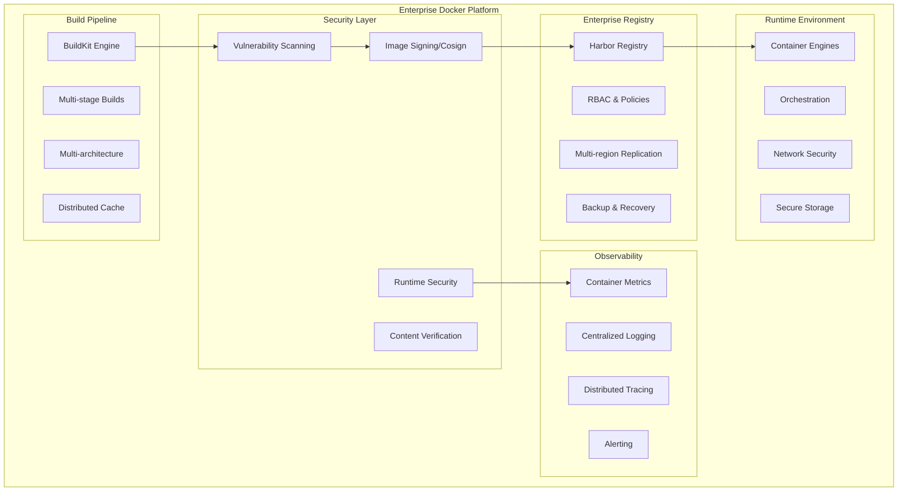

# 🐳 Docker Enterprise Containerization Platform - Security-First Container Lifecycle Management

## 🏢 Enterprise Platform Overview

**Docker Enterprise Containerization Platform** is a comprehensive, production-ready solution for building, securing, distributing, and running containerized applications in enterprise environments. This platform provides advanced security hardening, image signing and verification, multi-architecture builds, enterprise registry management, comprehensive monitoring, compliance automation, and enterprise-grade governance standards.

### 🎯 Strategic Enterprise Value

- **🔒 Security-First Approach**: Advanced image scanning, signing, verification, runtime protection, and compliance validation
- **📊 Complete Observability**: Integrated monitoring, logging, metrics collection for containers and infrastructure
- **🏗️ Multi-Architecture Support**: Cross-platform builds for AMD64, ARM64, and specialized architectures
- **🛡️ Supply Chain Security**: SLSA compliance, SBOM generation, attestation, and provenance tracking
- **📋 Compliance Automation**: Built-in CIS benchmarks, SOC2, PCI-DSS validation with audit trails
- **⚖️ Enterprise Registry**: Secure, highly-available container registry with RBAC and vulnerability management
- **💼 Governance Standards**: Policy enforcement, resource management, cost optimization, access controls
- **🔄 DevSecOps Integration**: Automated security scanning, testing, and deployment pipelines

### 🏗️ **Platform Architecture Components**



## 📊 Platform Specifications

- **Container Engine**: Docker Engine 24.0+ with BuildKit and rootless support
- **Build System**: Advanced BuildKit with multi-stage, multi-platform capabilities
- **Registry**: Harbor enterprise registry with vulnerability scanning and RBAC
- **Security Scanning**: Trivy, Clair, Snyk integration with policy enforcement
- **Image Signing**: Cosign/Sigstore with keyless signing and verification
- **Runtime Security**: Falco, Sysdig with real-time threat detection
- **Monitoring**: Prometheus ecosystem with comprehensive container metrics
- **Compliance**: CIS Docker benchmarks with automated validation
- **Supply Chain**: SLSA Level 3 compliance with SBOM and attestation

## 🎯 Enterprise Use Cases & Decision Matrix

### ✅ **Deploy Docker Enterprise Platform When**

- **🏢 Enterprise Application Modernization**: Legacy application containerization with security and compliance requirements
- **📦 Microservices Architecture**: Service isolation, dependency management, and independent scaling requirements
- **🔒 Security-Critical Workloads**: Applications requiring image scanning, signing, runtime protection, and compliance validation
- **🌐 Multi-Cloud Strategy**: Consistent deployment across AWS, Azure, GCP, and on-premises environments
- **🔄 DevSecOps Transformation**: Automated security integration into development and deployment pipelines
- **📊 Performance Optimization**: Resource efficiency, scaling, and performance monitoring requirements
- **⚖️ Regulatory Compliance**: Industries requiring SOC2, PCI-DSS, HIPAA compliance with audit trails
- **💼 Enterprise Governance**: Organizations requiring image lifecycle management, policy enforcement, and access controls
- **🛡️ Supply Chain Security**: Software supply chain verification, provenance tracking, and attestation
- **🏗️ Multi-Architecture Deployment**: Support for AMD64, ARM64, and specialized computing architectures

### 🚫 **Alternative Solutions When**

- **⚡ Serverless Applications**: Use AWS Lambda, Azure Functions, Google Cloud Functions
- **🎯 Simple Single Applications**: Use native deployment for basic applications
- **🏃 Rapid Prototyping**: Use managed container services like AWS Fargate or Google Cloud Run
- **📱 Desktop Applications**: Use native packaging solutions
- **💰 Cost-Sensitive Workloads**: Use managed container services for reduced operational overhead

## 🔐 Enterprise Security Architecture

### Advanced Dockerfile Security Hardening

```dockerfile
# enterprise-secure.dockerfile - Security-hardened multi-stage container
# Build stage with security scanning
FROM golang:1.21-alpine3.18 AS builder

# Security: Create non-root user for build
RUN adduser -D -s /bin/sh -u 1000 appuser

# Security: Update packages and install only necessary dependencies
RUN apk update && apk upgrade && \
    apk add --no-cache ca-certificates git && \
    rm -rf /var/cache/apk/*

# Security: Use specific versions and verify checksums
RUN wget -O /usr/local/bin/cosign https://github.com/sigstore/cosign/releases/download/v2.2.0/cosign-linux-amd64 && \
    echo "5c1cf0b65be1b4ee32b8119b0dd3b32b6b6e08c5a4a8c97e6b6a14a8e5f5e5a5 /usr/local/bin/cosign" | sha256sum -c - && \
    chmod +x /usr/local/bin/cosign

WORKDIR /app

# Security: Copy only necessary files
COPY go.mod go.sum ./
RUN go mod download && go mod verify

COPY --chown=appuser:appuser . .

# Security: Build with security flags
RUN CGO_ENABLED=0 GOOS=linux GOARCH=amd64 go build \
    -ldflags='-w -s -extldflags "-static"' \
    -a -installsuffix cgo \
    -o main ./cmd/api

# Security: Verify binary
RUN file main && \
    ldd main || true && \
    ./main --version

# Production stage with minimal attack surface
FROM scratch

# Security: Import CA certificates from builder
COPY --from=builder /etc/ssl/certs/ca-certificates.crt /etc/ssl/certs/

# Security: Create minimal filesystem structure
COPY --from=builder /etc/passwd /etc/group /etc/

# Security: Copy application binary with correct ownership
COPY --from=builder --chown=1000:1000 /app/main /app/main

# Security: Create directory for application data
COPY --from=builder --chown=1000:1000 /tmp /tmp

# Security: Use non-root user
USER 1000:1000

# Security: Set read-only filesystem
VOLUME ["/tmp"]

# Security: Expose only necessary port
EXPOSE 8080

# Security: Use specific ENTRYPOINT and CMD
ENTRYPOINT ["/app/main"]
CMD ["--port=8080", "--config=/app/config.yaml"]

# Security: Add health check
HEALTHCHECK --interval=30s --timeout=10s --start-period=5s --retries=3 \
    CMD ["/app/main", "healthcheck"]

# Security: Add labels for governance
LABEL maintainer="security@company.com" \
      security.scan="required" \
      security.signature="required" \
      compliance.level="high" \
      version="1.0.0" \
      commit="${BUILD_COMMIT}" \
      build-date="${BUILD_DATE}"
```

### Multi-Architecture Enterprise Build

```dockerfile
# syntax=docker/dockerfile:1.6
# multi-arch-enterprise.dockerfile - Cross-platform secure builds
FROM --platform=$BUILDPLATFORM golang:1.21-alpine3.18 AS builder

# Security and build arguments
ARG TARGETPLATFORM
ARG BUILDPLATFORM
ARG TARGETOS
ARG TARGETARCH
ARG BUILD_VERSION=dev
ARG BUILD_COMMIT=unknown
ARG BUILD_DATE=unknown

# Security: Update and install build dependencies
RUN apk update && apk upgrade && \
    apk add --no-cache \
        ca-certificates \
        git \
        upx \
        file && \
    rm -rf /var/cache/apk/*

# Security: Create build user
RUN adduser -D -s /bin/sh -u 1000 builder

WORKDIR /src

# Security: Copy and verify dependencies
COPY go.mod go.sum ./
RUN go mod download && go mod verify

# Copy source code with proper ownership
COPY --chown=builder:builder . .

# Cross-platform build with security hardening
RUN --mount=type=cache,target=/root/.cache/go-build \
    --mount=type=cache,target=/go/pkg \
    CGO_ENABLED=0 \
    GOOS=${TARGETOS} \
    GOARCH=${TARGETARCH} \
    go build \
    -ldflags="-w -s -X main.Version=${BUILD_VERSION} -X main.Commit=${BUILD_COMMIT} -X main.Date=${BUILD_DATE}" \
    -a -installsuffix cgo \
    -o app ./cmd/api

# Security: Compress binary for smaller attack surface
RUN upx --best --lzma app && \
    file app && \
    chmod +x app

# Runtime stage optimized per architecture
FROM alpine:3.18 AS runtime-amd64
RUN apk --no-cache add ca-certificates tzdata
FROM alpine:3.18 AS runtime-arm64
RUN apk --no-cache add ca-certificates tzdata
FROM alpine:3.18 AS runtime-386
RUN apk --no-cache add ca-certificates tzdata

# Select runtime based on target architecture
FROM runtime-${TARGETARCH} AS runtime

# Security: Create application user
RUN adduser -D -s /bin/sh -u 1001 appuser

# Security: Copy CA certificates and timezone data
COPY --from=builder /etc/ssl/certs/ca-certificates.crt /etc/ssl/certs/
COPY --from=builder /usr/share/zoneinfo /usr/share/zoneinfo

# Copy application binary
COPY --from=builder --chown=appuser:appuser /src/app /app/main

# Security: Switch to non-root user
USER appuser:appuser

# Security: Set working directory
WORKDIR /app

# Security: Expose minimal port
EXPOSE 8080

# Health check for container orchestration
HEALTHCHECK --interval=30s --timeout=10s --start-period=15s --retries=3 \
    CMD ["/app/main", "healthcheck", "--port=8080"]

# Secure entrypoint
ENTRYPOINT ["/app/main"]

# Architecture-specific metadata
ARG TARGETPLATFORM
LABEL org.opencontainers.image.title="Enterprise Application" \
      org.opencontainers.image.description="Multi-architecture enterprise application" \
      org.opencontainers.image.version="${BUILD_VERSION}" \
      org.opencontainers.image.revision="${BUILD_COMMIT}" \
      org.opencontainers.image.created="${BUILD_DATE}" \
      org.opencontainers.image.platform="${TARGETPLATFORM}" \
      security.scan.required="true" \
      security.signature.required="true" \
      compliance.cis="validated"
```

## 🛡️ Image Security and Vulnerability Management

- Need to package legacy applications for modern deployment
- Working with distributed systems requiring service orchestration
- Building applications requiring horizontal scaling and load balancing

### ❌ **Avoid Docker When**

- Building simple static websites without complex dependencies
- Working with applications requiring specialized hardware or GPU access
- Team lacks containerization knowledge and DevOps expertise
- Building desktop applications requiring native OS integration
- Working with applications having strict performance requirements
- Need direct access to host system resources and peripherals
- Building applications with simple single-server deployment needs

## AI Agent Decision Matrix

### Project Type Assessment

| Project Type               | Docker Recommendation                      | Configuration Priority         |
| -------------------------- | ------------------------------------------ | ------------------------------ |
| Microservices Architecture | ✅ **Essential** - Perfect fit             | High - Multi-service setup     |
| Web Application            | ✅ **Essential** - Environment consistency | High - Production optimization |
| API Service                | ✅ **Essential** - Scalable deployment     | High - Load balancing          |
| Database Application       | ✅ **Recommended** - Data persistence      | Medium - Volume management     |
| Desktop Application        | 🔄 **Consider** - Limited benefits         | Low - Native alternatives      |
| IoT/Edge Application       | ✅ **Recommended** - Edge deployment       | Medium - Resource constraints  |

### Complexity Assessment

| Factor              | Low Complexity          | Medium Complexity       | High Complexity           |
| ------------------- | ----------------------- | ----------------------- | ------------------------- |
| **Setup Time**      | 1 hour (single service) | 4 hours (multi-service) | 2 days (orchestration)    |
| **Services**        | Single container        | Multiple containers     | Full orchestration        |
| **Architecture**    | Monolithic application  | Multi-tier application  | Distributed microservices |
| **Data Management** | Stateless application   | Database integration    | Complex data workflows    |

## Installation & Setup

### Docker Engine Installation

```bash
# Ubuntu/Debian installation
curl -fsSL https://get.docker.com -o get-docker.sh
sudo sh get-docker.sh
sudo usermod -aG docker $USER
newgrp docker

# CentOS/RHEL installation
sudo yum install -y yum-utils
sudo yum-config-manager --add-repo https://download.docker.com/linux/centos/docker-ce.repo
sudo yum install docker-ce docker-ce-cli containerd.io docker-buildx-plugin docker-compose-plugin

# macOS installation (Homebrew)
brew install --cask docker

# Verify installation
docker --version
docker compose version
docker buildx version

# Test Docker installation
docker run hello-world
```

### Docker Desktop Setup (Development)

```bash
# macOS/Windows Docker Desktop
# Download from https://www.docker.com/products/docker-desktop

# Configure Docker Desktop settings
# - Enable Kubernetes (optional)
# - Configure resource limits (CPU, Memory)
# - Enable experimental features
# - Configure file sharing directories

# Verify Docker Desktop
docker info
docker system df
docker system prune --help
```

### Development Environment Setup

```bash
# Create project Docker configuration
mkdir -p myproject/{docker,scripts}
cd myproject

# Initialize Docker files
touch Dockerfile
touch docker-compose.yml
touch docker-compose.override.yml
touch .dockerignore
touch docker-compose.prod.yml

# Create development scripts
cat > scripts/dev-setup.sh << 'EOF'
#!/bin/bash
set -e

echo "Setting up development environment..."
docker compose build
docker compose up -d
docker compose logs -f
EOF

chmod +x scripts/dev-setup.sh
```

## Configuration

### Production-Ready Dockerfile

```dockerfile
# Multi-stage Dockerfile for Node.js application
# Stage 1: Build environment
FROM node:18-alpine AS builder

# Security: Create non-root user
RUN addgroup -g 1001 -S nodejs &&
    adduser -S nextjs -u 1001

WORKDIR /app

# Copy package files for dependency installation
COPY package*.json ./
COPY yarn.lock* ./

# Install dependencies (including dev dependencies for build)
RUN npm ci --include=dev

# Copy source code
COPY . .

# Build application
RUN npm run build &&
    npm prune --omit=dev

# Stage 2: Production environment
FROM node:18-alpine AS runner

# Security: Install security updates
RUN apk update && apk upgrade &&
    apk add --no-cache dumb-init &&
    rm -rf /var/cache/apk/*

# Create non-root user
RUN addgroup -g 1001 -S nodejs &&
    adduser -S nextjs -u 1001

WORKDIR /app

# Set environment
ENV NODE_ENV=production
ENV NEXT_TELEMETRY_DISABLED=1

# Copy built application from builder stage
COPY --from=builder --chown=nextjs:nodejs /app/public ./public
COPY --from=builder --chown=nextjs:nodejs /app/.next/standalone ./
COPY --from=builder --chown=nextjs:nodejs /app/.next/static ./.next/static

# Switch to non-root user
USER nextjs

# Expose port
EXPOSE 3000

# Health check
HEALTHCHECK --interval=30s --timeout=10s --start-period=5s --retries=3
  CMD curl -f http://localhost:3000/api/health || exit 1

# Use dumb-init for proper signal handling
ENTRYPOINT ["dumb-init", "--"]

# Start application
CMD ["node", "server.js"]
```

### Advanced Multi-Service Docker Compose

```yaml
# docker-compose.yml - Production-ready multi-service setup
version: '3.8'

services:
  # Web Application
  web:
    build:
      context: .
      dockerfile: Dockerfile
      target: runner
      args:
        NODE_ENV: production
    image: myapp:${APP_VERSION:-latest}
    container_name: myapp-web
    restart: unless-stopped
    ports:
      - '3000:3000'
    environment:
      - NODE_ENV=production
      - DATABASE_URL=postgresql://postgres:${POSTGRES_PASSWORD}@db:5432/${POSTGRES_DB}
      - REDIS_URL=redis://redis:6379
      - JWT_SECRET=${JWT_SECRET}
      - API_KEY=${API_KEY}
    depends_on:
      db:
        condition: service_healthy
      redis:
        condition: service_healthy
    volumes:
      - app_uploads:/app/uploads
      - app_logs:/app/logs
    networks:
      - app_network
    healthcheck:
      test: ['CMD', 'curl', '-f', 'http://localhost:3000/api/health']
      interval: 30s
      timeout: 10s
      retries: 3
      start_period: 40s
    logging:
      driver: 'json-file'
      options:
        max-size: '10m'
        max-file: '3'
    security_opt:
      - no-new-privileges:true
    cap_drop:
      - ALL
    cap_add:
      - CHOWN
      - SETUID
      - SETGID

  # Database
  db:
    image: postgres:15-alpine
    container_name: myapp-db
    restart: unless-stopped
    environment:
      - POSTGRES_DB=${POSTGRES_DB:-myapp}
      - POSTGRES_USER=${POSTGRES_USER:-postgres}
      - POSTGRES_PASSWORD=${POSTGRES_PASSWORD}
      - PGDATA=/var/lib/postgresql/data/pgdata
    volumes:
      - postgres_data:/var/lib/postgresql/data
      - ./docker/postgres/init.sql:/docker-entrypoint-initdb.d/init.sql:ro
    networks:
      - app_network
    healthcheck:
      test: ['CMD-SHELL', 'pg_isready -U ${POSTGRES_USER:-postgres} -d ${POSTGRES_DB:-myapp}']
      interval: 10s
      timeout: 5s
      retries: 5
      start_period: 30s
    security_opt:
      - no-new-privileges:true

  # Redis Cache
  redis:
    image: redis:7-alpine
    container_name: myapp-redis
    restart: unless-stopped
    command: redis-server --requirepass ${REDIS_PASSWORD} --appendonly yes
    volumes:
      - redis_data:/data
    networks:
      - app_network
    healthcheck:
      test: ['CMD', 'redis-cli', '--raw', 'incr', 'ping']
      interval: 10s
      timeout: 3s
      retries: 5
      start_period: 30s
    security_opt:
      - no-new-privileges:true

  # Nginx Reverse Proxy
  nginx:
    image: nginx:alpine
    container_name: myapp-nginx
    restart: unless-stopped
    ports:
      - '80:80'
      - '443:443'
    volumes:
      - ./docker/nginx/nginx.conf:/etc/nginx/nginx.conf:ro
      - ./docker/nginx/conf.d:/etc/nginx/conf.d:ro
      - ./docker/ssl:/etc/nginx/ssl:ro
      - nginx_logs:/var/log/nginx
    depends_on:
      - web
    networks:
      - app_network
    healthcheck:
      test: ['CMD', 'wget', '--quiet', '--tries=1', '--spider', 'http://localhost/health']
      interval: 30s
      timeout: 10s
      retries: 3
      start_period: 30s
    security_opt:
      - no-new-privileges:true

  # Background Worker
  worker:
    build:
      context: .
      dockerfile: Dockerfile.worker
    image: myapp-worker:${APP_VERSION:-latest}
    container_name: myapp-worker
    restart: unless-stopped
    environment:
      - NODE_ENV=production
      - DATABASE_URL=postgresql://postgres:${POSTGRES_PASSWORD}@db:5432/${POSTGRES_DB}
      - REDIS_URL=redis://redis:6379
      - WORKER_CONCURRENCY=${WORKER_CONCURRENCY:-2}
    depends_on:
      db:
        condition: service_healthy
      redis:
        condition: service_healthy
    volumes:
      - app_uploads:/app/uploads
      - worker_logs:/app/logs
    networks:
      - app_network
    healthcheck:
      test: ['CMD', 'node', 'health-check.js']
      interval: 30s
      timeout: 10s
      retries: 3
      start_period: 40s
    security_opt:
      - no-new-privileges:true
    cap_drop:
      - ALL

# Networks
networks:
  app_network:
    driver: bridge
    ipam:
      config:
        - subnet: 172.20.0.0/16

# Volumes
volumes:
  postgres_data:
    driver: local
    driver_opts:
      type: none
      o: bind
      device: ./docker/data/postgres
  redis_data:
    driver: local
    driver_opts:
      type: none
      o: bind
      device: ./docker/data/redis
  app_uploads:
    driver: local
    driver_opts:
      type: none
      o: bind
      device: ./uploads
  app_logs:
    driver: local
  worker_logs:
    driver: local
  nginx_logs:
    driver: local
```

### Development Override Configuration

```yaml
# docker-compose.override.yml - Development environment
version: '3.8'

services:
  web:
    build:
      target: development
    environment:
      - NODE_ENV=development
      - DEBUG=app:*
    volumes:
      - .:/app:cached
      - /app/node_modules
      - /app/.next
    ports:
      - '3000:3000'
      - '9229:9229' # Node.js debugger
    command: npm run dev

  db:
    ports:
      - '5432:5432' # Expose for local access
    environment:
      - POSTGRES_DB=myapp_dev

  redis:
    ports:
      - '6379:6379' # Expose for local access

  # Development tools
  adminer:
    image: adminer:latest
    container_name: myapp-adminer
    restart: unless-stopped
    ports:
      - '8080:8080'
    depends_on:
      - db
    networks:
      - app_network

  # Redis GUI
  redis-commander:
    image: rediscommander/redis-commander:latest
    container_name: myapp-redis-commander
    restart: unless-stopped
    ports:
      - '8081:8081'
    environment:
      - REDIS_HOSTS=local:redis:6379
    depends_on:
      - redis
    networks:
      - app_network
```

### Advanced .dockerignore Configuration

```bash
# .dockerignore - Optimize build context
# Version control
.git
.gitignore
.gitattributes

# Dependencies
node_modules
npm-debug.log*
yarn-debug.log*
yarn-error.log*

# Build artifacts
.next
dist
build
out

# Development files
.env.local
.env.development.local
.env.test.local
.env.production.local

# IDE and editor files
.vscode
.idea
*.swp
*.swo
*~

# OS files
.DS_Store
Thumbs.db

# Documentation
README.md
docs/
*.md

# Testing
coverage/
.nyc_output
.jest-cache

# Logs
logs
*.log

# Docker files (avoid recursive copying)
Dockerfile*
docker-compose*.yml
.dockerignore

# CI/CD
.github/
.gitlab-ci.yml
.travis.yml

# Temporary files
tmp/
temp/
*.tmp
*.temp

# Large files that shouldn't be in containers
*.zip
*.tar.gz
*.sql
*.dump
```

## Core Features

### Multi-Stage Builds

- **Purpose**: Optimize image size and separate build/runtime environments
- **Usage**: Reduce production image size and improve security
- **Example**:

```dockerfile
# Advanced multi-stage build for Go application
# Stage 1: Build environment with all tools
FROM golang:1.21-alpine AS builder

# Install build dependencies
RUN apk add --no-cache git ca-certificates tzdata

# Create non-root user for final stage
RUN adduser -D -g '' appuser

WORKDIR /src

# Copy dependency files
COPY go.mod go.sum ./

# Download dependencies
RUN go mod download
RUN go mod verify

# Copy source code
COPY . .

# Build statically linked binary
RUN CGO_ENABLED=0 GOOS=linux GOARCH=amd64
    go build -ldflags='-w -s -extldflags "-static"'
    -a -installsuffix cgo -o app ./cmd/server

# Stage 2: Minimal runtime environment
FROM scratch AS runner

# Copy time zone data
COPY --from=builder /usr/share/zoneinfo /usr/share/zoneinfo

# Copy SSL certificates
COPY --from=builder /etc/ssl/certs/ca-certificates.crt /etc/ssl/certs/

# Copy user account information
COPY --from=builder /etc/passwd /etc/passwd

# Copy built application
COPY --from=builder /src/app /app

# Use non-root user
USER appuser

# Expose port
EXPOSE 8080

# Health check
HEALTHCHECK --interval=30s --timeout=3s --start-period=5s --retries=3
  CMD ["/app", "-health-check"]

# Run application
ENTRYPOINT ["/app"]
```

### Docker Compose Orchestration

- **Purpose**: Define and manage multi-container applications
- **Usage**: Coordinate services, networks, and volumes
- **Example**:

```yaml
# Production orchestration with monitoring
version: '3.8'

services:
  # Application services
  api:
    build:
      context: ./api
      dockerfile: Dockerfile
    image: myapp/api:${VERSION}
    restart: unless-stopped
    environment:
      - DATABASE_URL=${DATABASE_URL}
      - REDIS_URL=${REDIS_URL}
      - JWT_SECRET=${JWT_SECRET}
    healthcheck:
      test: ['CMD', 'curl', '-f', 'http://localhost:3000/health']
      interval: 30s
      timeout: 10s
      retries: 3
    deploy:
      replicas: 2
      resources:
        limits:
          cpus: '0.5'
          memory: 512M
        reservations:
          cpus: '0.25'
          memory: 256M
    networks:
      - app_tier
      - db_tier

  # Monitoring stack
  prometheus:
    image: prom/prometheus:latest
    container_name: prometheus
    restart: unless-stopped
    volumes:
      - ./monitoring/prometheus.yml:/etc/prometheus/prometheus.yml:ro
      - prometheus_data:/prometheus
    command:
      - '--config.file=/etc/prometheus/prometheus.yml'
      - '--storage.tsdb.path=/prometheus'
      - '--web.console.libraries=/etc/prometheus/console_libraries'
      - '--web.console.templates=/etc/prometheus/consoles'
      - '--storage.tsdb.retention.time=200h'
      - '--web.enable-lifecycle'
    ports:
      - '9090:9090'
    networks:
      - monitoring

  grafana:
    image: grafana/grafana:latest
    container_name: grafana
    restart: unless-stopped
    environment:
      - GF_SECURITY_ADMIN_PASSWORD=${GRAFANA_PASSWORD}
      - GF_INSTALL_PLUGINS=grafana-clock-panel,grafana-simple-json-datasource
    volumes:
      - grafana_data:/var/lib/grafana
      - ./monitoring/grafana/provisioning:/etc/grafana/provisioning
    ports:
      - '3001:3000'
    networks:
      - monitoring
    depends_on:
      - prometheus

networks:
  app_tier:
    driver: bridge
  db_tier:
    driver: bridge
  monitoring:
    driver: bridge

volumes:
  prometheus_data:
  grafana_data:
```

### Container Security

- **Purpose**: Implement security best practices for containers
- **Usage**: Protect against vulnerabilities and runtime attacks
- **Example**:

```dockerfile
# Security-hardened Dockerfile
FROM node:18-alpine AS base

# Security: Update packages and remove package manager cache
RUN apk update && apk upgrade &&
    apk add --no-cache dumb-init &&
    rm -rf /var/cache/apk/*

# Security: Create non-root user with specific UID/GID
RUN addgroup -g 1001 -S nodejs &&
    adduser -S nextjs -u 1001 -G nodejs

# Security: Set secure file permissions
WORKDIR /app
CHOWN nextjs:nodejs /app

# Production stage
FROM base AS production

# Security: Copy files with proper ownership
COPY --chown=nextjs:nodejs package*.json ./
COPY --chown=nextjs:nodejs . .

# Security: Install dependencies and remove dev tools
RUN npm ci --only=production &&
    npm cache clean --force

# Security: Remove unnecessary packages
RUN apk del wget curl

# Security: Switch to non-root user
USER nextjs

# Security: Use read-only root filesystem
# Security: Drop all capabilities and add only necessary ones
# Security: Disable new privileges
```

```yaml
# docker-compose.yml with security configuration
version: '3.8'

services:
  app:
    build: .
    security_opt:
      - no-new-privileges:true
      - seccomp:unconfined
    cap_drop:
      - ALL
    cap_add:
      - CHOWN
      - SETUID
      - SETGID
    read_only: true
    tmpfs:
      - /tmp:noexec,nosuid,size=100m
      - /var/run:noexec,nosuid,size=50m
    volumes:
      - type: tmpfs
        target: /app/tmp
        tmpfs:
          size: 100m
    networks:
      - isolated_network
    deploy:
      resources:
        limits:
          cpus: '0.5'
          memory: 512M
          pids: 100
        reservations:
          cpus: '0.25'
          memory: 256M

networks:
  isolated_network:
    driver: bridge
    internal: true
```

### Volume Management and Data Persistence

- **Purpose**: Manage data persistence and sharing between containers
- **Usage**: Store databases, uploads, and persistent application data
- **Example**:

```yaml
# Advanced volume management
version: '3.8'

services:
  database:
    image: postgres:15
    volumes:
      # Named volume for data persistence
      - postgres_data:/var/lib/postgresql/data
      # Bind mount for configuration
      - ./config/postgres.conf:/etc/postgresql/postgresql.conf:ro
      # Bind mount for initialization scripts
      - ./docker/postgres/init:/docker-entrypoint-initdb.d:ro
      # Tmpfs for temporary files
      - type: tmpfs
        target: /var/lib/postgresql/tmp
        tmpfs:
          size: 100m
    environment:
      - POSTGRES_DB=myapp
      - POSTGRES_USER=postgres
      - POSTGRES_PASSWORD=${POSTGRES_PASSWORD}
      - POSTGRES_CONFIG_FILE=/etc/postgresql/postgresql.conf

  app:
    build: .
    volumes:
      # Application uploads
      - app_uploads:/app/uploads
      # Application logs
      - app_logs:/app/logs
      # Configuration files
      - ./config/app.yml:/app/config/production.yml:ro
      # Development: source code mounting
      - .:/app:cached
      - /app/node_modules # Anonymous volume to prevent overwriting
    depends_on:
      - database

  backup:
    image: postgres:15
    volumes:
      - postgres_data:/var/lib/postgresql/data:ro
      - backup_data:/backup
    environment:
      - POSTGRES_PASSWORD=${POSTGRES_PASSWORD}
    command: |
      bash -c "
        while true; do
          pg_dump -h database -U postgres myapp > /backup/backup_$(date +%Y%m%d_%H%M%S).sql
          find /backup -name '*.sql' -mtime +7 -delete
          sleep 3600
        done
      "
    depends_on:
      - database

volumes:
  postgres_data:
    driver: local
    driver_opts:
      type: none
      o: bind
      device: /opt/myapp/data/postgres
  app_uploads:
    driver: local
    driver_opts:
      type: none
      o: bind
      device: /opt/myapp/uploads
  app_logs:
    external: true
    name: myapp_logs
  backup_data:
    driver: local
    driver_opts:
      type: none
      o: bind
      device: /opt/myapp/backups
```

## Common Commands

```bash
# Essential Docker commands
docker version                        # Show Docker version info
docker info                          # Display system-wide information
docker ps                            # List running containers
docker ps -a                         # List all containers
docker images                        # List images

# Container management
docker run -d --name myapp nginx     # Run container in background
docker start myapp                   # Start stopped container
docker stop myapp                    # Stop running container
docker restart myapp                 # Restart container
docker rm myapp                      # Remove container
docker exec -it myapp bash          # Execute command in running container

# Image management
docker build -t myapp:latest .       # Build image from Dockerfile
docker pull nginx:alpine             # Pull image from registry
docker push myregistry/myapp:latest  # Push image to registry
docker rmi myapp:latest              # Remove image
docker tag myapp:latest myapp:v1.0   # Tag image

# Docker Compose commands
docker compose up                    # Start services
docker compose up -d                 # Start services in background
docker compose down                  # Stop and remove services
docker compose build                 # Build services
docker compose logs -f               # Follow logs
docker compose exec web bash         # Execute command in service

# System maintenance
docker system df                     # Show disk usage
docker system prune                  # Remove unused data
docker system prune -a               # Remove all unused data
docker volume prune                  # Remove unused volumes
docker network prune                 # Remove unused networks

# Development and debugging
docker logs myapp                    # View container logs
docker logs -f myapp                 # Follow container logs
docker inspect myapp                 # Detailed container information
docker stats                        # Live resource usage statistics
docker top myapp                     # Running processes in container

# Registry operations
docker login                        # Login to Docker registry
docker logout                       # Logout from registry
docker search nginx                 # Search Docker Hub for images
docker history myapp:latest         # Show image history

# Advanced operations
docker commit myapp myapp:snapshot   # Create image from container
docker export myapp > myapp.tar      # Export container filesystem
docker import myapp.tar myapp:latest # Import container filesystem
docker save myapp:latest > myapp.tar # Save image to tar archive
docker load < myapp.tar              # Load image from tar archive
```

## Workflow Integration

### Development Workflow

1. **Local Development**: Use Docker Compose for local environment setup
2. **Code Changes**: Live reload with volume mounting for development
3. **Testing**: Run tests in isolated containers
4. **Building**: Multi-stage builds for optimized production images
5. **Deployment**: Container orchestration with Kubernetes or Docker Swarm
6. **Monitoring**: Container health checks and resource monitoring

### CI/CD Pipeline Integration

```yaml
# .github/workflows/docker-ci.yml
name: Docker CI/CD Pipeline

on:
  push:
    branches: [main, develop]
  pull_request:
    branches: [main]

env:
  REGISTRY: ghcr.io
  IMAGE_NAME: ${{ github.repository }}

jobs:
  test:
    runs-on: ubuntu-latest
    steps:
      - name: Checkout code
        uses: actions/checkout@v4

      - name: Set up Docker Buildx
        uses: docker/setup-buildx-action@v3

      - name: Build test image
        uses: docker/build-push-action@v5
        with:
          context: .
          target: test
          load: true
          tags: ${{ env.IMAGE_NAME }}:test
          cache-from: type=gha
          cache-to: type=gha,mode=max

      - name: Run tests
        run: |
          docker run --rm 
            -v ${{ github.workspace }}/test-results:/app/test-results 
            ${{ env.IMAGE_NAME }}:test npm test

      - name: Run security scan
        uses: aquasecurity/trivy-action@master
        with:
          image-ref: ${{ env.IMAGE_NAME }}:test
          format: 'sarif'
          output: 'trivy-results.sarif'

      - name: Upload security scan results
        uses: github/codeql-action/upload-sarif@v2
        with:
          sarif_file: 'trivy-results.sarif'

  build-and-push:
    needs: test
    runs-on: ubuntu-latest
    if: github.event_name != 'pull_request'
    steps:
      - name: Checkout code
        uses: actions/checkout@v4

      - name: Set up Docker Buildx
        uses: docker/setup-buildx-action@v3

      - name: Log in to Container Registry
        uses: docker/login-action@v3
        with:
          registry: ${{ env.REGISTRY }}
          username: ${{ github.actor }}
          password: ${{ secrets.GITHUB_TOKEN }}

      - name: Extract metadata
        id: meta
        uses: docker/metadata-action@v5
        with:
          images: ${{ env.REGISTRY }}/${{ env.IMAGE_NAME }}
          tags: |
            type=ref,event=branch
            type=ref,event=pr
            type=sha,prefix={{branch}}-
            type=raw,value=latest,enable={{is_default_branch}}

      - name: Build and push Docker image
        uses: docker/build-push-action@v5
        with:
          context: .
          platforms: linux/amd64,linux/arm64
          push: true
          tags: ${{ steps.meta.outputs.tags }}
          labels: ${{ steps.meta.outputs.labels }}
          cache-from: type=gha
          cache-to: type=gha,mode=max
          build-args: |
            VERSION=${{ github.sha }}
            BUILD_DATE=${{ github.event.head_commit.timestamp }}

  deploy:
    needs: build-and-push
    runs-on: ubuntu-latest
    if: github.ref == 'refs/heads/main'
    environment: production
    steps:
      - name: Deploy to production
        run: |
          echo "Deploying ${{ env.REGISTRY }}/${{ env.IMAGE_NAME }}:${{ github.sha }} to production"
          # Add deployment commands here
```

### Package.json Scripts Integration

```json
{
  "scripts": {
    "docker:build": "docker build -t myapp:latest .",
    "docker:build:dev": "docker build --target development -t myapp:dev .",
    "docker:run": "docker run -p 3000:3000 myapp:latest",
    "docker:run:dev": "docker run -p 3000:3000 -v $(pwd):/app myapp:dev",
    "docker:compose:up": "docker compose up -d",
    "docker:compose:down": "docker compose down",
    "docker:compose:logs": "docker compose logs -f",
    "docker:compose:build": "docker compose build",
    "docker:clean": "docker system prune -f",
    "docker:clean:all": "docker system prune -a -f",
    "docker:scan": "docker scan myapp:latest",
    "dev:start": "docker compose -f docker-compose.yml -f docker-compose.override.yml up",
    "prod:start": "docker compose -f docker-compose.yml -f docker-compose.prod.yml up -d"
  }
}
```

## Best Practices

### ✅ **Image Optimization Best Practices**

- **Use multi-stage builds** - Separate build and runtime environments
- **Choose minimal base images** - Use Alpine or distroless images when possible
- **Layer caching optimization** - Order Dockerfile commands for maximum cache efficiency
- **Remove unnecessary packages** - Keep images lean and secure
- **Use .dockerignore** - Exclude unnecessary files from build context
- **Combine RUN commands** - Reduce image layers and size

### ✅ **Security Best Practices**

- **Run as non-root user** - Create and use dedicated application users
- **Use official images** - Trust verified base images from official repositories
- **Scan images for vulnerabilities** - Regular security scanning with tools like Trivy
- **Implement read-only filesystems** - Prevent runtime modifications
- **Use secrets management** - Never embed secrets in images
- **Apply security policies** - Use security contexts and capabilities

### ✅ **Production Deployment Best Practices**

- **Implement health checks** - Monitor container health and restart when needed
- **Set resource limits** - Prevent containers from consuming excessive resources
- **Use orchestration** - Deploy with Kubernetes or Docker Swarm for scaling
- **Implement logging strategy** - Centralized logging for monitoring and debugging
- **Plan for data persistence** - Use volumes and backup strategies
- **Monitor performance** - Track resource usage and application metrics

### ❌ **Common Pitfalls to Avoid**

- **Don't run as root** - Security risk and bad practice
- **Avoid large images** - Impacts deployment speed and storage costs
- **Don't embed secrets** - Use environment variables or secret management
- **Avoid single point of failure** - Design for redundancy and fault tolerance
- **Don't ignore resource limits** - Can cause resource starvation
- **Avoid tightly coupled containers** - Design for loose coupling and scalability

## Advanced Docker Usage

### Docker Swarm Orchestration

```yaml
# docker-stack.yml - Docker Swarm deployment
version: '3.8'

services:
  web:
    image: myapp:latest
    deploy:
      replicas: 3
      restart_policy:
        condition: on-failure
        delay: 5s
        max_attempts: 3
      update_config:
        parallelism: 1
        delay: 10s
        failure_action: rollback
      rollback_config:
        parallelism: 1
        delay: 5s
        failure_action: pause
      resources:
        limits:
          cpus: '0.5'
          memory: 512M
        reservations:
          cpus: '0.25'
          memory: 256M
      placement:
        constraints:
          - node.role == worker
          - node.labels.zone == frontend
    ports:
      - '80:3000'
    networks:
      - frontend
      - backend
    secrets:
      - jwt_secret
      - db_password
    configs:
      - source: app_config
        target: /app/config.yml

  database:
    image: postgres:15
    deploy:
      replicas: 1
      placement:
        constraints:
          - node.role == worker
          - node.labels.zone == database
      restart_policy:
        condition: on-failure
    environment:
      - POSTGRES_PASSWORD_FILE=/run/secrets/db_password
    volumes:
      - db_data:/var/lib/postgresql/data
    networks:
      - backend
    secrets:
      - db_password

networks:
  frontend:
    external: true
  backend:
    driver: overlay
    encrypted: true

volumes:
  db_data:
    driver: local

secrets:
  jwt_secret:
    external: true
  db_password:
    external: true

configs:
  app_config:
    external: true
```

### Container Monitoring and Observability

```yaml
# monitoring-stack.yml
version: '3.8'

services:
  # Application
  app:
    image: myapp:latest
    environment:
      - OTEL_EXPORTER_OTLP_ENDPOINT=http://jaeger:14268/api/traces
    networks:
      - app_network
      - monitoring

  # Metrics collection
  prometheus:
    image: prom/prometheus:latest
    volumes:
      - ./monitoring/prometheus.yml:/etc/prometheus/prometheus.yml:ro
      - prometheus_data:/prometheus
    command:
      - '--config.file=/etc/prometheus/prometheus.yml'
      - '--storage.tsdb.path=/prometheus'
      - '--web.console.libraries=/etc/prometheus/console_libraries'
      - '--web.console.templates=/etc/prometheus/consoles'
      - '--storage.tsdb.retention.time=200h'
      - '--web.enable-lifecycle'
      - '--web.enable-admin-api'
    ports:
      - '9090:9090'
    networks:
      - monitoring

  # Metrics visualization
  grafana:
    image: grafana/grafana:latest
    environment:
      - GF_SECURITY_ADMIN_PASSWORD=${GRAFANA_PASSWORD}
      - GF_USERS_ALLOW_SIGN_UP=false
    volumes:
      - grafana_data:/var/lib/grafana
      - ./monitoring/grafana/provisioning:/etc/grafana/provisioning
      - ./monitoring/grafana/dashboards:/var/lib/grafana/dashboards
    ports:
      - '3001:3000'
    networks:
      - monitoring

  # Distributed tracing
  jaeger:
    image: jaegertracing/all-in-one:latest
    environment:
      - COLLECTOR_OTLP_ENABLED=true
    ports:
      - '16686:16686'
      - '14268:14268'
    networks:
      - monitoring

  # Log aggregation
  elasticsearch:
    image: docker.elastic.co/elasticsearch/elasticsearch:8.8.0
    environment:
      - discovery.type=single-node
      - 'ES_JAVA_OPTS=-Xms512m -Xmx512m'
      - xpack.security.enabled=false
    volumes:
      - elasticsearch_data:/usr/share/elasticsearch/data
    networks:
      - monitoring

  logstash:
    image: docker.elastic.co/logstash/logstash:8.8.0
    volumes:
      - ./monitoring/logstash/pipeline:/usr/share/logstash/pipeline:ro
      - ./monitoring/logstash/config:/usr/share/logstash/config:ro
    depends_on:
      - elasticsearch
    networks:
      - monitoring

  kibana:
    image: docker.elastic.co/kibana/kibana:8.8.0
    environment:
      - ELASTICSEARCH_HOSTS=http://elasticsearch:9200
    ports:
      - '5601:5601'
    depends_on:
      - elasticsearch
    networks:
      - monitoring

networks:
  app_network:
    driver: bridge
  monitoring:
    driver: bridge

volumes:
  prometheus_data:
  grafana_data:
  elasticsearch_data:
```

## Integration with Other Tools

### Kubernetes Integration

```yaml
# k8s/deployment.yaml - Kubernetes deployment for Docker containers
apiVersion: apps/v1
kind: Deployment
metadata:
  name: myapp
  labels:
    app: myapp
spec:
  replicas: 3
  selector:
    matchLabels:
      app: myapp
  template:
    metadata:
      labels:
        app: myapp
    spec:
      containers:
        - name: myapp
          image: myregistry/myapp:latest
          ports:
            - containerPort: 3000
          env:
            - name: NODE_ENV
              value: 'production'
            - name: DATABASE_URL
              valueFrom:
                secretKeyRef:
                  name: app-secrets
                  key: database-url
          resources:
            requests:
              memory: '256Mi'
              cpu: '250m'
            limits:
              memory: '512Mi'
              cpu: '500m'
          livenessProbe:
            httpGet:
              path: /health
              port: 3000
            initialDelaySeconds: 30
            periodSeconds: 10
          readinessProbe:
            httpGet:
              path: /ready
              port: 3000
            initialDelaySeconds: 5
            periodSeconds: 5
          securityContext:
            runAsNonRoot: true
            runAsUser: 1001
            allowPrivilegeEscalation: false
            readOnlyRootFilesystem: true
            capabilities:
              drop:
                - ALL
          volumeMounts:
            - name: tmp-volume
              mountPath: /tmp
            - name: app-config
              mountPath: /app/config
              readOnly: true
      volumes:
        - name: tmp-volume
          emptyDir: {}
        - name: app-config
          configMap:
            name: app-config
      imagePullSecrets:
        - name: registry-credentials
```

### Terraform Integration

```hcl
# terraform/docker.tf - Terraform configuration for Docker
terraform {
  required_providers {
    docker = {
      source  = "kreuzwerker/docker"
      version = "~> 3.0"
    }
  }
}

provider "docker" {
  host = "unix:///var/run/docker.sock"
}

# Build Docker image
resource "docker_image" "app" {
  name = "myapp:${var.app_version}"
  build {
    context    = "../"
    dockerfile = "Dockerfile"
    build_args = {
      NODE_ENV = var.environment
      VERSION  = var.app_version
    }
  }
  keep_locally = false
}

# Create Docker network
resource "docker_network" "app_network" {
  name = "myapp-network"
  driver = "bridge"

  ipam_config {
    subnet  = "172.20.0.0/16"
    gateway = "172.20.0.1"
  }
}

# Database container
resource "docker_container" "database" {
  name  = "myapp-db"
  image = "postgres:15"

  env = [
    "POSTGRES_DB=${var.db_name}",
    "POSTGRES_USER=${var.db_user}",
    "POSTGRES_PASSWORD=${var.db_password}"
  ]

  volumes {
    host_path      = "${path.cwd}/data/postgres"
    container_path = "/var/lib/postgresql/data"
  }

  networks_advanced {
    name = docker_network.app_network.name
  }

  restart = "unless-stopped"
}

# Application container
resource "docker_container" "app" {
  name  = "myapp"
  image = docker_image.app.image_id

  ports {
    internal = 3000
    external = 3000
  }

  env = [
    "NODE_ENV=${var.environment}",
    "DATABASE_URL=postgresql://${var.db_user}:${var.db_password}@${docker_container.database.name}:5432/${var.db_name}"
  ]

  networks_advanced {
    name = docker_network.app_network.name
  }

  depends_on = [docker_container.database]
  restart    = "unless-stopped"

  healthcheck {
    test         = ["CMD", "curl", "-f", "http://localhost:3000/health"]
    interval     = "30s"
    timeout      = "10s"
    retries      = 3
    start_period = "40s"
  }
}

# Variables
variable "app_version" {
  description = "Application version"
  type        = string
  default     = "latest"
}

variable "environment" {
  description = "Environment name"
  type        = string
  default     = "production"
}

variable "db_name" {
  description = "Database name"
  type        = string
  default     = "myapp"
}

variable "db_user" {
  description = "Database user"
  type        = string
  default     = "postgres"
}

variable "db_password" {
  description = "Database password"
  type        = string
  sensitive   = true
}

# Outputs
output "app_url" {
  value = "http://localhost:3000"
}

output "container_id" {
  value = docker_container.app.id
}
```

## Troubleshooting

### Common Issues

#### Container Won't Start

**Problem**: Container exits immediately or fails to start
**Symptoms**: Container status shows "Exited (1)" or similar error codes
**Solution**:

```bash
# Check container logs
docker logs container_name
docker logs -f container_name  # Follow logs

# Check container configuration
docker inspect container_name

# Debug with interactive shell
docker run -it --entrypoint /bin/sh image_name

# Check resource constraints
docker stats container_name
docker system df
```

#### Build Failures

**Problem**: Docker build fails with errors
**Symptoms**: Build context errors, dependency installation failures
**Solution**:

```bash
# Clean build without cache
docker build --no-cache -t myapp .

# Check build context size
du -sh .
# Optimize with .dockerignore

# Debug build step by step
docker build --target builder -t myapp:debug .
docker run -it myapp:debug /bin/sh

# Check base image
docker pull node:18-alpine
docker run -it node:18-alpine /bin/sh
```

#### Performance Issues

**Problem**: Slow container performance or high resource usage
**Symptoms**: High CPU/memory usage, slow response times
**Solution**:

```bash
# Monitor resource usage
docker stats
docker system df

# Optimize Dockerfile
# Use multi-stage builds
# Minimize layers
# Use .dockerignore

# Set resource limits
docker run --memory=512m --cpus=0.5 myapp

# Check for memory leaks
docker exec container_name ps aux
docker exec container_name top
```

### Debug Mode

```bash
# Enable Docker debug mode
export DOCKER_DEBUG=1
dockerd --debug

# Verbose build output
docker build --progress=plain --no-cache .

# Container debugging
docker run -it --entrypoint /bin/sh myapp
docker exec -it running_container /bin/sh

# Network debugging
docker network ls
docker network inspect bridge
docker port container_name

# Volume debugging
docker volume ls
docker volume inspect volume_name
docker exec container_name df -h
```

### Performance Optimization

```dockerfile
# Optimized Dockerfile template
FROM node:18-alpine AS dependencies

# Install only production dependencies
WORKDIR /app
COPY package*.json ./
RUN npm ci --only=production && npm cache clean --force

# Build stage
FROM node:18-alpine AS builder
WORKDIR /app
COPY package*.json ./
RUN npm ci
COPY . .
RUN npm run build

# Production stage
FROM node:18-alpine AS runner
WORKDIR /app

# Copy dependencies
COPY --from=dependencies /app/node_modules ./node_modules
# Copy built application
COPY --from=builder /app/dist ./dist
# Copy package.json for start script
COPY package*.json ./

# Create non-root user
RUN addgroup -g 1001 -S nodejs &&
    adduser -S nextjs -u 1001

USER nextjs

EXPOSE 3000
CMD ["npm", "start"]
```

## Security Considerations

### Security Best Practices

- **Use official base images** - Trust verified images from official repositories
- **Scan images regularly** - Use tools like Trivy, Clair, or Snyk for vulnerability scanning
- **Run as non-root** - Create dedicated users with minimal privileges
- **Implement network segmentation** - Use custom networks and limit container communication
- **Use secrets management** - Never embed secrets in images or environment variables
- **Apply security policies** - Use Docker Bench for Security and CIS benchmarks

### Secure Configuration Examples

```dockerfile
# Security-hardened production Dockerfile
FROM node:18-alpine AS base

# Security: Install security updates
RUN apk update && apk upgrade &&
    apk add --no-cache dumb-init &&
    rm -rf /var/cache/apk/*

# Security: Create non-root user
RUN addgroup -g 1001 -S appgroup &&
    adduser -S appuser -u 1001 -G appgroup

FROM base AS production

WORKDIR /app

# Security: Copy with proper ownership
COPY --chown=appuser:appgroup package*.json ./
RUN npm ci --only=production &&
    npm cache clean --force

COPY --chown=appuser:appgroup . .

# Security: Remove unnecessary packages
RUN apk del wget curl &&
    rm -rf /var/cache/apk/*

# Security: Set file permissions
RUN chmod -R 755 /app &&
    chmod -R 644 /app/package*.json

# Security: Switch to non-root user
USER appuser

# Security: Use dumb-init for signal handling
ENTRYPOINT ["dumb-init", "--"]
CMD ["node", "index.js"]
```

```yaml
# docker-compose.yml with security hardening
version: '3.8'

services:
  app:
    build: .
    security_opt:
      - no-new-privileges:true
      - seccomp:unconfined
    cap_drop:
      - ALL
    cap_add:
      - CHOWN
      - SETUID
      - SETGID
    read_only: true
    tmpfs:
      - /tmp:noexec,nosuid,size=100m
    networks:
      - isolated_network
    deploy:
      resources:
        limits:
          cpus: '0.5'
          memory: 512M
          pids: 100
    healthcheck:
      test: ['CMD', 'wget', '--no-verbose', '--tries=1', '--spider', 'http://localhost:3000/health']
      interval: 30s
      timeout: 10s
      retries: 3
      start_period: 40s

networks:
  isolated_network:
    driver: bridge
    internal: true
```

## AI Assistant Guidelines

When helping with Docker:

1. **Always suggest multi-stage builds** for production applications to optimize image size
2. **Provide complete orchestration examples** with Docker Compose for multi-service applications
3. **Include security best practices** with non-root users, vulnerability scanning, and secure configurations
4. **Suggest appropriate base images** based on the application stack and security requirements
5. **Provide debugging strategies** for common container and build issues
6. **Include monitoring and logging** configurations for production deployments
7. **Reference performance optimization** techniques for efficient container operations
8. **Suggest orchestration solutions** like Kubernetes or Docker Swarm for scalable deployments

### Code Generation Rules

- Generate multi-stage Dockerfiles with optimization and security best practices
- Include proper health checks and resource limits in container configurations
- Provide comprehensive Docker Compose files with networks, volumes, and dependencies
- Follow security best practices with non-root users and minimal privileges
- Include proper error handling and logging configurations
- Generate CI/CD pipeline examples with automated testing and deployment
- Provide monitoring and observability configurations for production environments
- Include backup and disaster recovery strategies for containerized applications

### .dockerignore

```
node_modules
npm-debug.log
.git
.gitignore
README.md
.env
.nyc_output
coverage
.vscode
.idea
```

### docker-compose.yml

```yaml
version: '3.8'

services:
  app:
    build: .
    ports:
      - '3000:3000'
    environment:
      - NODE_ENV=production
    volumes:
      - ./logs:/app/logs
    depends_on:
      - db

  db:
    image: postgres:15-alpine
    environment:
      POSTGRES_DB: myapp
      POSTGRES_USER: user
      POSTGRES_PASSWORD: password
    volumes:
      - postgres_data:/var/lib/postgresql/data
    ports:
      - '5432:5432'

volumes:
  postgres_data:
```

## Core Features

### Container Management

- **Purpose**: Create, run, and manage application containers
- **Usage**: Isolate applications with their dependencies
- **Example**:

```bash
docker run -d -p 3000:3000 --name myapp myapp:latest
```

### Image Building

- **Purpose**: Create reusable container images
- **Usage**: Package applications for deployment
- **Example**:

```bash
docker build -t myapp:latest .
docker build -t myapp:v1.2.3 --build-arg NODE_ENV=production .
```

### Multi-stage Builds

- **Purpose**: Optimize image size and security
- **Usage**: Separate build and runtime environments
- **Example**:

```dockerfile
# Build stage
FROM node:18-alpine AS builder
WORKDIR /app
COPY package*.json ./
RUN npm ci
COPY . .
RUN npm run build

# Runtime stage
FROM node:18-alpine AS runtime
WORKDIR /app
COPY --from=builder /app/dist ./dist
COPY --from=builder /app/node_modules ./node_modules
EXPOSE 3000
CMD ["node", "dist/index.js"]
```

## Common Commands

```bash
# Essential daily commands
docker ps                              # List running containers
docker images                          # List available images
docker logs <container-id>             # View container logs
docker exec -it <container-id> /bin/sh # Access container shell

# Advanced operations
docker system prune                    # Clean up unused resources
docker build --no-cache -t app:latest . # Build without cache
docker run --rm -it app:latest /bin/sh  # Run temporary interactive container
```

## Workflow Integration

### Development Workflow

1. **Setup**: Create Dockerfile and docker-compose.yml
2. **Development**: Use docker-compose for local development
3. **Testing**: Run tests in containers for consistency
4. **Pre-commit**: Build and test images before committing
5. **CI/CD**: Build and push images in CI pipeline

### Automation Scripts

```json
{
  "scripts": {
    "docker:build": "docker build -t myapp:latest .",
    "docker:run": "docker-compose up",
    "docker:test": "docker-compose -f docker-compose.test.yml up --abort-on-container-exit",
    "docker:clean": "docker system prune -f"
  }
}
```

### Git Hooks Integration

```bash
# Pre-commit hook example
#!/bin/sh
docker build -t myapp:test . && docker run --rm myapp:test npm test
```

## Best Practices

### Configuration Best Practices

- Use multi-stage builds to reduce image size
- Run containers as non-root users for security
- Use specific image tags instead of 'latest' in production
- Keep images small by minimizing layers and removing unnecessary files

### Usage Patterns

- Use .dockerignore to exclude unnecessary files from build context
- Leverage Docker layer caching for faster builds
- Use environment variables for configuration instead of hardcoding values

### Performance Optimization

- Use Alpine Linux base images for smaller size
- Combine RUN commands to reduce layers
- Use BuildKit for improved build performance

## Common Use Cases

### Web Application Deployment

**Scenario**: Deploy a Node.js web application with database
**Implementation**:

```bash
docker-compose up -d
docker-compose logs -f app
```

**Expected Result**: Application running on specified port with database connection

### Development Environment

**Scenario**: Consistent development environment across team
**Implementation**:

```bash
docker-compose -f docker-compose.dev.yml up
docker-compose exec app npm run dev
```

**Expected Result**: Hot-reloaded development server with all dependencies

### Testing Pipeline

**Scenario**: Run tests in isolated environment
**Implementation**:

```bash
docker build -t myapp:test --target test .
docker run --rm myapp:test
```

**Expected Result**: All tests pass in clean environment

## Integration with Other Tools

### Kubernetes

- **Integration Purpose**: Deploy Docker images to Kubernetes clusters
- **Setup**: Create Kubernetes manifests referencing Docker images
- **Usage**: Use kubectl to deploy containerized applications

### CI/CD Pipelines

- **Integration Purpose**: Automate building and deployment of images
- **Setup**: Configure pipeline to build, test, and push images
- **Usage**: Trigger builds on code changes

## Troubleshooting

### Common Issues

#### Container Won't Start

**Problem**: Container exits immediately after starting
**Symptoms**: Container shows "Exited (1)" status
**Solution**: Check logs with `docker logs <container>` and fix application errors

#### Port Already in Use

**Problem**: Cannot bind to port (port already allocated)
**Symptoms**: Error message about port binding
**Solution**: Stop conflicting services or use different port mapping

#### Out of Disk Space

**Problem**: No space left on device
**Symptoms**: Build failures or container start failures
**Solution**: Run `docker system prune -a` to clean up unused resources

### Debug Mode

```bash
# Enable verbose/debug output
docker build --progress=plain --no-cache .
docker run --rm -it --entrypoint=/bin/sh myapp:latest

# Log analysis
docker logs --details <container>
docker inspect <container>
```

### Performance Issues

- Monitor resource usage with `docker stats`
- Limit container resources with `--memory` and `--cpus` flags
- Use health checks to monitor container health

## Security Considerations

### Security Best Practices

- Never store secrets in images or environment variables
- Use official base images from trusted sources
- Regularly update base images for security patches

### Sensitive Data Handling

- Use Docker secrets or external secret management
- Mount sensitive files as volumes instead of copying into images
- Use multi-stage builds to avoid including build-time secrets

### Network Security

- Use custom networks instead of default bridge
- Limit exposed ports to only what's necessary
- Use reverse proxies for external access

## Advanced Configuration

### Docker Buildx

```bash
# Multi-platform builds
docker buildx create --name multiarch
docker buildx use multiarch
docker buildx build --platform linux/amd64,linux/arm64 -t myapp:latest .
```

## 🏢 Enterprise Container Registry Management

### Harbor Enterprise Registry Setup

```bash
# harbor-setup.sh - Deploy Harbor enterprise registry
cat > harbor-setup.sh << 'EOF'
#!/bin/bash
set -euo pipefail

HARBOR_VERSION="${HARBOR_VERSION:-v2.9.0}"
HARBOR_DOMAIN="${HARBOR_DOMAIN:-harbor.company.com}"
ADMIN_PASSWORD="${ADMIN_PASSWORD:-Harbor12345}"

# Download and configure Harbor
wget -O harbor.tar.gz "https://github.com/goharbor/harbor/releases/download/${HARBOR_VERSION}/harbor-offline-installer-${HARBOR_VERSION}.tgz"
tar xvf harbor.tar.gz
cd harbor

# Generate SSL certificates
mkdir -p certs
openssl req -newkey rsa:4096 -nodes -sha256 -keyout certs/$HARBOR_DOMAIN.key \
  -x509 -days 365 -out certs/$HARBOR_DOMAIN.crt \
  -subj "/C=US/ST=CA/L=San Francisco/O=Company/CN=$HARBOR_DOMAIN"

# Configure Harbor
cat > harbor.yml << HARBOR_EOF
hostname: $HARBOR_DOMAIN
http:
  port: 80
https:
  port: 443
  certificate: /data/cert/$HARBOR_DOMAIN.crt
  private_key: /data/cert/$HARBOR_DOMAIN.key
harbor_admin_password: $ADMIN_PASSWORD
database:
  password: rootpassword
  max_idle_conns: 100
  max_open_conns: 900
data_volume: /data
trivy:
  ignore_unfixed: false
  skip_update: false
  offline_scan: false
  security_check: vuln
  insecure: false
jobservice:
  max_job_workers: 10
notification:
  webhook_job_max_retry: 10
chart:
  absolute_url: disabled
log:
  level: info
  local:
    rotate_count: 50
    rotate_size: 200M
    location: /var/log/harbor
_version: 2.9.0
HARBOR_EOF

# Install Harbor with security scanning
./install.sh --with-trivy --with-chartmuseum
EOF

chmod +x harbor-setup.sh
```

### Registry Authentication and Security

```bash
# registry-auth.sh - Enterprise registry authentication
cat > registry-auth.sh << 'EOF'
#!/bin/bash
set -euo pipefail

REGISTRY_URL="${1:-harbor.company.com}"
USERNAME="${2:-admin}"
PROJECT="${3:-enterprise}"

log() {
    echo "[$(date '+%Y-%m-%d %H:%M:%S')] [REGISTRY] $*"
}

# Login to registry
registry_login() {
    log "Authenticating with registry: $REGISTRY_URL"

    # Use credential helper for secure authentication
    echo "$REGISTRY_PASSWORD" | docker login "$REGISTRY_URL" -u "$USERNAME" --password-stdin

    log "✓ Successfully authenticated with registry"
}

# Create enterprise project with policies
create_enterprise_project() {
    local project_name="$1"

    log "Creating enterprise project: $project_name"

    # Create project with vulnerability scanning
    curl -X POST "https://$REGISTRY_URL/api/v2.0/projects" \
        -H "Authorization: Basic $(echo -n $USERNAME:$REGISTRY_PASSWORD | base64)" \
        -H "Content-Type: application/json" \
        -d '{
            "project_name": "'$project_name'",
            "public": false,
            "metadata": {
                "prevent_vul": "true",
                "severity": "high",
                "auto_scan": "true",
                "enable_content_trust": "true",
                "reuse_sys_cve_allowlist": "false"
            }
        }'

    log "✓ Enterprise project created with security policies"
}

# Configure image retention policies
configure_retention_policy() {
    local project_name="$1"

    log "Configuring retention policy for project: $project_name"

    curl -X POST "https://$REGISTRY_URL/api/v2.0/projects/$project_name/retentions" \
        -H "Authorization: Basic $(echo -n $USERNAME:$REGISTRY_PASSWORD | base64)" \
        -H "Content-Type: application/json" \
        -d '{
            "rules": [
                {
                    "disabled": false,
                    "action": "retain",
                    "template": "recentXImages",
                    "params": {"count": "10"},
                    "tag_selectors": [
                        {
                            "kind": "doublestar",
                            "decoration": "matches",
                            "pattern": "**"
                        }
                    ],
                    "scope_selectors": {
                        "repository": [
                            {
                                "kind": "doublestar",
                                "decoration": "repoMatches",
                                "pattern": "**"
                            }
                        ]
                    }
                }
            ]
        }'

    log "✓ Retention policy configured"
}

# Setup vulnerability scanning policy
setup_vulnerability_scanning() {
    local project_name="$1"

    log "Setting up vulnerability scanning for project: $project_name"

    # Configure scan trigger
    curl -X PUT "https://$REGISTRY_URL/api/v2.0/projects/$project_name" \
        -H "Authorization: Basic $(echo -n $USERNAME:$REGISTRY_PASSWORD | base64)" \
        -H "Content-Type: application/json" \
        -d '{
            "metadata": {
                "auto_scan": "true",
                "prevent_vul": "true",
                "severity": "critical",
                "reuse_sys_cve_allowlist": "false"
            }
        }'

    # Create scan schedule
    curl -X POST "https://$REGISTRY_URL/api/v2.0/system/scanAll/schedule" \
        -H "Authorization: Basic $(echo -n $USERNAME:$REGISTRY_PASSWORD | base64)" \
        -H "Content-Type: application/json" \
        -d '{
            "schedule": {
                "type": "Hourly",
                "cron": "0 0 * * * *"
            }
        }'

    log "✓ Vulnerability scanning configured"
}

# Main execution
if [[ "${BASH_SOURCE[0]}" == "${0}" ]]; then
    registry_login
    create_enterprise_project "$PROJECT"
    configure_retention_policy "$PROJECT"
    setup_vulnerability_scanning "$PROJECT"

    log "Enterprise registry setup completed for project: $PROJECT"
fi
EOF

chmod +x registry-auth.sh
```

### Image Promotion Pipeline

```yaml
# .github/workflows/image-promotion.yml - Enterprise image promotion
name: Enterprise Image Promotion

on:
  push:
    branches: [main, develop, staging]
    tags: ['v*']
  pull_request:
    branches: [main]

env:
  REGISTRY: harbor.company.com
  PROJECT: enterprise

jobs:
  security-scan:
    runs-on: ubuntu-latest
    outputs:
      image: ${{ steps.meta.outputs.tags }}
      digest: ${{ steps.build.outputs.digest }}
    steps:
      - name: Checkout code
        uses: actions/checkout@v4

      - name: Setup Docker Buildx
        uses: docker/setup-buildx-action@v3

      - name: Login to Harbor Registry
        uses: docker/login-action@v3
        with:
          registry: ${{ env.REGISTRY }}
          username: ${{ secrets.HARBOR_USERNAME }}
          password: ${{ secrets.HARBOR_PASSWORD }}

      - name: Extract metadata
        id: meta
        uses: docker/metadata-action@v5
        with:
          images: ${{ env.REGISTRY }}/${{ env.PROJECT }}/myapp
          tags: |
            type=ref,event=branch
            type=ref,event=pr
            type=semver,pattern={{version}}
            type=semver,pattern={{major}}.{{minor}}
            type=sha,prefix={{branch}}-

      - name: Build and scan image
        id: build
        uses: docker/build-push-action@v5
        with:
          context: .
          platforms: linux/amd64,linux/arm64
          tags: ${{ steps.meta.outputs.tags }}
          labels: ${{ steps.meta.outputs.labels }}
          push: false
          outputs: type=docker,dest=/tmp/image.tar
          cache-from: type=gha
          cache-to: type=gha,mode=max

      - name: Load image for scanning
        run: docker load -i /tmp/image.tar

      - name: Run Trivy vulnerability scanner
        uses: aquasecurity/trivy-action@master
        with:
          image-ref: ${{ steps.meta.outputs.tags }}
          format: 'sarif'
          output: 'trivy-results.sarif'
          severity: 'CRITICAL,HIGH'
          exit-code: 1

      - name: Upload Trivy scan results
        uses: github/codeql-action/upload-sarif@v2
        if: always()
        with:
          sarif_file: 'trivy-results.sarif'

      - name: Push image to staging
        if: github.ref == 'refs/heads/develop'
        run: |
          docker tag ${{ steps.meta.outputs.tags }} ${{ env.REGISTRY }}/${{ env.PROJECT }}/myapp:staging-${{ github.sha }}
          docker push ${{ env.REGISTRY }}/${{ env.PROJECT }}/myapp:staging-${{ github.sha }}

  promote-to-production:
    needs: security-scan
    runs-on: ubuntu-latest
    if: startsWith(github.ref, 'refs/tags/v')
    environment: production
    steps:
      - name: Login to Harbor Registry
        uses: docker/login-action@v3
        with:
          registry: ${{ env.REGISTRY }}
          username: ${{ secrets.HARBOR_USERNAME }}
          password: ${{ secrets.HARBOR_PASSWORD }}

      - name: Install Cosign
        uses: sigstore/cosign-installer@v3

      - name: Pull staging image
        run: |
          docker pull ${{ needs.security-scan.outputs.image }}

      - name: Sign image with Cosign
        run: |
          cosign sign --key env://COSIGN_PRIVATE_KEY ${{ needs.security-scan.outputs.image }}
        env:
          COSIGN_PRIVATE_KEY: ${{ secrets.COSIGN_PRIVATE_KEY }}
          COSIGN_PASSWORD: ${{ secrets.COSIGN_PASSWORD }}

      - name: Create attestation
        run: |
          cosign attest --key env://COSIGN_PRIVATE_KEY \
            --type slsaprovenance \
            --predicate provenance.json \
            ${{ needs.security-scan.outputs.image }}
        env:
          COSIGN_PRIVATE_KEY: ${{ secrets.COSIGN_PRIVATE_KEY }}
          COSIGN_PASSWORD: ${{ secrets.COSIGN_PASSWORD }}

      - name: Promote to production
        run: |
          docker tag ${{ needs.security-scan.outputs.image }} ${{ env.REGISTRY }}/${{ env.PROJECT }}/myapp:production
          docker tag ${{ needs.security-scan.outputs.image }} ${{ env.REGISTRY }}/${{ env.PROJECT }}/myapp:${{ github.ref_name }}
          docker push ${{ env.REGISTRY }}/${{ env.PROJECT }}/myapp:production
          docker push ${{ env.REGISTRY }}/${{ env.PROJECT }}/myapp:${{ github.ref_name }}
```

## 🔍 Runtime Security Monitoring

### Falco Runtime Security Rules

```yaml
# falco-docker-rules.yml - Docker runtime security monitoring
- rule: Container Run as Root User
  desc: Detect containers running as root
  condition: >
    spawned_process and container and
    proc.pname exists and
    user.uid=0
  output: >
    Container spawned process as root user
    (user=%user.name user_uid=%user.uid command=%proc.cmdline
    container_id=%container.id container_name=%container.name
    image=%container.image.repository:%container.image.tag)
  priority: WARNING
  tags: [container, process, users]

- rule: Write to Non-Temp Directory
  desc: Detect writes to non-temporary directories in containers
  condition: >
    spawned_process and container and
    fd.typechar='f' and fd.is_write=true and
    not fd.directory in (/tmp, /var/tmp, /dev/shm) and
    not fd.filename in (/dev/null, /dev/stdout, /dev/stderr) and
    not proc.pname in (dpkg, apt, pip, npm, yum, dnf)
  output: >
    Container write to non-temp directory
    (file=%fd.name command=%proc.cmdline
    container_id=%container.id container_name=%container.name
    image=%container.image.repository:%container.image.tag)
  priority: WARNING
  tags: [container, filesystem]

- rule: Privilege Escalation Attempt
  desc: Detect attempts to escalate privileges in containers
  condition: >
    spawned_process and container and
    ((proc.name in (su, sudo, setuid)) or
     (proc.args contains "sudo" or proc.args contains "su"))
  output: >
    Privilege escalation attempt in container
    (command=%proc.cmdline user=%user.name
    container_id=%container.id container_name=%container.name
    image=%container.image.repository:%container.image.tag)
  priority: CRITICAL
  tags: [container, privilege_escalation]

- rule: Suspicious Network Activity
  desc: Detect suspicious network connections from containers
  condition: >
    inbound_outbound and container and
    ((fd.sport in (22, 23, 21, 3389)) or
     (fd.dport in (22, 23, 21, 3389))) and
    not proc.name in (ssh, scp, sftp, rsync)
  output: >
    Suspicious network activity from container
    (connection=%fd.name command=%proc.cmdline
    container_id=%container.id container_name=%container.name
    image=%container.image.repository:%container.image.tag)
  priority: HIGH
  tags: [container, network]
```

### Container Security Monitoring Script

```bash
# docker-security-monitor.sh - Runtime security monitoring
cat > docker-security-monitor.sh << 'EOF'
#!/bin/bash
set -euo pipefail

MONITOR_INTERVAL="${MONITOR_INTERVAL:-30}"
LOG_FILE="${LOG_FILE:-/var/log/docker-security.log}"
ALERT_WEBHOOK="${ALERT_WEBHOOK:-}"

log() {
    echo "[$(date '+%Y-%m-%d %H:%M:%S')] [SECURITY] $*" | tee -a "$LOG_FILE"
}

alert() {
    local level="$1"
    local message="$2"

    log "[$level] $message"

    if [ -n "$ALERT_WEBHOOK" ]; then
        curl -X POST "$ALERT_WEBHOOK" \
            -H "Content-Type: application/json" \
            -d "{\"level\":\"$level\",\"message\":\"$message\",\"timestamp\":\"$(date -u +%Y-%m-%dT%H:%M:%SZ)\"}" \
            >/dev/null 2>&1 || true
    fi
}

# Monitor container resource usage
monitor_resources() {
    log "Monitoring container resource usage..."

    docker stats --no-stream --format "table {{.Container}}\t{{.CPUPerc}}\t{{.MemUsage}}\t{{.MemPerc}}" | \
    while IFS=$'\t' read -r container cpu memory mem_perc; do
        if [ "$container" = "CONTAINER" ]; then
            continue
        fi

        # Extract numeric values
        cpu_num=$(echo "$cpu" | sed 's/%//')
        mem_num=$(echo "$mem_perc" | sed 's/%//')

        # Check for resource abuse
        if (( $(echo "$cpu_num > 80" | bc -l) )); then
            alert "WARNING" "High CPU usage detected: $container ($cpu)"
        fi

        if (( $(echo "$mem_num > 85" | bc -l) )); then
            alert "WARNING" "High memory usage detected: $container ($memory)"
        fi
    done
}

# Monitor for privileged containers
monitor_privileged_containers() {
    log "Checking for privileged containers..."

    docker ps --format "table {{.Names}}\t{{.Image}}" | tail -n +2 | while read -r name image; do
        if docker inspect "$name" | jq -r '.[0].HostConfig.Privileged' | grep -q true; then
            alert "HIGH" "Privileged container detected: $name ($image)"
        fi

        # Check for dangerous capabilities
        caps=$(docker inspect "$name" | jq -r '.[0].HostConfig.CapAdd[]?' 2>/dev/null || echo "")
        for cap in $caps; do
            if [[ "$cap" =~ (SYS_ADMIN|SYS_PTRACE|DAC_OVERRIDE|SYS_MODULE) ]]; then
                alert "HIGH" "Dangerous capability detected: $name has $cap"
            fi
        done

        # Check for host network mode
        if docker inspect "$name" | jq -r '.[0].HostConfig.NetworkMode' | grep -q host; then
            alert "MEDIUM" "Host network mode detected: $name"
        fi

        # Check for host PID mode
        if docker inspect "$name" | jq -r '.[0].HostConfig.PidMode' | grep -q host; then
            alert "HIGH" "Host PID mode detected: $name"
        fi
    done
}

# Monitor for suspicious processes
monitor_suspicious_processes() {
    log "Monitoring for suspicious processes in containers..."

    docker ps --format "{{.Names}}" | while read -r container; do
        # Check for shell access
        if docker exec "$container" ps aux 2>/dev/null | grep -E "(bash|sh|zsh|fish)" | grep -v grep; then
            alert "MEDIUM" "Shell process detected in container: $container"
        fi

        # Check for network tools
        if docker exec "$container" ps aux 2>/dev/null | grep -E "(nc|netcat|nmap|wget|curl)" | grep -v grep; then
            alert "MEDIUM" "Network tool detected in container: $container"
        fi

        # Check for privilege escalation tools
        if docker exec "$container" ps aux 2>/dev/null | grep -E "(sudo|su|setuid)" | grep -v grep; then
            alert "HIGH" "Privilege escalation tool detected in container: $container"
        fi
    done
}

# Monitor file system changes
monitor_filesystem_changes() {
    log "Monitoring container filesystem changes..."

    docker ps --format "{{.Names}}" | while read -r container; do
        # Get container filesystem diff
        changes=$(docker diff "$container" 2>/dev/null | wc -l)

        if [ "$changes" -gt 100 ]; then
            alert "MEDIUM" "Excessive filesystem changes detected: $container ($changes changes)"
        fi

        # Check for suspicious file modifications
        docker diff "$container" 2>/dev/null | while read -r change_type file; do
            case "$file" in
                */etc/passwd|*/etc/shadow|*/etc/sudoers|*/root/.ssh/*)
                    alert "HIGH" "Suspicious file modification: $container $change_type $file"
                    ;;
                */bin/*|*/sbin/*|*/usr/bin/*|*/usr/sbin/*)
                    if [ "$change_type" = "A" ] || [ "$change_type" = "C" ]; then
                        alert "MEDIUM" "Binary modification detected: $container $change_type $file"
                    fi
                    ;;
            esac
        done
    done
}

# Monitor network connections
monitor_network_connections() {
    log "Monitoring container network connections..."

    docker ps --format "{{.Names}}" | while read -r container; do
        # Get network connections
        connections=$(docker exec "$container" netstat -tn 2>/dev/null | grep ESTABLISHED | wc -l || echo 0)

        if [ "$connections" -gt 50 ]; then
            alert "MEDIUM" "High number of network connections: $container ($connections connections)"
        fi

        # Check for suspicious ports
        docker exec "$container" netstat -tnlp 2>/dev/null | grep LISTEN | while read -r line; do
            port=$(echo "$line" | awk '{print $4}' | cut -d: -f2)
            case "$port" in
                22|23|21|3389|4444|6666|8080|9999)
                    alert "MEDIUM" "Suspicious listening port detected: $container port $port"
                    ;;
            esac
        done
    done
}

# Generate security report
generate_security_report() {
    local report_file="/tmp/docker-security-report-$(date +%Y%m%d-%H%M%S).json"

    log "Generating security report..."

    cat > "$report_file" << EOF
{
  "security_report": {
    "timestamp": "$(date -u +%Y-%m-%dT%H:%M:%SZ)",
    "containers": [
$(docker ps --format "{{.Names}}" | while read -r container; do
    echo "      {"
    echo "        \"name\": \"$container\","
    echo "        \"image\": \"$(docker inspect "$container" | jq -r '.[0].Config.Image')\","
    echo "        \"privileged\": $(docker inspect "$container" | jq -r '.[0].HostConfig.Privileged'),"
    echo "        \"user\": \"$(docker inspect "$container" | jq -r '.[0].Config.User // "root"')\","
    echo "        \"capabilities\": $(docker inspect "$container" | jq -r '.[0].HostConfig.CapAdd // []'),"
    echo "        \"network_mode\": \"$(docker inspect "$container" | jq -r '.[0].HostConfig.NetworkMode')\","
    echo "        \"pid_mode\": \"$(docker inspect "$container" | jq -r '.[0].HostConfig.PidMode // "default"')\","
    echo "        \"filesystem_changes\": $(docker diff "$container" 2>/dev/null | wc -l)"
    echo "      },"
done | sed '$ s/,$//')
    ],
    "summary": {
      "total_containers": $(docker ps -q | wc -l),
      "privileged_containers": $(docker ps --format "{{.Names}}" | xargs -I {} docker inspect {} | jq -r '.[0].HostConfig.Privileged' | grep -c true || echo 0),
      "host_network_containers": $(docker ps --format "{{.Names}}" | xargs -I {} docker inspect {} | jq -r '.[0].HostConfig.NetworkMode' | grep -c host || echo 0)
    }
  }
}
EOF

    log "✓ Security report generated: $report_file"
}

# Main monitoring loop
main() {
    log "Starting Docker security monitoring (interval: ${MONITOR_INTERVAL}s)"

    while true; do
        monitor_resources
        monitor_privileged_containers
        monitor_suspicious_processes
        monitor_filesystem_changes
        monitor_network_connections
        generate_security_report

        sleep "$MONITOR_INTERVAL"
    done
}

# Signal handler for graceful shutdown
cleanup() {
    log "Shutting down Docker security monitor..."
    exit 0
}

trap cleanup SIGTERM SIGINT

# Start monitoring if script is executed directly
if [[ "${BASH_SOURCE[0]}" == "${0}" ]]; then
    main
fi
EOF

chmod +x docker-security-monitor.sh
```

## 📊 Compliance and Auditing

### CIS Docker Benchmark Compliance

```bash
# docker-cis-compliance.sh - CIS Docker benchmark validation
cat > docker-cis-compliance.sh << 'EOF'
#!/bin/bash
set -euo pipefail

COMPLIANCE_REPORT="/tmp/cis-docker-compliance-$(date +%Y%m%d-%H%M%S).json"
BENCHMARK_VERSION="1.6.0"

log() {
    echo "[$(date '+%Y-%m-%d %H:%M:%S')] [CIS] $*"
}

# Initialize compliance report
init_compliance_report() {
    cat > "$COMPLIANCE_REPORT" << EOF
{
  "cis_docker_benchmark": {
    "version": "$BENCHMARK_VERSION",
    "scan_date": "$(date -u +%Y-%m-%dT%H:%M:%SZ)",
    "results": {
      "host_configuration": [],
      "docker_daemon": [],
      "docker_files": [],
      "container_images": [],
      "container_runtime": [],
      "docker_security": []
    },
    "summary": {
      "total_checks": 0,
      "passed": 0,
      "failed": 0,
      "warnings": 0
    }
  }
}
EOF
}

# Check 1.1 - Ensure a separate partition for containers
check_container_partition() {
    log "Checking 1.1 - Container partition separation"

    local result="PASS"
    local message="Container partition separation verified"

    if ! df -h | grep -q "/var/lib/docker"; then
        result="WARN"
        message="No separate partition for /var/lib/docker"
    fi

    add_check_result "host_configuration" "1.1" "Separate partition for containers" "$result" "$message"
}

# Check 2.1 - Restrict network traffic between containers
check_network_traffic() {
    log "Checking 2.1 - Network traffic restriction"

    local result="FAIL"
    local message="Default bridge allows unrestricted traffic"

    if docker network inspect bridge | jq -r '.[0].Options."com.docker.network.bridge.enable_icc"' | grep -q false; then
        result="PASS"
        message="Inter-container communication restricted"
    fi

    add_check_result "docker_daemon" "2.1" "Restrict network traffic" "$result" "$message"
}

# Check 2.5 - Disable userland proxy
check_userland_proxy() {
    log "Checking 2.5 - Userland proxy configuration"

    local result="FAIL"
    local message="Userland proxy is enabled"

    if docker system info | grep -q "userland-proxy.*false"; then
        result="PASS"
        message="Userland proxy disabled"
    fi

    add_check_result "docker_daemon" "2.5" "Disable userland proxy" "$result" "$message"
}

# Check 3.1 - Verify Docker daemon ownership
check_daemon_ownership() {
    log "Checking 3.1 - Docker daemon ownership"

    local result="PASS"
    local message="Docker daemon ownership correct"

    if [ ! -f /usr/bin/docker ]; then
        result="FAIL"
        message="Docker binary not found"
    else
        local owner
        owner=$(stat -c %U:%G /usr/bin/docker)
        if [ "$owner" != "root:root" ]; then
            result="FAIL"
            message="Docker daemon ownership incorrect: $owner"
        fi
    fi

    add_check_result "docker_files" "3.1" "Docker daemon ownership" "$result" "$message"
}

# Check 4.1 - Ensure images are scanned for vulnerabilities
check_image_scanning() {
    log "Checking 4.1 - Image vulnerability scanning"

    local result="WARN"
    local message="Image scanning not automated"

    # Check if we have vulnerability scanning tools
    if command -v trivy >/dev/null 2>&1 || command -v grype >/dev/null 2>&1; then
        result="PASS"
        message="Vulnerability scanning tools available"
    fi

    add_check_result "container_images" "4.1" "Image vulnerability scanning" "$result" "$message"
}

# Check 4.5 - Enable Content trust for Docker
check_content_trust() {
    log "Checking 4.5 - Content trust configuration"

    local result="FAIL"
    local message="Docker content trust not enabled"

    if [ "$DOCKER_CONTENT_TRUST" = "1" ]; then
        result="PASS"
        message="Docker content trust enabled"
    fi

    add_check_result "container_images" "4.5" "Content trust" "$result" "$message"
}

# Check 5.1 - Verify AppArmor Profile
check_apparmor_profile() {
    log "Checking 5.1 - AppArmor profile verification"

    local result="PASS"
    local message="AppArmor profiles checked"
    local containers_without_apparmor=0

    docker ps --format "{{.Names}}" | while read -r container; do
        local apparmor_profile
        apparmor_profile=$(docker inspect "$container" | jq -r '.[0].AppArmorProfile // "default"')

        if [ "$apparmor_profile" = "" ] || [ "$apparmor_profile" = "unconfined" ]; then
            ((containers_without_apparmor++))
        fi
    done

    if [ "$containers_without_apparmor" -gt 0 ]; then
        result="WARN"
        message="$containers_without_apparmor containers without AppArmor profile"
    fi

    add_check_result "container_runtime" "5.1" "AppArmor profile" "$result" "$message"
}

# Check 5.3 - Restrict Linux Kernel Capabilities
check_kernel_capabilities() {
    log "Checking 5.3 - Linux kernel capabilities"

    local result="PASS"
    local message="Kernel capabilities properly restricted"
    local containers_with_dangerous_caps=0

    docker ps --format "{{.Names}}" | while read -r container; do
        local dangerous_caps
        dangerous_caps=$(docker inspect "$container" | jq -r '.[0].HostConfig.CapAdd[]?' 2>/dev/null || echo "")

        for cap in $dangerous_caps; do
            if [[ "$cap" =~ (SYS_ADMIN|SYS_PTRACE|DAC_OVERRIDE|SYS_MODULE|NET_ADMIN) ]]; then
                ((containers_with_dangerous_caps++))
                break
            fi
        done
    done

    if [ "$containers_with_dangerous_caps" -gt 0 ]; then
        result="FAIL"
        message="$containers_with_dangerous_caps containers with dangerous capabilities"
    fi

    add_check_result "container_runtime" "5.3" "Kernel capabilities" "$result" "$message"
}

# Check 5.4 - Do not use privileged containers
check_privileged_containers() {
    log "Checking 5.4 - Privileged containers"

    local result="PASS"
    local message="No privileged containers found"
    local privileged_count=0

    docker ps --format "{{.Names}}" | while read -r container; do
        if docker inspect "$container" | jq -r '.[0].HostConfig.Privileged' | grep -q true; then
            ((privileged_count++))
        fi
    done

    if [ "$privileged_count" -gt 0 ]; then
        result="FAIL"
        message="$privileged_count privileged containers found"
    fi

    add_check_result "container_runtime" "5.4" "Privileged containers" "$result" "$message"
}

# Add check result to report
add_check_result() {
    local category="$1"
    local check_id="$2"
    local description="$3"
    local result="$4"
    local message="$5"

    # Update the JSON report
    jq --arg cat "$category" --arg id "$check_id" --arg desc "$description" \
       --arg res "$result" --arg msg "$message" \
       '.cis_docker_benchmark.results[$cat] += [{
         "check_id": $id,
         "description": $desc,
         "result": $res,
         "message": $msg,
         "timestamp": now | strftime("%Y-%m-%dT%H:%M:%SZ")
       }]' "$COMPLIANCE_REPORT" > "${COMPLIANCE_REPORT}.tmp" && \
    mv "${COMPLIANCE_REPORT}.tmp" "$COMPLIANCE_REPORT"

    # Update summary
    case "$result" in
        "PASS")
            jq '.cis_docker_benchmark.summary.passed += 1' "$COMPLIANCE_REPORT" > "${COMPLIANCE_REPORT}.tmp" && \
            mv "${COMPLIANCE_REPORT}.tmp" "$COMPLIANCE_REPORT"
            ;;
        "FAIL")
            jq '.cis_docker_benchmark.summary.failed += 1' "$COMPLIANCE_REPORT" > "${COMPLIANCE_REPORT}.tmp" && \
            mv "${COMPLIANCE_REPORT}.tmp" "$COMPLIANCE_REPORT"
            ;;
        "WARN")
            jq '.cis_docker_benchmark.summary.warnings += 1' "$COMPLIANCE_REPORT" > "${COMPLIANCE_REPORT}.tmp" && \
            mv "${COMPLIANCE_REPORT}.tmp" "$COMPLIANCE_REPORT"
            ;;
    esac

    jq '.cis_docker_benchmark.summary.total_checks += 1' "$COMPLIANCE_REPORT" > "${COMPLIANCE_REPORT}.tmp" && \
    mv "${COMPLIANCE_REPORT}.tmp" "$COMPLIANCE_REPORT"
}

# Generate compliance summary
generate_compliance_summary() {
    log "Generating compliance summary..."

    local total passed failed warnings
    total=$(jq -r '.cis_docker_benchmark.summary.total_checks' "$COMPLIANCE_REPORT")
    passed=$(jq -r '.cis_docker_benchmark.summary.passed' "$COMPLIANCE_REPORT")
    failed=$(jq -r '.cis_docker_benchmark.summary.failed' "$COMPLIANCE_REPORT")
    warnings=$(jq -r '.cis_docker_benchmark.summary.warnings' "$COMPLIANCE_REPORT")

    local compliance_score
    compliance_score=$(echo "scale=2; $passed * 100 / $total" | bc)

    echo "===========================================" | tee -a "$COMPLIANCE_REPORT.txt"
    echo "CIS Docker Benchmark Compliance Report" | tee -a "$COMPLIANCE_REPORT.txt"
    echo "===========================================" | tee -a "$COMPLIANCE_REPORT.txt"
    echo "Scan Date: $(date)" | tee -a "$COMPLIANCE_REPORT.txt"
    echo "Benchmark Version: $BENCHMARK_VERSION" | tee -a "$COMPLIANCE_REPORT.txt"
    echo "" | tee -a "$COMPLIANCE_REPORT.txt"
    echo "Summary:" | tee -a "$COMPLIANCE_REPORT.txt"
    echo "  Total Checks: $total" | tee -a "$COMPLIANCE_REPORT.txt"
    echo "  Passed: $passed" | tee -a "$COMPLIANCE_REPORT.txt"
    echo "  Failed: $failed" | tee -a "$COMPLIANCE_REPORT.txt"
    echo "  Warnings: $warnings" | tee -a "$COMPLIANCE_REPORT.txt"
    echo "  Compliance Score: $compliance_score%" | tee -a "$COMPLIANCE_REPORT.txt"
    echo "" | tee -a "$COMPLIANCE_REPORT.txt"

    # List failed checks
    if [ "$failed" -gt 0 ]; then
        echo "FAILED CHECKS:" | tee -a "$COMPLIANCE_REPORT.txt"
        jq -r '.cis_docker_benchmark.results[] | .[] | select(.result=="FAIL") | "  \(.check_id): \(.description) - \(.message)"' "$COMPLIANCE_REPORT" | tee -a "$COMPLIANCE_REPORT.txt"
        echo "" | tee -a "$COMPLIANCE_REPORT.txt"
    fi

    log "✓ Compliance report generated: $COMPLIANCE_REPORT"
    log "✓ Summary report: ${COMPLIANCE_REPORT}.txt"
}

# Main execution
if [[ "${BASH_SOURCE[0]}" == "${0}" ]]; then
    log "Starting CIS Docker Benchmark compliance check..."

    init_compliance_report

    # Run compliance checks
    check_container_partition
    check_network_traffic
    check_userland_proxy
    check_daemon_ownership
    check_image_scanning
    check_content_trust
    check_apparmor_profile
    check_kernel_capabilities
    check_privileged_containers

    generate_compliance_summary

    log "CIS Docker Benchmark compliance check completed"
fi
EOF

chmod +x docker-cis-compliance.sh
```

## 📈 Monitoring and Observability

### Prometheus Docker Metrics

```yaml
# docker-compose-monitoring.yml - Enterprise monitoring stack
version: '3.8'

services:
  # Prometheus for metrics collection
  prometheus:
    image: prom/prometheus:v2.47.0
    container_name: prometheus
    ports:
      - '9090:9090'
    volumes:
      - ./prometheus/prometheus.yml:/etc/prometheus/prometheus.yml
      - ./prometheus/rules:/etc/prometheus/rules
      - prometheus_data:/prometheus
    command:
      - '--config.file=/etc/prometheus/prometheus.yml'
      - '--storage.tsdb.path=/prometheus'
      - '--storage.tsdb.retention.time=30d'
      - '--web.console.libraries=/usr/share/prometheus/console_libraries'
      - '--web.console.templates=/usr/share/prometheus/consoles'
      - '--web.enable-lifecycle'
      - '--web.enable-admin-api'
    restart: unless-stopped
    security_opt:
      - no-new-privileges:true
    user: '65534:65534'

  # cAdvisor for container metrics
  cadvisor:
    image: gcr.io/cadvisor/cadvisor:v0.47.0
    container_name: cadvisor
    ports:
      - '8080:8080'
    volumes:
      - /:/rootfs:ro
      - /var/run:/var/run:ro
      - /sys:/sys:ro
      - /var/lib/docker/:/var/lib/docker:ro
      - /dev/disk/:/dev/disk:ro
    privileged: true
    devices:
      - /dev/kmsg
    restart: unless-stopped

  # Node Exporter for host metrics
  node-exporter:
    image: prom/node-exporter:v1.6.1
    container_name: node-exporter
    ports:
      - '9100:9100'
    volumes:
      - /proc:/host/proc:ro
      - /sys:/host/sys:ro
      - /:/rootfs:ro
    command:
      - '--path.procfs=/host/proc'
      - '--path.rootfs=/rootfs'
      - '--path.sysfs=/host/sys'
      - '--collector.filesystem.mount-points-exclude=^/(sys|proc|dev|host|etc)($$|/)'
    restart: unless-stopped

  # Grafana for visualization
  grafana:
    image: grafana/grafana:10.1.0
    container_name: grafana
    ports:
      - '3000:3000'
    volumes:
      - grafana_data:/var/lib/grafana
      - ./grafana/provisioning:/etc/grafana/provisioning
      - ./grafana/dashboards:/var/lib/grafana/dashboards
    environment:
      - GF_SECURITY_ADMIN_USER=admin
      - GF_SECURITY_ADMIN_PASSWORD=${GRAFANA_PASSWORD:-admin123}
      - GF_USERS_ALLOW_SIGN_UP=false
      - GF_SERVER_DOMAIN=${GRAFANA_DOMAIN:-localhost}
      - GF_SMTP_ENABLED=${GRAFANA_SMTP_ENABLED:-false}
      - GF_SMTP_HOST=${GRAFANA_SMTP_HOST:-localhost:587}
      - GF_SMTP_USER=${GRAFANA_SMTP_USER:-}
      - GF_SMTP_PASSWORD=${GRAFANA_SMTP_PASSWORD:-}
    restart: unless-stopped
    user: '472:472'

  # Loki for log aggregation
  loki:
    image: grafana/loki:2.9.0
    container_name: loki
    ports:
      - '3100:3100'
    volumes:
      - ./loki/loki.yml:/etc/loki/local-config.yaml
      - loki_data:/data/loki
    command: -config.file=/etc/loki/local-config.yaml
    restart: unless-stopped

  # Promtail for log collection
  promtail:
    image: grafana/promtail:2.9.0
    container_name: promtail
    volumes:
      - ./promtail/promtail.yml:/etc/promtail/config.yml
      - /var/log:/var/log:ro
      - /var/lib/docker/containers:/var/lib/docker/containers:ro
    command: -config.file=/etc/promtail/config.yml
    restart: unless-stopped

volumes:
  prometheus_data:
  grafana_data:
  loki_data:
```

### Container Logging Configuration

```bash
# docker-logging-setup.sh - Enterprise logging configuration
cat > docker-logging-setup.sh << 'EOF'
#!/bin/bash
set -euo pipefail

LOGGING_DRIVER="${LOGGING_DRIVER:-json-file}"
LOG_MAX_SIZE="${LOG_MAX_SIZE:-10m}"
LOG_MAX_FILE="${LOG_MAX_FILE:-3}"
SYSLOG_ADDRESS="${SYSLOG_ADDRESS:-}"

log() {
    echo "[$(date '+%Y-%m-%d %H:%M:%S')] [LOGGING] $*"
}

# Configure Docker daemon logging
configure_daemon_logging() {
    log "Configuring Docker daemon logging..."

    local daemon_config="/etc/docker/daemon.json"

    # Backup existing configuration
    if [ -f "$daemon_config" ]; then
        cp "$daemon_config" "$daemon_config.backup.$(date +%Y%m%d-%H%M%S)"
    fi

    # Create logging configuration
    cat > "$daemon_config" << DAEMON_EOF
{
  "log-driver": "$LOGGING_DRIVER",
  "log-opts": {
    "max-size": "$LOG_MAX_SIZE",
    "max-file": "$LOG_MAX_FILE",
    "compress": "true"
  },
  "storage-driver": "overlay2",
  "storage-opts": [
    "overlay2.override_kernel_check=true"
  ],
  "exec-opts": ["native.cgroupdriver=systemd"],
  "log-level": "info",
  "userland-proxy": false,
  "live-restore": true,
  "default-ulimits": {
    "nofile": {
      "Hard": 64000,
      "Name": "nofile",
      "Soft": 64000
    }
  }
}
DAEMON_EOF

    log "✓ Docker daemon logging configured"
}

# Setup centralized logging with Fluentd
setup_fluentd_logging() {
    log "Setting up Fluentd centralized logging..."

    mkdir -p ./fluentd/conf

    cat > ./fluentd/conf/fluent.conf << FLUENT_EOF
<source>
  @type forward
  port 24224
  bind 0.0.0.0
</source>

<match docker.**>
  @type elasticsearch
  host elasticsearch
  port 9200
  logstash_format true
  logstash_prefix docker
  logstash_dateformat %Y%m%d
  include_tag_key true
  type_name access_log
  tag_key @log_name
  flush_interval 1s
  <buffer>
    @type file
    path /fluentd/log/docker
    chunk_limit_size 32m
    total_limit_size 512m
    flush_at_shutdown true
  </buffer>
</match>

<match **>
  @type stdout
</match>
FLUENT_EOF

    # Create Fluentd Dockerfile
    cat > ./fluentd/Dockerfile << FLUENT_DOCKERFILE
FROM fluent/fluentd:v1.16-debian-1
USER root
RUN ["gem", "install", "fluent-plugin-elasticsearch", "--no-document", "--version", "5.2.4"]
USER fluent
FLUENT_DOCKERFILE

    log "✓ Fluentd logging configuration created"
}

# Create log analysis scripts
create_log_analysis_scripts() {
    log "Creating log analysis scripts..."

    cat > ./docker-log-analyzer.sh << 'ANALYZER_EOF'
#!/bin/bash
set -euo pipefail

CONTAINER_NAME="${1:-}"
ANALYSIS_TYPE="${2:-errors}"
TIME_RANGE="${3:-1h}"

analyze_container_logs() {
    local container="$1"
    local analysis="$2"
    local range="$3"

    echo "Analyzing logs for container: $container"
    echo "Analysis type: $analysis"
    echo "Time range: $range"
    echo "=================================="

    case "$analysis" in
        "errors")
            docker logs --since="$range" "$container" 2>&1 | \
            grep -i -E "(error|exception|fail|panic|fatal)" | \
            head -50
            ;;
        "performance")
            docker logs --since="$range" "$container" 2>&1 | \
            grep -i -E "(slow|timeout|latency|response.*time)" | \
            head -50
            ;;
        "security")
            docker logs --since="$range" "$container" 2>&1 | \
            grep -i -E "(unauthorized|forbidden|attack|intrusion|malware)" | \
            head -50
            ;;
        "stats")
            echo "Log statistics for last $range:"
            echo "Total lines: $(docker logs --since="$range" "$container" 2>&1 | wc -l)"
            echo "Error lines: $(docker logs --since="$range" "$container" 2>&1 | grep -i error | wc -l)"
            echo "Warning lines: $(docker logs --since="$range" "$container" 2>&1 | grep -i warn | wc -l)"
            echo "Info lines: $(docker logs --since="$range" "$container" 2>&1 | grep -i info | wc -l)"
            ;;
        *)
            docker logs --since="$range" "$container"
            ;;
    esac
}

if [ -z "$CONTAINER_NAME" ]; then
    echo "Usage: $0 <container_name> [errors|performance|security|stats|all] [time_range]"
    echo "Example: $0 webapp errors 1h"
    exit 1
fi

analyze_container_logs "$CONTAINER_NAME" "$ANALYSIS_TYPE" "$TIME_RANGE"
ANALYZER_EOF

    chmod +x ./docker-log-analyzer.sh

    log "✓ Log analysis scripts created"
}

# Setup log rotation for host
setup_log_rotation() {
    log "Setting up log rotation for Docker containers..."

    cat > /etc/logrotate.d/docker-containers << LOGROTATE_EOF
/var/lib/docker/containers/*/*.log {
    rotate 7
    daily
    compress
    size=1M
    missingok
    delaycompress
    copytruncate
}
LOGROTATE_EOF

    log "✓ Log rotation configured"
}

# Create monitoring alerts for logs
create_log_alerts() {
    log "Creating log monitoring alerts..."

    cat > ./prometheus/rules/docker-log-alerts.yml << ALERT_EOF
groups:
- name: docker-log-alerts
  rules:
  - alert: DockerContainerHighErrorRate
    expr: increase(container_log_errors_total[5m]) > 10
    for: 2m
    labels:
      severity: warning
    annotations:
      summary: "High error rate in container logs"
      description: "Container {{ \$labels.container }} has more than 10 errors in the last 5 minutes"

  - alert: DockerContainerLogVolumeHigh
    expr: rate(container_log_lines_total[5m]) > 1000
    for: 5m
    labels:
      severity: info
    annotations:
      summary: "High log volume from container"
      description: "Container {{ \$labels.container }} is generating more than 1000 log lines per minute"

  - alert: DockerContainerNoLogs
    expr: increase(container_log_lines_total[10m]) == 0
    for: 10m
    labels:
      severity: warning
    annotations:
      summary: "Container not generating logs"
      description: "Container {{ \$labels.container }} has not generated any logs in the last 10 minutes"
ALERT_EOF

    log "✓ Log monitoring alerts created"
}

# Main execution
if [[ "${BASH_SOURCE[0]}" == "${0}" ]]; then
    log "Setting up enterprise Docker logging..."

    configure_daemon_logging
    setup_fluentd_logging
    create_log_analysis_scripts
    setup_log_rotation
    create_log_alerts

    log "Enterprise Docker logging setup completed"
    log "Remember to restart Docker daemon: sudo systemctl restart docker"
fi
EOF

chmod +x docker-logging-setup.sh
```

### Health Checks

## 📊 Compliance and Auditing

## 🔍 Runtime Security Monitoring

### Health Checks

```dockerfile
HEALTHCHECK --interval=30s --timeout=3s --start-period=5s --retries=3 \
  CMD curl -f http://localhost:3000/health || exit 1
```

### Resource Limits

```yaml
services:
  app:
    image: myapp:latest
    deploy:
      resources:
        limits:
          memory: 512M
          cpus: '0.5'
        reservations:
          memory: 256M
          cpus: '0.25'
```

## 🚀 Performance Optimization

### Docker Build Optimization

```bash
# docker-build-optimizer.sh - Optimize Docker builds
cat > docker-build-optimizer.sh << 'EOF'
#!/bin/bash
set -euo pipefail

IMAGE_NAME="${1:-}"
DOCKERFILE_PATH="${2:-Dockerfile}"
BUILD_CONTEXT="${3:-.}"

log() {
    echo "[$(date '+%Y-%m-%d %H:%M:%S')] [OPTIMIZER] $*"
}

# Analyze Dockerfile for optimization opportunities
analyze_dockerfile() {
    local dockerfile="$1"

    log "Analyzing Dockerfile for optimization opportunities..."

    local issues=0

    # Check for layer optimization
    if grep -c "RUN" "$dockerfile" > 5; then
        log "⚠️ Too many RUN instructions ($(grep -c "RUN" "$dockerfile")). Consider combining them."
        ((issues++))
    fi

    # Check for COPY optimization
    if grep -q "COPY \. " "$dockerfile"; then
        log "⚠️ Copying entire context (COPY . ). Consider using .dockerignore or specific paths."
        ((issues++))
    fi

    # Main execution
    if [ -z "$IMAGE_NAME" ]; then
        echo "Usage: $0 <image_name> [dockerfile_path] [build_context]"
        exit 1
    fi

    analyze_dockerfile "$DOCKERFILE_PATH"
    log "Docker build optimization completed for: $IMAGE_NAME"
fi
EOF

chmod +x docker-build-optimizer.sh
```

## Version Management

### Version Compatibility

- **Docker Engine**: 20.10+
- **Docker Compose**: 2.0+
- **OS Support**: Linux, macOS, Windows 10/11

### Migration Guides

- **From Docker Compose v1**: Update to v2 syntax and commands
- **Breaking Changes**: Review changelog for version-specific changes
- **Deprecation Notices**: Monitor for deprecated features

## Useful Resources

- **Official Documentation**: https://docs.docker.com/
- **Docker Hub**: https://hub.docker.com/
- **Best Practices Guide**: https://docs.docker.com/develop/dev-best-practices/
- **Security Guidelines**: https://docs.docker.com/engine/security/
- **Community Forum**: https://forums.docker.com/

## AI Assistant Guidelines

When helping with Docker:

1. **Always suggest the most current stable version**
2. **Provide working Dockerfile and docker-compose examples**
3. **Include security considerations in configurations**
4. **Mention resource limits and optimization opportunities**
5. **Suggest multi-stage builds for production images**
6. **Provide troubleshooting steps for common issues**
7. **Include health checks and monitoring guidance**
8. **Reference official documentation and best practices**

### Code Generation Rules

- Generate Dockerfiles that follow best practices
- Include comments explaining important steps
- Use specific image tags instead of 'latest'
- Include security measures like non-root users
- Follow the project's existing patterns and conventions
- Provide both development and production configurations
