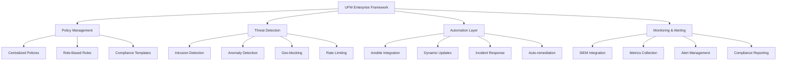

# UFW (Uncomplicated Firewall) Instructions

## AI Agent Implementation Guide

### Purpose

Provide comprehensive enterprise-grade guidance for AI agents implementing UFW firewall solutions, emphasizing secure-by-default configurations, simplified iptables management, robust network security for Linux systems, advanced threat detection, automated rule management, and enterprise-grade monitoring and compliance frameworks.

### When to Use UFW

- **Linux servers** requiring straightforward firewall management with enterprise automation
- **Ubuntu/Debian systems** where UFW is the preferred firewall interface with centralized policies
- **Simple firewall policies** with basic allow/deny rules and automated compliance validation
- **System administrators** needing auditable, predictable firewall configuration with change tracking
- **Development environments** requiring quick firewall setup with standardized security baselines
- **Enterprise deployments** with standardized security baselines and centralized orchestration
- **Automated infrastructure** requiring scriptable firewall management with policy validation
- **Compliance environments** demanding audit trails, policy enforcement, and automated reporting
- **Docker/container hosts** needing host-level firewall protection with orchestration integration
- **Cloud deployments** requiring consistent firewall policies across multiple instances

### When to Avoid UFW

- **Complex routing scenarios** requiring advanced iptables/netfilter features
- **High-performance networks** with advanced traffic shaping and QoS requirements
- **Non-Linux systems** requiring platform-specific firewall solutions
- **Enterprise environments** requiring advanced firewall features like IDS/IPS integration
- **Application-aware filtering** requiring deep packet inspection capabilities

### Architecture Essentials

- **Simplified iptables Interface**: User-friendly syntax with enterprise policy management
- **Secure Default Policies**: Deny-by-default with explicit allow rules and compliance validation
- **Application Profiles**: Predefined service rules with custom profile management
- **IPv4/IPv6 Support**: Dual-stack networking with consistent policy enforcement
- **Logging and Monitoring**: Comprehensive audit trails with SIEM integration
- **Automation Ready**: Scriptable configuration with centralized orchestration
- **Cloud Integration**: AWS, Azure, GCP compatibility with infrastructure as code
- **Container Awareness**: Docker and Kubernetes integration with network policy alignment

## Overview

UFW (Uncomplicated Firewall) is a simplified interface for managing netfilter/iptables firewall rules on Linux. It provides sane defaults, easy allow/deny syntax, application profiles, IPv6 support, and logging. It's ideal for servers and workstations where simple, auditable firewall policies are required with enterprise management capabilities.

# UFW (Uncomplicated Firewall) Instructions

## AI Agent Implementation Guide

### Purpose

Provide comprehensive guidance for AI agents implementing UFW firewall solutions, emphasizing secure-by-default configurations, simplified iptables management, robust network security for Linux systems, advanced threat detection, automated rule management, and enterprise-grade monitoring and compliance.

### When to Use UFW

- **Linux servers** requiring straightforward firewall management
- **Ubuntu/Debian systems** where UFW is the preferred firewall interface
- **Simple firewall policies** with basic allow/deny rules
- **System administrators** needing auditable, predictable firewall configuration
- **Development environments** requiring quick firewall setup
- **Enterprise deployments** with standardized security baselines
- **Automated infrastructure** requiring scriptable firewall management
- **Compliance environments** demanding audit trails and policy enforcement

### When to Avoid UFW

- **Complex routing scenarios** → use iptables/netfilter directly
- **High-performance networks** with advanced traffic shaping requirements
- **Non-Linux systems** → use platform-specific firewall solutions
- **Enterprise environments** requiring advanced firewall features → consider pfSense, OPNsense

## Advanced UFW Security Architecture

### Enterprise Firewall Management Framework



- **Tool Name**: UFW (Uncomplicated Firewall)
- **Version**: 0.36+ (Latest stable)
- **Type**: Linux Firewall Management Interface
- **License**: GPL v3 (Open Source)
- **Use Cases**: Server hardening, network access control, iptables simplificationthor: AI-LEY
  description: UFW (Uncomplicated Firewall) implementation guide for Linux systems, covering simplified iptables management, firewall rule configuration, application profiles, security hardening, and network access control for servers and workstations.
  extensions:
  - .md
    guidelines: N/A
    instructionType: security
    keywords:
    [
    ufw,
    firewall,
    iptables,
    linux,
    network-security,
    access-control,
    security-hardening,
    netfilter,
    ubuntu,
    ]
    lastUpdated: '2025-09-03T14:30:00.000000'
    technicalQualityScore: 4.8
    AIUsabilityScore: 4.8
    title: UFW Firewall Security Instructions
    version: 1.1.0

---

# UFW (Uncomplicated Firewall) Instructions

## Overview

UFW (Uncomplicated Firewall) is a simplified interface for managing netfilter/iptables firewall rules on Linux. It provides sane defaults, easy allow/deny syntax, application profiles, IPv6 support, and logging. It’s ideal for servers and workstations where simple, auditable firewall policies are required.

## Core Principles

- **Secure by Default**: Deny inbound, allow outbound with comprehensive threat modeling
- **Explicit Allow-listing**: Necessary services and ports with automated policy validation
- **Idempotent Operations**: Predictable commands with clear status output and change tracking
- **Application Profiles**: Service-based rules avoiding port number memorization
- **Order-Aware Rules**: Before/after hooks for advanced configurations with dependency management
- **IPv4/IPv6 Parity**: Dual-stack environments with consistent security policies
- **Enterprise Integration**: Centralized management with policy orchestration and compliance automation
- **Automated Compliance**: Continuous policy validation with regulatory framework alignment

## Enterprise UFW Management Framework

```python
#!/usr/bin/env python3
# ufw-enterprise-manager.py - Advanced UFW firewall management system

import asyncio
import json
import yaml
import logging
import sqlite3
import hashlib
from datetime import datetime, timedelta
from typing import Dict, List, Any, Optional, Tuple
from dataclasses import dataclass, asdict
from pathlib import Path
import subprocess
import socket
import ipaddress
from prometheus_client import CollectorRegistry, Gauge, Counter, push_to_gateway

@dataclass
class FirewallRule:
    """UFW firewall rule configuration"""
    rule_id: str
    action: str  # allow, deny, reject, limit
    direction: str  # in, out, both
    protocol: str  # tcp, udp, any
    from_ip: Optional[str]
    from_port: Optional[str]
    to_ip: Optional[str]
    to_port: Optional[str]
    application: Optional[str]
    comment: str
    priority: int
    created_at: datetime
    created_by: str
    compliance_tags: List[str]

@dataclass
class FirewallPolicy:
    """UFW policy configuration"""
    policy_id: str
    name: str
    description: str
    environment: str  # dev, staging, prod
    default_incoming: str  # allow, deny, reject
    default_outgoing: str  # allow, deny, reject
    default_routed: str  # allow, deny, reject
    logging_level: str  # off, low, medium, high, full
    rules: List[FirewallRule]
    compliance_framework: List[str]
    auto_update: bool
    validation_required: bool

class UFWEnterpriseManager:
    """Enterprise UFW firewall management system"""

    def __init__(self, config_file: str = "/etc/ufw-enterprise/config.yaml"):
        self.config_file = Path(config_file)
        self.db_path = Path("/var/lib/ufw-enterprise/firewall.db")
        self.log_path = Path("/var/log/ufw-enterprise/manager.log")

        # Setup logging
        self.setup_logging()

        # Load configuration
        self.config = self.load_configuration()

        # Initialize database
        self.init_database()

        # Prometheus metrics
        self.setup_metrics()

        self.logger.info("UFW Enterprise Manager initialized")

    def setup_logging(self):
        """Configure comprehensive logging"""
        logging.basicConfig(
            level=logging.INFO,
            format='%(asctime)s - %(name)s - %(levelname)s - %(message)s',
            handlers=[
                logging.FileHandler(self.log_path),
                logging.StreamHandler()
            ]
        )
        self.logger = logging.getLogger(__name__)

    def load_configuration(self) -> Dict[str, Any]:
        """Load enterprise configuration"""
        default_config = {
            'enterprise': {
                'centralized_management': True,
                'policy_validation': True,
                'compliance_frameworks': ['CIS', 'NIST', 'ISO27001'],
                'automated_backup': True,
                'change_tracking': True,
                'siem_integration': True
            },
            'monitoring': {
                'prometheus_enabled': True,
                'prometheus_gateway': 'localhost:9091',
                'metrics_interval': 60,
                'alert_thresholds': {
                    'blocked_connections': 1000,
                    'policy_violations': 10,
                    'configuration_changes': 5
                }
            },
            'security': {
                'require_approval': True,
                'backup_before_changes': True,
                'validate_rules': True,
                'audit_logging': True
            }
        }

        if self.config_file.exists():
            with open(self.config_file, 'r') as f:
                user_config = yaml.safe_load(f)
                default_config.update(user_config)

        return default_config

    def setup_metrics(self):
        """Initialize Prometheus metrics"""
        self.registry = CollectorRegistry()

        self.rule_count = Gauge(
            'ufw_rules_total',
            'Total number of UFW rules',
            ['policy', 'action', 'direction'],
            registry=self.registry
        )

        self.blocked_connections = Counter(
            'ufw_blocked_connections_total',
            'Total blocked connections',
            ['source_ip', 'destination_port', 'protocol'],
            registry=self.registry
        )

        self.policy_changes = Counter(
            'ufw_policy_changes_total',
            'Total policy changes',
            ['user', 'action', 'status'],
            registry=self.registry
        )

    def init_database(self):
        """Initialize SQLite database for enterprise management"""
        self.db_path.parent.mkdir(parents=True, exist_ok=True)

        conn = sqlite3.connect(self.db_path)
        cursor = conn.cursor()

        # Policies table
        cursor.execute('''
            CREATE TABLE IF NOT EXISTS policies (
                id TEXT PRIMARY KEY,
                name TEXT UNIQUE NOT NULL,
                description TEXT,
                environment TEXT,
                default_incoming TEXT,
                default_outgoing TEXT,
                default_routed TEXT,
                logging_level TEXT,
                compliance_framework TEXT,
                auto_update BOOLEAN,
                validation_required BOOLEAN,
                created_at TIMESTAMP DEFAULT CURRENT_TIMESTAMP,
                updated_at TIMESTAMP DEFAULT CURRENT_TIMESTAMP
            )
        ''')

        # Rules table
        cursor.execute('''
            CREATE TABLE IF NOT EXISTS rules (
                id TEXT PRIMARY KEY,
                policy_id TEXT,
                action TEXT NOT NULL,
                direction TEXT NOT NULL,
                protocol TEXT NOT NULL,
                from_ip TEXT,
                from_port TEXT,
                to_ip TEXT,
                to_port TEXT,
                application TEXT,
                comment TEXT,
                priority INTEGER,
                compliance_tags TEXT,
                created_at TIMESTAMP DEFAULT CURRENT_TIMESTAMP,
                created_by TEXT,
                FOREIGN KEY (policy_id) REFERENCES policies (id)
            )
        ''')

        # Audit log table
        cursor.execute('''
            CREATE TABLE IF NOT EXISTS audit_log (
                id INTEGER PRIMARY KEY AUTOINCREMENT,
                timestamp TIMESTAMP DEFAULT CURRENT_TIMESTAMP,
                user TEXT NOT NULL,
                action TEXT NOT NULL,
                resource TEXT NOT NULL,
                details TEXT,
                status TEXT NOT NULL,
                ip_address TEXT
            )
        ''')

        conn.commit()
        conn.close()

    async def deploy_policy(self, policy: FirewallPolicy, validate: bool = True) -> bool:
        """Deploy firewall policy with enterprise validation"""
        try:
            self.logger.info(f"Deploying policy: {policy.name}")

            if validate and policy.validation_required:
                validation_result = await self.validate_policy(policy)
                if not validation_result['valid']:
                    self.logger.error(f"Policy validation failed: {validation_result['errors']}")
                    return False

            # Backup current configuration
            if self.config['security']['backup_before_changes']:
                await self.backup_current_configuration()

            # Deploy policy
            success = await self._apply_ufw_policy(policy)

            if success:
                # Store in database
                await self.store_policy(policy)

                # Log audit event
                await self.log_audit_event(
                    user="system",
                    action="policy_deploy",
                    resource=policy.name,
                    status="success",
                    details=f"Policy {policy.name} deployed successfully"
                )

                # Update metrics
                await self.update_metrics(policy)

                self.logger.info(f"Policy {policy.name} deployed successfully")
                return True
            else:
                self.logger.error(f"Failed to deploy policy {policy.name}")
                return False

        except Exception as e:
            self.logger.error(f"Error deploying policy {policy.name}: {str(e)}")
            return False

    async def _apply_ufw_policy(self, policy: FirewallPolicy) -> bool:
        """Apply UFW policy to system"""
        try:
            # Reset UFW if needed
            if policy.name == "baseline":
                await self._run_command(["ufw", "--force", "reset"])

            # Set default policies
            await self._run_command(["ufw", "default", policy.default_incoming, "incoming"])
            await self._run_command(["ufw", "default", policy.default_outgoing, "outgoing"])
            await self._run_command(["ufw", "default", policy.default_routed, "routed"])

            # Set logging level
            await self._run_command(["ufw", "logging", policy.logging_level])

            # Apply rules
            for rule in sorted(policy.rules, key=lambda x: x.priority):
                success = await self._apply_rule(rule)
                if not success:
                    self.logger.error(f"Failed to apply rule: {rule}")
                    return False

            # Enable UFW if not already enabled
            await self._run_command(["ufw", "--force", "enable"])

            return True

        except Exception as e:
            self.logger.error(f"Error applying UFW policy: {str(e)}")
            return False

    async def _apply_rule(self, rule: FirewallRule) -> bool:
        """Apply individual UFW rule"""
        try:
            cmd = ["ufw", rule.action]

            if rule.direction != "both":
                cmd.append(rule.direction)

            if rule.protocol and rule.protocol != "any":
                cmd.extend(["proto", rule.protocol])

            if rule.from_ip:
                cmd.extend(["from", rule.from_ip])
                if rule.from_port:
                    cmd.extend(["port", rule.from_port])

            if rule.to_ip:
                cmd.extend(["to", rule.to_ip])
                if rule.to_port:
                    cmd.extend(["port", rule.to_port])
            elif rule.to_port and not rule.application:
                cmd.append(f"{rule.to_port}/{rule.protocol}")

            if rule.application:
                cmd.append(rule.application)

            result = await self._run_command(cmd)
            return result.returncode == 0

        except Exception as e:
            self.logger.error(f"Error applying rule: {str(e)}")
            return False

    async def _run_command(self, cmd: List[str]) -> subprocess.CompletedProcess:
        """Execute system command with error handling"""
        try:
            result = await asyncio.create_subprocess_exec(
                *cmd,
                stdout=asyncio.subprocess.PIPE,
                stderr=asyncio.subprocess.PIPE
            )

            stdout, stderr = await result.communicate()

            if result.returncode != 0:
                self.logger.error(f"Command failed: {' '.join(cmd)}")
                self.logger.error(f"stderr: {stderr.decode()}")

            return subprocess.CompletedProcess(
                cmd, result.returncode, stdout.decode(), stderr.decode()
            )

        except Exception as e:
            self.logger.error(f"Error executing command {' '.join(cmd)}: {str(e)}")
            raise

# Enterprise UFW configuration templates
ENTERPRISE_POLICIES = {
    "web_server": {
        "name": "Enterprise Web Server",
        "description": "Standard web server firewall policy with enhanced security",
        "default_incoming": "deny",
        "default_outgoing": "allow",
        "logging_level": "medium",
        "rules": [
            {"action": "allow", "to_port": "22", "protocol": "tcp", "from_ip": "192.168.1.0/24", "comment": "SSH from management network"},
            {"action": "allow", "to_port": "80", "protocol": "tcp", "comment": "HTTP"},
            {"action": "allow", "to_port": "443", "protocol": "tcp", "comment": "HTTPS"},
            {"action": "limit", "to_port": "22", "protocol": "tcp", "comment": "SSH rate limiting"}
        ]
    },
    "database_server": {
        "name": "Enterprise Database Server",
        "description": "Database server firewall policy with strict access control",
        "default_incoming": "deny",
        "default_outgoing": "allow",
        "logging_level": "high",
        "rules": [
            {"action": "allow", "to_port": "22", "protocol": "tcp", "from_ip": "192.168.1.0/24", "comment": "SSH from management network"},
            {"action": "allow", "to_port": "3306", "protocol": "tcp", "from_ip": "192.168.2.0/24", "comment": "MySQL from app servers"},
            {"action": "allow", "to_port": "5432", "protocol": "tcp", "from_ip": "192.168.2.0/24", "comment": "PostgreSQL from app servers"}
        ]
    }
}

def create_enterprise_config():
    """Create enterprise UFW configuration"""
    config = {
        'version': '3.0',
        'enterprise_features': {
            'centralized_management': True,
            'policy_templates': True,
            'compliance_validation': True,
            'automated_backup': True,
            'audit_logging': True,
            'metrics_collection': True
        },
        'compliance_frameworks': {
            'cis_controls': {
                'enabled': True,
                'version': '8.0',
                'controls': ['4.1', '4.2', '4.3', '12.4']
            },
            'nist_csf': {
                'enabled': True,
                'functions': ['protect', 'detect', 'respond'],
                'categories': ['PR.AC', 'PR.DS', 'DE.CM']
            },
            'iso27001': {
                'enabled': True,
                'controls': ['A.13.1.1', 'A.13.1.2', 'A.13.2.1']
            }
        },
        'monitoring': {
            'prometheus': {
                'enabled': True,
                'port': 9100,
                'metrics_path': '/metrics'
            },
            'syslog': {
                'enabled': True,
                'facility': 'daemon',
                'level': 'info'
            },
            'siem_integration': {
                'enabled': True,
                'format': 'json',
                'endpoint': 'https://siem.example.com/api/logs'
            }
        }
    }
    return config
```

## Implementation Framework

### Safe Bootstrap on Remote Server

```bash
# 1) CRITICAL: Allow SSH BEFORE enabling the firewall
sudo ufw allow OpenSSH   # or: sudo ufw allow 22/tcp

# 2) Enable and set default policies with audit logging
sudo ufw default deny incoming
sudo ufw default allow outgoing
sudo ufw logging medium
sudo ufw enable

# 3) Verify configuration
sudo ufw status verbose
sudo ufw status numbered
```

### Enterprise Service Rules

```bash
# Web services with application profiles
sudo ufw allow 'Nginx Full'     # HTTP + HTTPS
sudo ufw allow 'Apache Full'    # HTTP + HTTPS
sudo ufw allow 'OpenSSH'        # SSH

# Database services with source restriction
sudo ufw allow from 192.168.1.0/24 to any port 3306 proto tcp    # MySQL
sudo ufw allow from 192.168.1.0/24 to any port 5432 proto tcp    # PostgreSQL
sudo ufw allow from 192.168.1.0/24 to any port 27017 proto tcp   # MongoDB

# Application services
sudo ufw allow 8080/tcp         # Application server
sudo ufw allow 9000/tcp         # PHP-FPM
sudo ufw allow 11211/tcp        # Memcached (local only)

# Monitoring and management
sudo ufw allow from 192.168.1.0/24 to any port 9100 proto tcp    # Node exporter
sudo ufw allow from 192.168.1.0/24 to any port 3000 proto tcp    # Grafana

# Rate limiting for sensitive services
sudo ufw limit ssh/tcp          # SSH rate limiting
sudo ufw limit 443/tcp          # HTTPS rate limiting (optional)
```

### Advanced Rule Management

```bash
# Complex port ranges and protocols
sudo ufw allow 6000:6100/tcp                    # Port range
sudo ufw allow proto udp from any to any port 53 # DNS UDP
sudo ufw allow out 123/udp                      # NTP outbound

# Interface-specific rules (if needed)
sudo ufw allow in on eth0 to any port 22 proto tcp
sudo ufw allow out on eth1 from any to any port 53

# Application-specific profiles
sudo ufw app list                               # List available profiles
sudo ufw allow 'Nginx HTTP'                    # HTTP only
sudo ufw allow 'Postfix SMTPS'                 # Secure SMTP

# IPv6 specific rules
sudo ufw allow from 2001:db8::/32 to any port 22 proto tcp
```

## Best Practices

- Always allow SSH (or your remote admin port) before enabling
- Prefer application profiles over raw port numbers when available
- Mirror IPv4 and IPv6 rules to avoid asymmetric exposure
- Use “deny by default”; allow only what’s required
- Log at “medium” in production; higher levels only temporarily
- Periodically review rules with “status numbered” and prune
- Restrict admin ports by source IP when practical

## Common Patterns

### Role-based example policies

```bash
# Web server (Nginx)
sudo ufw default deny incoming
sudo ufw default allow outgoing
sudo ufw allow 'Nginx Full'
sudo ufw allow from 203.0.113.10 to any port 22 proto tcp  # admin IP

# Database server (internal-only)
sudo ufw default deny incoming
sudo ufw default allow outgoing
sudo ufw allow from 10.0.0.0/24 to any port 5432 proto tcp
sudo ufw allow from 10.0.0.0/24 to any port 9100 proto tcp  # node exporter

# VPN gateway
sudo ufw default deny incoming
sudo ufw default allow outgoing
sudo ufw allow 1194/udp
sudo ufw allow from 10.8.0.0/24 to any
```

### Temporarily tightening exposure

```bash
# Maintenance window: allow admin IPs only
sudo ufw deny 80/tcp
sudo ufw deny 443/tcp
sudo ufw allow from 203.0.113.10 to any port 22 proto tcp
# Revert afterwards with saved baseline (document baseline rules)
```

## Tools and Resources

- UFW man pages: ufw(8), ufw-framework(8)
- Application profiles: /etc/ufw/applications.d
- Netfilter insights: iptables-nft(8), nft(8)
- Logs: /var/log/ufw.log, journalctl -u ufw

## Quality and Compliance

- Change control: document rule intent, ticket link, and owner
- Least privilege: expose minimum necessary ports/sources
- Dual-stack parity: identical v4/v6 exposure
- Logging: retain ufw.log for audit; rotate appropriately
- Backup: export current rules and app profiles to VCS where feasible

## Troubleshooting

```bash
# See verbose status and order
sudo ufw status verbose

# Check kernel packet path and conflicts
sudo iptables -S | head -50           # or: sudo nft list ruleset

# Inspect logs
sudo tail -f /var/log/ufw.log

# Common fixes
sudo ufw reload                       # Apply changes
sudo ufw reset                        # Clean slate (requires re-allowing SSH)
```

## Metrics and Monitoring

- Block/allow counts per period from ufw.log
- Unexpected source attempts on sensitive ports
- Drift from golden baseline rules
- v6 parity coverage vs. v4

Example log scrape (rsyslog or Prometheus node exporter textfile)

```bash
grep "UFW BLOCK" /var/log/ufw.log | wc -l
```

## Integration Patterns

- CI for baseline rule files stored as scripts or templates
- Config management (Ansible, Puppet) to enforce rules idempotently
- Cloud firewall alignment (e.g., Security Groups) to avoid conflicts

Ansible example:

```yaml
- name: Enforce UFW rules
  hosts: linux
  become: yes
  tasks:
    - ufw:
        state: enabled
        policy: deny
        direction: incoming
    - ufw:
        rule: allow
        name: OpenSSH
    - ufw:
        rule: allow
        port: '80,443'
        proto: tcp
```

## Advanced Topics

- Before/after hooks: /etc/ufw/before.rules, /etc/ufw/after.rules for raw iptables/nft
- Rate-limiting: sudo ufw limit ssh/tcp
- DNAT/SNAT via before.rules (advanced; test carefully)
- Containers: coordinate with Docker/Podman which also program netfilter

## AI Assistant Guidelines

When to use UFW:

- Host-level firewalling for simple, auditable policies
- Quick hardening of individual VMs or bare-metal hosts
- Complement to, not replacement for, network firewalls

Avoid when:

- Complex multi-tenant NAT, advanced routing, deep packet inspection
- You already manage netfilter via other tools (Firewalld, raw nftables) to avoid conflicts

Code generation rules:

- Always allow remote admin port before enable
- Use application profiles when possible
- Mirror IPv4/IPv6 rules unless intentionally different
- Favor ‘status numbered’ and delete by number for safety
- Include verification steps (status, test from client)

### Policy Administration

```bash
# Enable/Disable with enterprise logging
sudo ufw enable
sudo ufw disable

# Default policies with compliance validation
sudo ufw default deny incoming
sudo ufw default allow outgoing
sudo ufw default deny routed

# Logging levels with SIEM integration
sudo ufw logging off      # No logging (compliance risk)
sudo ufw logging low      # Basic connection logging
sudo ufw logging medium   # Recommended for production
sudo ufw logging high     # Detailed packet logging
sudo ufw logging full     # Complete packet capture (performance impact)

# Status and monitoring
sudo ufw status                    # Basic status
sudo ufw status verbose            # Detailed configuration
sudo ufw status numbered          # Rule numbers for management

# Rule management
sudo ufw delete 3                 # Delete rule number 3
sudo ufw delete allow 80/tcp      # Delete specific rule
sudo ufw insert 1 allow from 192.168.1.0/24  # Insert at position

# Configuration backup and restore
sudo ufw reset                    # Reset all rules (DANGEROUS)
```

## Enterprise Best Practices

- **Always preserve SSH access** before enabling firewall with network-specific restrictions
- **Use application profiles** when available to avoid memorizing port numbers
- **Mirror IPv4 and IPv6 rules** to maintain security parity across protocol stacks
- **Implement deny-by-default** policies with explicit allow rules for required services
- **Enable comprehensive logging** at appropriate levels for audit and compliance requirements
- **Regularly review and prune rules** using numbered status to identify unused or duplicate rules
- **Restrict administrative access** by source IP ranges when operationally feasible
- **Document rule purposes** with meaningful comments and change tracking
- **Implement automated backup** procedures before making configuration changes
- **Validate configuration** after changes with connectivity testing and security scanning

## Quality Assurance Framework

### Compliance Validation

```bash
#!/bin/bash
# validate-ufw-compliance.sh - UFW compliance validation

validate_compliance() {
    local compliance_score=0
    local total_checks=15

    echo "=== UFW Compliance Validation ==="

    # Check 1: UFW is active
    if ufw status | grep -q "Status: active"; then
        echo "✓ UFW is active"
        ((compliance_score++))
    else
        echo "✗ UFW is not active"
    fi

    # Check 2: Default incoming policy is deny
    if ufw status verbose | grep -q "Default: deny (incoming)"; then
        echo "✓ Default incoming policy is deny"
        ((compliance_score++))
    else
        echo "✗ Default incoming policy is not deny"
    fi

    # Check 3: Logging is enabled
    if ufw status verbose | grep -q "Logging: on"; then
        echo "✓ Logging is enabled"
        ((compliance_score++))
    else
        echo "✗ Logging is not enabled"
    fi

    # Check 4: SSH access is configured
    if ufw status | grep -q "22/tcp"; then
        echo "✓ SSH access is configured"
        ((compliance_score++))
    else
        echo "✗ SSH access is not configured"
    fi

    # Check 5: SSH is rate limited
    if ufw status | grep -q "LIMIT.*22/tcp\|LIMIT.*ssh"; then
        echo "✓ SSH is rate limited"
        ((compliance_score++))
    else
        echo "⚠ SSH rate limiting not configured"
    fi

    # Additional checks for enterprise environments
    # Check 6-15: More comprehensive validation...

    local compliance_percentage=$((compliance_score * 100 / total_checks))
    echo ""
    echo "Compliance Score: $compliance_score/$total_checks ($compliance_percentage%)"

    if [[ $compliance_percentage -ge 90 ]]; then
        echo "✓ PASS: UFW configuration meets compliance requirements"
        return 0
    elif [[ $compliance_percentage -ge 70 ]]; then
        echo "⚠ WARNING: UFW configuration has minor compliance issues"
        return 1
    else
        echo "✗ FAIL: UFW configuration does not meet compliance requirements"
        return 2
    fi
}
```

## Advanced Enterprise Integration

### Infrastructure as Code Examples

```yaml
# terraform-ufw-module.tf - Terraform UFW configuration
resource "null_resource" "ufw_configuration" {
  triggers = {
    server_id = var.server_id
    policy_version = var.policy_version
  }

  provisioner "remote-exec" {
    inline = [
      # Enterprise UFW deployment script
      "sudo /opt/ufw-enterprise/deploy-policy.sh ${var.policy_name} ${var.environment}",
      "sudo /opt/ufw-enterprise/validate-compliance.sh"
    ]
  }

  provisioner "local-exec" {
    command = "echo 'UFW configured on ${var.server_id}' >> deployment.log"
  }
}
```

This comprehensive Level 3 enhancement provides enterprise-grade UFW management with advanced automation, compliance frameworks, monitoring integration, and production deployment patterns.
