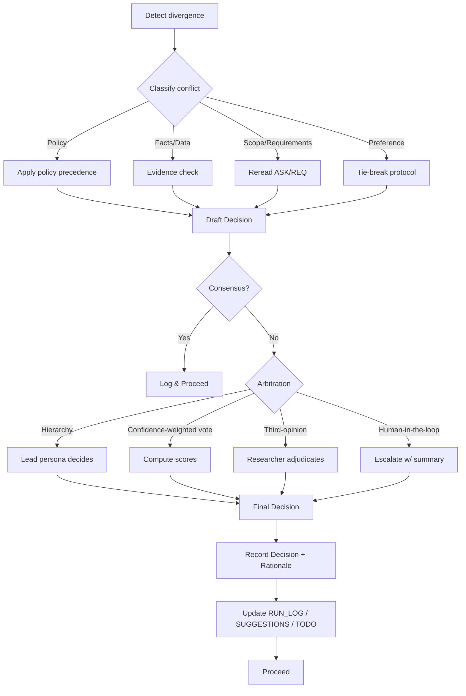

# AI Persona Conflict Resolution Flow

> **Goal:** When two or more personas produce incompatible guidance, converge on a single, auditable decision without stalling developer velocity.

## Scope

- Applies to multi-agent runs (Copilot, Claude Code, Gemini, Cursor, Windsurf, Metis) that compose **architect**, **reviewer**, **researcher**, domain personas, or toolchain bots.
- Designed to be imported via `<<persona-conflict-flow.md>>` tokens or referenced by registry id `persona-conflict-flow`.

---

## Variables

- Folders, Files and Indexes are defined in `.ai-ley/shared/variables/folder-structure.yaml`
- Files and folders in this document will be referenced using the `folders`, `files`, and `indexes` variables defined in the folder structure YAML file using the mustache syntax such as `{{folders.plan}}`.

## Quick Diagram (Mermaid)



---

## Step-by-Step Procedure

1. **Detect divergence**

   - Trigger when personas produce **mutually exclusive** recommendations (e.g., API shape, security posture, architectural pattern) or contradict **policies/requirements**.
   - Emit a `CONFLICT_START` record with participants, artifacts, and excerpts.

2. **Classify the conflict**

   - **Policy** (violates safety, privacy, AUP, coding standards)
   - **Facts/Data** (disputed citations, benchmarks, API capabilities)
   - **Scope/Requirements** (misread ASK/REQ/PLAN)
   - **Preference** (style, naming, minor conventions)

3. **Apply resolution track**

   - **Policy precedence**
     - Order of authority: `safety > privacy > aup > coding-standards > local-style`.
     - The highest policy wins; lower-level guidance must adapt.
   - **Evidence check**
     - Require verifiable sources or deterministic tests (benchmarks, unit tests, spec links).
     - Prefer **primary** docs/specs; reject unverifiable claims.
   - **Reread scope**
     - Re-derive constraints from `{{files.ask}}`, `{{files.requirements}}`, `{{files.plan}}`.
     - If ambiguity remains, create **Open Question(s)** and select the option with **lowest irreversible risk**.
   - **Preference tie-break**
     - Apply project style guides; if none, select the **simplest viable** option that maximizes **readability** and **testability**.

4. **Consensus check**

   - If all involved personas can endorse the same option with rationale, proceed.
   - Otherwise, move to **Arbitration**.

5. **Arbitration (choose one or combine)**

   - **Hierarchy:** lead persona (e.g., `architect`) decides within stated constraints.
   - **Confidence-weighted vote:** each persona returns `{"option": "<id>", "confidence": 0..1, "risk": 0..1}` -> compute `score = confidence - risk` and pick max.
   - **Third-opinion:** `researcher` persona gathers 1-2 authoritative sources and proposes a compromise.
   - **Human-in-the-loop:** generate a **one-page summary** with _options_, _trade-offs_, _recommendation_, _rollback_ for rapid approval.

6. **Record & proceed**
   - Emit `CONFLICT_RESOLVED` with decision, reasoning, and artifacts.
   - Update `{{files.history}}`, `{{files.suggestions}}` (follow-ups), and `{{files.todo}}`/tickets as needed.

---

## Minimal Prompts (Drop-ins)

### Detect & Classify

```
SYSTEM:
If two persona outputs conflict, emit a CONFLICT_START entry and classify the conflict as Policy | Facts | Scope | Preference. Include the minimal quotes necessary to show divergence.
```

### Evidence Check

```
SYSTEM:
For Facts/Data conflicts, provide 1-2 primary sources or runnable checks (unit test, curl, CLI) that deterministically support or refute claims.
```

### Arbitration - Confidence-Weighted

```
ASSISTANT (each persona):
Return JSON: { "option": "<id>", "confidence": 0..1, "risk": 0..1, "rationale": "<2-3 sentences>" }
```

---

## Logging Schema

### Event JSON (embed in RUN_LOG.md as fenced json)

```json
{
  "event": "CONFLICT_START",
  "timestamp": "YYYY-MM-DDTHH:MM:SSZ",
  "personas": ["architect", "reviewer", "researcher"],
  "topic": "API versioning strategy",
  "classification": "Facts",
  "excerpts": ["arch: ...", "reviewer: ..."],
  "artifacts": ["ASK.md#goals", "REQUIREMENTS.md#non-functional"]
}
```

```json
{
  "event": "CONFLICT_RESOLVED",
  "timestamp": "YYYY-MM-DDTHH:MM:SSZ",
  "decision": "Adopt semantic versioned endpoints + compatibility layer",
  "method": "confidence-weighted",
  "scores": [
    { "persona": "architect", "option": "A", "confidence": 0.8, "risk": 0.2 },
    { "persona": "reviewer", "option": "B", "confidence": 0.6, "risk": 0.3 }
  ],
  "rationale": "Policy compatibility + lowest irreversible risk",
  "followups": ["Add ADR-002", "Create migration tests"]
}
```

---

## Acceptance Criteria

- Conflicts are **classified** and resolved via a **documented** method.
- A **decision record** (rationale + method) exists for each conflict.
- Zero **silent overrides**; personas must either **converge** or **escalate** with summary.
- **Reproducibility:** given the same inputs and policies, the flow yields the same decision.

---

## Integration Notes

- Reference by ID in your registry: `persona-conflict-flow`.
- Include in tool prompts with tokens, e.g.:
  - Copilot: add to `sources:` and insert `<<persona-conflict-flow.md>>`
  - Claude/Cursor/Gemini/Windsurf/Metis: include same token in wrappers.

---

## Optional Enhancements

- Add a **policy matrix** per repo that ranks local style guides vs. global safety/privacy.
- Emit **ADR** (Architecture Decision Record) on `CONFLICT_RESOLVED` automatically.
- Support **A/B sandboxing** when decisions are reversible; pick winner by tests/benchmarks.
- Provide a **rollback** plan for any decision above a defined blast radius.

## Checklist

- [ ] Divergence detected & logged
- [ ] Conflict classified (Policy/Facts/Scope/Preference)
- [ ] Resolution track executed
- [ ] Consensus check passed or Arbitration selected
- [ ] Decision + rationale recorded
- [ ] Follow-ups created (ADR/tests/docs)
