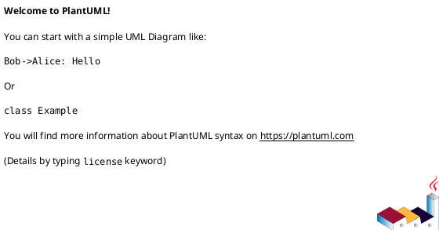

# Instruction

Evaluate the corpus:

- **Inputs:** `{{files.requirements}}`, `{{files.plan}}`, all files in `{{folders.personas}}`, and `{{folders.instructions}}`.
- **Outputs:**
  1. An **Architecture Document** at `{{folders.plan}}/architecture/architecture.md`.
  2. An initial **Architecture Decision Record (ADR)** at `{{folders.plan}}/architecture/adrs/ADR-0001-architecture-direction.md`.
  3. An **updated** `{{files.requirements}}` with architecture-specific details merged in (in-place update).

Operate deterministically. If information is missing, **state minimal assumptions** and proceed.

## Operating Rules

- Prefer **C4 Model** views (Context → Container → Component) with **clear contracts**.
- Maintain **traceability**: map each requirement `R-###` to one or more architecture components `A-###` and interfaces `I-###`.
- Use **ISO dates**, explicit time zones, and units. No placeholders like “TBD” unless unavoidable; justify briefly.
- Keep secrets and credentials out of docs; reference secret managers & policies.
- Emit both **PlantUML** and **Mermaid** diagram snippets for portability.
- Document **trade-offs** and **assumptions** inline; include **non-functional** commitments (SLOs, cost, security, accessibility).

---

## Deliverable 1 — Architecture Document (write to {{folders.plan}}/architecture/architecture.md)

Produce **exactly** this structure.

# System Architecture — {{project_or_product_name}}

> Date: {{iso_date}} | Owner: Architecture | Sources: {{files.requirements}}, {{files.plan}}, {{folders.personas}}, {{folders.instructions}}

## 1) Context & Goals (C4: Context)

- Business/mission context, key user journeys/personas.
- **Top 5 requirements (R-###)** this architecture optimizes for.

## 2) Assumptions & Constraints

- Assumptions (explicit, minimal).
- Constraints: tech, compliance, budget, timeline, skills, vendor lock-in.

## 3) Non-Functional Requirements (NFRs)

- Performance, scalability, availability/SLOs, reliability, security, privacy, accessibility, observability, cost.

## 4) C4 Views

### 4.1 Context Diagram

### 4.2 Container Diagram

### 4.3 Component Diagram (key services)

## 5) Architecture Components (A-###)

- List components with purpose, responsibilities, tech choices, SLIs/SLOs, scaling, and ownership.

## 6) Interface Contracts (I-###)

- External/internal APIs, events, webhooks, file exchanges.
- For each: purpose, method/topic, schema, idempotency, rate limits, authN/Z, error semantics.

## 7) Data & Schema

- Canonical data models, storage choices, partitioning/indexing, retention/lineage, backup/DR, PII handling.

## 8) Security & Compliance

- Threats & mitigations (STRIDE summary).
- Controls: authn, authz, encryption, secrets, audit, SAST/DAST/DSO, supply chain integrity.
- Privacy & regulatory notes (GDPR/FERPA/PCI/etc as relevant).

## 9) Observability & Operations

- Metrics, logs, traces; dashboards; alerting SLOs.
- Deploy strategy (CI/CD), environments, config/feature flags, rollback, chaos testing.

## 10) Performance & Capacity

- Workload assumptions; target P50/P95 latencies; throughput; error budgets; capacity math; cost envelope.

## 11) Reliability & Resilience

- Failure modes, retries/backoff, circuit breakers, bulkheads, timeouts, DR strategy, graceful degradation.

## 12) Sequence Scenarios (key flows)

## 13) Alternatives & Trade-offs

- Option A/B/C with pros/cons (cost, complexity, risk, time-to-value); **Recommendation** and rationale.

## 14) Risks & Mitigations

| ID  | Risk | Likelihood | Impact | Mitigation | Owner | Trigger |
| --- | ---- | ---------- | ------ | ---------- | ----- | ------- |

## 15) Roadmap & Milestones

- Phases with ISO dates, owners; dependencies; cutover/migration strategy.

## 16) Traceability

| Req ID | Component(s) | Interface(s) | Notes |
| ------ | ------------ | ------------ | ----- |
| R-001  | A-001, A-004 | I-002        |       |

## 17) Open Questions

- List with proposed resolution owners/date.

---

## Deliverable 2 — ADR (write to {{folders.plan}}/architecture/adrs/ADR-0001-architecture-direction.md})

Follow **Michael Nygard’s ADR** style.

# ADR-0001: Architecture Direction

- **Status:** Proposed
- **Date:** {{iso_date}}
- **Context:** (drivers, constraints, alternatives considered)
- **Decision:** (what we chose and why)
- **Consequences:** (positive/negative, follow-ups)
- **References:** links to architecture doc sections and requirements

---

## Deliverable 3 — Update Requirements In-Place ({{files.requirements}})

Merge architecture-specific details into the requirements with **surgical edits**, preserving intent and numbering.

### Update Strategy

- **Insert a new section**: `## Architecture-Specific Requirements` after NFRs (or near the end if no NFRs).
- For each `A-###` and `I-###`, add precise, testable requirements. Example:
  - **R-ARCH-### (maps A-###/I-###):** “The `<API>` SHALL enforce idempotent POST via `Idempotency-Key`; duplicate requests MUST return the original response within 2s.”
- **Augment NFRs** with numeric targets (e.g., **P95 ≤ 300 ms @ 200 RPS**, error rate < 0.2%).
- **Add Acceptance Criteria** bullets under affected requirements.
- **Versioning:** bump `Requirements Version` (semver) and add a **Changelog** entry with ISO date.
- **Traceability:** append a brief table mapping `R-### ↔ A-###/I-###`.

### Patch Rules

- Do not remove original requirements; clarify with sub-bullets if ambiguous.
- If conflicts arise, keep both and add a **Conflict Note** with a suggested resolution in `{{files.suggestions}}` (if present).
- Maintain consistent numbering; if absent, auto-number `R-###` by heading order.

---

## Synthesis Procedure (internal)

1. **Parse & Normalize:** Extract goals, constraints, NFRs, acceptance criteria, personas’ journeys, plan milestones, and instruction runbooks.
2. **Derive Architecture:** Choose minimal components that satisfy requirements with headroom; define `A-###` and `I-###` artifacts.
3. **Quantify NFRs:** Convert qualitative statements into measurable SLOs; compute initial capacity and cost envelopes.
4. **Author Artifacts:** Populate Architecture Document and ADR with evidence-backed rationale.
5. **Requirements Update:** Insert architecture-specific requirements, acceptance criteria, and traceability; bump version + changelog.
6. **Quality Gate:** Ensure these hold or annotate exceptions:
   - ✅ Each critical `R-###` maps to ≥1 `A-###` and ≥1 `I-###`.
   - ✅ All NFRs have numeric targets and testability.
   - ✅ No contradictions with plan milestones and personas.
   - ✅ Security, privacy, and accessibility addressed with concrete controls.
7. **Write Files:**
   - Architecture → `{{folders.plan}}/architecture/architecture.md`
   - ADR → `{{folders.plan}}/architecture/adrs/ADR-0001-architecture-direction.md`
   - Updated Requirements → `{{files.requirements}}` (in-place)

## Output Rules

- Concise, scannable, evidence-backed prose.
- ISO dates/time zones and explicit units.
- Include at least one creative alternative for a major decision.
- Avoid placeholders unless justified.
