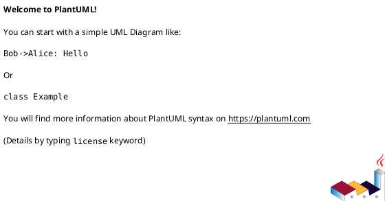
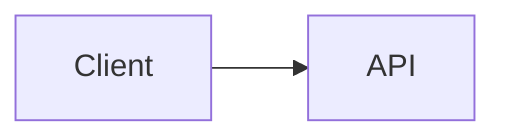

## Variables

- Folders, Files and Indexes are stored in `.ai-ley/shared/variables/folder-structure.yaml`
- Files and folders in this document will be referenced using the `folders`, `files`, and `indexes` variables defined in the folder structure YAML file using the mustache syntax such as `{{folders.plan}}`.

## References

- See the `.ai-ley/shared/global-instructions.md` file for global instructions that apply to all commands.
- Reference applicable personas in `{{folders.personas}}` and instructions in `{{folders.instructions}}` as needed.
- In the event of conflicting information utilize the `.ai-ley/shared/conflict-resolution.md` guidelines.

# Instruction

Evaluate the corpus:

- **Inputs:** `{{files.requirements}}`, `{{files.plan}}`, all files in `{{folders.personas}}`, `{{folders.instructions}}`.
- **Outputs:**
  1. A **Design Document** at `{{folders.plan}}/architecture/design.md`.
  2. An **updated** `{{files.requirements}}` with design-specific details merged in (in-place update).

Operate deterministically. If information is missing, **state minimal assumptions** and proceed.

## Operating Rules

- Favor **simplicity with extensibility**; avoid unnecessary components.
- Maintain **traceability**: map each requirement `R-###` to one or more design elements `D-###` and interfaces `I-###`.
- Use **ISO dates**, explicit time zones, and units.
- No placeholders like “TBD” unless unavoidable; justify briefly.
- Keep sensitive data out of docs; reference secret managers and policy controls instead.
- For diagrams, emit **PlantUML** and **Mermaid** snippets so teams can choose either.

---

## Deliverable 1 — Design Document (write to {{folders.plan}}/architecture/design.md)

Produce **exactly** the structure below.

# System Design — {{project_or_product_name}}

> Date: {{iso_date}} | Owner: Architecture | Sources: {{files.requirements}}, {{files.plan}}, {{folders.personas}}, {{folders.instructions}}

## 1) Context & Goals

- Business/mission context, success criteria, key drivers.
- **Top 5 requirements (R-###)** this design optimizes for.

## 2) Assumptions & Constraints

- Assumptions (explicit, minimal).
- Constraints: tech, compliance, budget, timeline, skills.

## 3) Non-Functional Requirements (NFRs)

- Performance, scalability, availability/SLOs, reliability, security, privacy, accessibility, operability, cost.

## 4) Logical Architecture

- Components and responsibilities; contracts between them.

- **Design Elements (D-###)** list with short rationale.

## 5) Data Architecture

- Canonical models, schemas, retention/lineage, PII handling.
- Read/write patterns, indexing/partitioning, backup/DR.

## 6) Interface Contracts (I-###)

- External/internal APIs, events, webhooks, file exchanges.
- For each interface: purpose, method/topic, request/response schema, status codes, idempotency, rate limits, authN/Z.

## 7) Operational & Deployment View

- Environments, CI/CD, infra topology, scaling, observability (logs/metrics/traces), feature flags, config/secret management.

## 8) Security & Compliance

- Threats and mitigations (STRIDE at a glance).
- Controls: authn, authz, encryption, key mgmt, secrets, audit, SAST/DAST/DSO, supply chain.
- Data protection, PII, retention policies.

## 9) Performance & Capacity Model

- Workload assumptions, SLOs, target P95 latencies, throughput, headroom.
- Capacity math and cost envelope; vertical/horizontal scaling plan.

## 10) Failure Modes & Resilience

- Single points of failure, retries/backoff, circuit breakers, bulkheads, DR patterns, graceful degradation.

## 11) Sequence Scenarios (key flows)

## 12) Alternatives Considered

- Option A/B/C with trade-offs (cost, complexity, risk, time-to-value).
- **Recommendation** and justification.

## 13) Risks & Mitigations

| ID  | Risk | Likelihood | Impact | Mitigation | Owner | Trigger |
| --- | ---- | ---------- | ------ | ---------- | ----- | ------- |

## 14) Implementation Roadmap

- Phases, milestones (ISO dates), owners; dependency notes.
- Feature flags and migration/cutover strategy.

## 15) Traceability

| Req ID | Design Element(s) | Interface(s) | Notes |
| ------ | ----------------- | ------------ | ----- |
| R-001  | D-001, D-004      | I-002        |       |

## 16) Open Questions

- List with proposed resolution owners/date.

---

## Deliverable 2 — Update Requirements In-Place ({{files.requirements}})

Merge design-specific detail into the requirements with **surgical edits**, preserving intent and numbering.

### Update Strategy

- **Insert a new section**: `## Design-Specific Requirements` after the existing NFRs (or near the end if no NFRs).
- For each `D-###` and `I-###`, add precise, testable requirements. Example:
  - **R-DS-### (maps D-###/I-###):** “The `<API>` SHALL support idempotent POST with `Idempotency-Key` header; duplicate requests MUST return the original response within 2s.”
- **Augment NFRs** with measurable targets (e.g., “P95 latency ≤ 300 ms at 200 RPS, error rate < 0.2%”).
- **Add Acceptance Criteria** bullets under affected requirements.
- **Versioning:** bump `Requirements Version` (semver); add changelog entry with ISO date.
- **Traceability:** add a brief `Traceability` table mapping `R-### ↔ D-###/I-###`.

### Patch Rules

- Do not remove original requirements; clarify with sub-bullets if ambiguous.
- If conflicts arise, keep both and add a **Conflict Note** plus a suggested resolution in `{{files.suggestions}}` (if that file exists).
- Maintain consistent numbering; if missing, auto-number `R-###` by heading order.

---

## Synthesis Procedure (internal)

1. **Parse & Normalize:** Extract goals, constraints, NFRs, acceptance criteria, personas’ key journeys, plan milestones, and instruction runbooks.
2. **Derive Design:** Choose minimal architecture that satisfies requirements with headroom; define D-### and I-### artifacts.
3. **Quantify NFRs:** Turn qualitative statements into measurable targets; compute initial capacity numbers and budgets.
4. **Author Design Doc:** Populate all sections exactly as templated above with evidence-backed rationale.
5. **Requirements Update:** Insert `Design-Specific Requirements`, acceptance criteria, and traceability; bump version + changelog.
6. **Quality Gate:** Ensure items below are true; else add a note with rationale:
   - ✅ Each critical `R-###` maps to ≥1 `D-###` and ≥1 `I-###`.
   - ✅ All NFRs have numeric targets and testability.
   - ✅ No contradictions with the existing plan milestones and personas.
   - ✅ Security, privacy, and accessibility addressed with concrete controls.
7. **Write Files:**
   - Design → `{{folders.plan}}/architecture/design.md`
   - Updated Requirements → `{{files.requirements}}` (in-place)

## Output Rules

- Keep prose concise, scannable, and evidence-backed.
- Use ISO dates/time zones and explicit units.
- Include at least one **creative alternative** for a major decision.
- Avoid placeholders like “TBD” unless justified.
