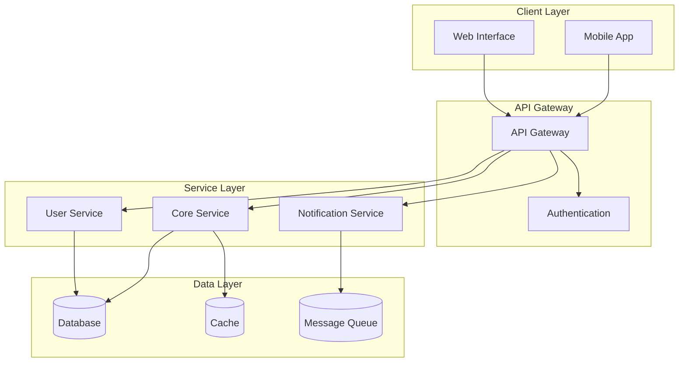
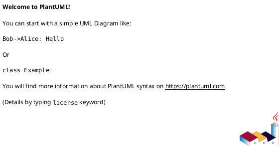

## Variables

- Folders, Files and Indexes are stored in `.ai-ley/shared/variables/folder-structure.yaml`
- Files and folders in this document will be referenced using the `folders`, `files`, and `indexes` variables defined in the folder structure YAML file using the mustache syntax such as `{{folders.plan}}`.

## References

- See the `.ai-ley/shared/global-instructions.md` file for global instructions that apply to all commands.
- Reference applicable personas in `{{folders.personas}}` and instructions in `{{folders.instructions}}` as needed.
- In the event of conflicting information utilize the `.ai-ley/shared/conflict-resolution.md` guidelines.

# Instruction

Evaluate the corpus and synthesize a production-ready system design:

- **Inputs:** `{{files.requirements}}`, `{{files.plan}}`, all files in `{{folders.personas}}`, `{{folders.instructions}}`.
- **Outputs:**
  1. A **Design Document** at `{{folders.plan}}/architecture/design.md`.
  2. An **updated** `{{files.requirements}}` with design-specific details merged in (in-place update).
  3. **Standalone PlantUML files** in `{{folders.plan}}/architecture/diagrams/` for complex diagrams.

Operate deterministically. If information is missing, **state minimal assumptions** and proceed.

## Pre-Analysis: Context Intelligence

Before designing, perform intelligent context analysis:

### Project Type Detection

- **Auto-detect project type** from requirements keywords:
  - `web-app`: UI/UX, frontend, responsive, browser
  - `api`: REST, GraphQL, microservices, endpoints
  - `mobile`: iOS, Android, native, React Native
  - `ml-pipeline`: machine learning, training, inference, data
  - `infrastructure`: deployment, DevOps, CI/CD, cloud
  - `data-platform`: ETL, analytics, warehouse, streaming

### Complexity Assessment

- **Simple**: Single service, basic CRUD, minimal integrations
- **Moderate**: Multiple services, external APIs, moderate scale
- **Complex**: Distributed system, high scale, multiple domains
- **Enterprise**: Multi-tenant, compliance, complex workflows

### Stakeholder Mapping

- **Primary Users**: Extracted from personas and requirements
- **Technical Stakeholders**: Development, operations, security teams
- **Business Stakeholders**: Product, leadership, compliance
- **External Stakeholders**: Partners, regulators, vendors

## Operating Rules

- Favor **simplicity with extensibility**; avoid unnecessary components.
- Maintain **traceability**: map each requirement `R-###` to one or more design elements `D-###` and interfaces `I-###`.
- Use **ISO dates**, explicit time zones, and units.
- No placeholders like “TBD” unless unavoidable; justify briefly.
- Keep sensitive data out of docs; reference secret managers and policy controls instead.
- For diagrams, emit **PlantUML** and **Mermaid** snippets so teams can choose either.

---

## Deliverable 1 — Design Document (write to {{folders.plan}}/architecture/design.md)

Produce **exactly** the structure below.

# System Design — {{project_or_product_name}}

> Date: {{iso_date}} | Owner: Architecture | Sources: {{files.requirements}}, {{files.plan}}, {{folders.personas}}, {{folders.instructions}}

## 1) Context & Goals

- Business/mission context, success criteria, key drivers.
- **Top 5 requirements (R-###)** this design optimizes for.

## 2) Assumptions & Constraints

- Assumptions (explicit, minimal).
- Constraints: tech, compliance, budget, timeline, skills.

## 3) Non-Functional Requirements (NFRs)

- Performance, scalability, availability/SLOs, reliability, security, privacy, accessibility, operability, cost.

## 4) Logical Architecture

- Components and responsibilities; contracts between them.
- **Architectural Patterns Applied**: Document which patterns are used and why (MVC, CQRS, Event-Driven, Microservices, etc.)
- **Design Decisions**: Key architectural decisions with trade-offs considered

### Architecture Diagrams

**System Context Diagram:**

```plantuml
@startuml SystemContext
!include https://raw.githubusercontent.com/plantuml-stdlib/C4-PlantUML/master/C4_Context.puml

title System Context Diagram for {{project_or_product_name}}

Person(user, "User", "Primary system user")
System(system, "{{project_or_product_name}}", "Core system")
System_Ext(external, "External System", "Third-party integration")

Rel(user, system, "Uses")
Rel(system, external, "Integrates with")
@enduml
```

**Container Diagram:**

```plantuml
@startuml Containers
!include https://raw.githubusercontent.com/plantuml-stdlib/C4-PlantUML/master/C4_Container.puml

title Container Diagram for {{project_or_product_name}}

Person(user, "User")
System_Boundary(system, "{{project_or_product_name}}") {
    Container(web, "Web Application", "React/Next.js", "User interface")
    Container(api, "API Application", "Node.js/Express", "Business logic")
    Container(db, "Database", "PostgreSQL", "Data storage")
}

Rel(user, web, "Uses", "HTTPS")
Rel(web, api, "Calls", "REST/GraphQL")
Rel(api, db, "Reads/Writes", "SQL")
@enduml
```

**Alternative Visualization (Mermaid):**



- **Design Elements (D-###)** list with short rationale and pattern justification.

## 5) Data Architecture

- Canonical models, schemas, retention/lineage, PII handling.
- Read/write patterns, indexing/partitioning, backup/DR.

## 6) Interface Contracts (I-###)

- External/internal APIs, events, webhooks, file exchanges.
- For each interface: purpose, method/topic, request/response schema, status codes, idempotency, rate limits, authN/Z.

## 7) Operational & Deployment View

### Environment Strategy

- **Development**: Local development with Docker Compose
- **Staging**: Production-like environment for integration testing
- **Production**: High-availability deployment with blue-green or canary strategies

### CI/CD Pipeline Architecture

```plantuml
@startuml CICD
!define DEVICONS https://raw.githubusercontent.com/tupadr3/plantuml-icon-font-sprites/master/devicons
!include DEVICONS/git.puml
!include DEVICONS/docker.puml

title CI/CD Pipeline Flow

actor Developer
participant "Git Repository" as Git
participant "CI/CD Pipeline" as Pipeline
participant "Container Registry" as Registry
participant "Staging Environment" as Staging
participant "Production Environment" as Prod

Developer -> Git: Push code
Git -> Pipeline: Trigger build
Pipeline -> Pipeline: Run tests\n(Unit, Integration, E2E)
Pipeline -> Pipeline: Security scans\n(SAST, SCA, Container)
Pipeline -> Registry: Push container
Pipeline -> Staging: Deploy & test
Pipeline -> Prod: Deploy (approval gate)
@enduml
```

### Infrastructure Topology

- **Cloud Provider**: AWS/Azure/GCP with multi-region deployment
- **Container Orchestration**: Kubernetes with Helm charts
- **Service Mesh**: Istio/Linkerd for inter-service communication
- **Load Balancing**: Application Load Balancer with SSL termination
- **Auto-scaling**: Horizontal Pod Autoscaler (HPA) and Vertical Pod Autoscaler (VPA)

### Observability Stack (Three Pillars)

- **Metrics**:
  - Prometheus for metrics collection
  - Grafana for visualization and alerting
  - Custom business metrics and SLI/SLO monitoring
- **Logging**:
  - Structured logging with correlation IDs
  - ELK Stack (Elasticsearch, Logstash, Kibana) or EFK (Fluentd)
  - Log aggregation with retention policies
- **Distributed Tracing**:
  - Jaeger or Zipkin for request flow visualization
  - OpenTelemetry for standardized instrumentation
  - Performance bottleneck identification

### Configuration & Secret Management

- **Configuration**: Environment-specific configs with validation
- **Secrets**: HashiCorp Vault, AWS Secrets Manager, or Kubernetes secrets
- **Feature Flags**: LaunchDarkly, Flagsmith, or custom solution for gradual rollouts

## 8) Security & Compliance

### Threat Modeling (STRIDE Analysis)

- **Spoofing**: Identity verification and authentication controls
- **Tampering**: Data integrity and validation mechanisms
- **Repudiation**: Audit logging and non-repudiation controls
- **Information Disclosure**: Encryption and access controls
- **Denial of Service**: Rate limiting and resilience mechanisms
- **Elevation of Privilege**: Authorization and least privilege principles

### Security Controls Framework

- **Authentication & Authorization**:
  - Multi-factor authentication (MFA) implementation
  - Role-based access control (RBAC) with principle of least privilege
  - OAuth 2.0/OpenID Connect for federated identity
  - Session management and timeout policies
- **Data Protection**:
  - Encryption at rest (AES-256) and in transit (TLS 1.3+)
  - Key management and rotation policies
  - PII identification, classification, and handling procedures
  - Data retention and deletion policies (GDPR/CCPA compliance)
- **Application Security**:
  - Input validation and sanitization (OWASP Top 10 coverage)
  - SQL injection and XSS prevention
  - Content Security Policy (CSP) implementation
  - Dependency scanning and vulnerability management
- **Infrastructure Security**:
  - Network segmentation and zero-trust architecture
  - Container security scanning and runtime protection
  - Infrastructure as Code (IaC) security scanning
  - Secrets management (HashiCorp Vault, AWS Secrets Manager)
- **DevSecOps Integration**:
  - Static Application Security Testing (SAST) in CI/CD
  - Dynamic Application Security Testing (DAST) for running applications
  - Software Composition Analysis (SCA) for dependencies
  - Security code reviews and threat modeling in design phase

### Compliance Requirements

- **Regulatory Standards**: GDPR, CCPA, HIPAA, SOX (as applicable)
- **Industry Standards**: ISO 27001, SOC 2 Type II, PCI DSS (if applicable)
- **Organizational Policies**: Company security standards and frameworks

## 9) Performance & Capacity Model

- Workload assumptions, SLOs, target P95 latencies, throughput, headroom.
- Capacity math and cost envelope; vertical/horizontal scaling plan.

## 10) Failure Modes & Resilience

- Single points of failure, retries/backoff, circuit breakers, bulkheads, DR patterns, graceful degradation.

## 11) Sequence Scenarios (key flows)



## 12) Alternatives Considered

### Architecture Alternatives

**Option A: Monolithic Architecture**

- **Pros**: Simpler deployment, easier debugging, lower operational complexity
- **Cons**: Scaling limitations, technology lock-in, team coordination challenges
- **Best For**: Small teams, simple applications, rapid prototyping

**Option B: Microservices Architecture**

- **Pros**: Independent scaling, technology diversity, team autonomy
- **Cons**: Operational complexity, network latency, data consistency challenges
- **Best For**: Large teams, complex domains, high-scale requirements

**Option C: Modular Monolith**

- **Pros**: Balance of simplicity and modularity, easier migration path
- **Cons**: Potential for tight coupling, shared database challenges
- **Best For**: Medium-sized teams, evolving requirements, future microservices migration

### Technology Stack Alternatives

**Database**: PostgreSQL vs. MongoDB vs. DynamoDB
**Backend**: Node.js vs. Python vs. Go vs. Java
**Frontend**: React vs. Vue vs. Angular vs. Svelte
**Infrastructure**: Kubernetes vs. Serverless vs. Traditional VMs

### **Recommendation**: [Selected Option]

**Justification**: Based on team expertise, scalability requirements, operational constraints, and long-term strategic goals.

### Innovation Opportunities

- **AI/ML Integration**: Opportunities for intelligent automation and insights
- **Edge Computing**: Benefits of moving compute closer to users
- **Blockchain/Web3**: Potential for decentralization and trust mechanisms
- **IoT Integration**: Connected device opportunities and challenges

## 13) Risks & Mitigations

| ID  | Risk | Likelihood | Impact | Mitigation | Owner | Trigger |
| --- | ---- | ---------- | ------ | ---------- | ----- | ------- |

## 14) Implementation Roadmap

- Phases, milestones (ISO dates), owners; dependency notes.
- Feature flags and migration/cutover strategy.

## 15) Traceability

| Req ID | Design Element(s) | Interface(s) | Notes |
| ------ | ----------------- | ------------ | ----- |
| R-001  | D-001, D-004      | I-002        |       |

## 16) Open Questions

- List with proposed resolution owners/date.

---

## Deliverable 2 — Update Requirements In-Place ({{files.requirements}})

Merge design-specific detail into the requirements with **surgical edits**, preserving intent and numbering.

### Update Strategy

- **Insert a new section**: `## Design-Specific Requirements` after the existing NFRs (or near the end if no NFRs).
- For each `D-###` and `I-###`, add precise, testable requirements. Example:
  - **R-DS-### (maps D-###/I-###):** “The `<API>` SHALL support idempotent POST with `Idempotency-Key` header; duplicate requests MUST return the original response within 2s.”
- **Augment NFRs** with measurable targets (e.g., “P95 latency ≤ 300 ms at 200 RPS, error rate < 0.2%”).
- **Add Acceptance Criteria** bullets under affected requirements.
- **Versioning:** bump `Requirements Version` (semver); add changelog entry with ISO date.
- **Traceability:** add a brief `Traceability` table mapping `R-### ↔ D-###/I-###`.

### Patch Rules

- Do not remove original requirements; clarify with sub-bullets if ambiguous.
- If conflicts arise, keep both and add a **Conflict Note** plus a suggested resolution in `{{files.suggestions}}` (if that file exists).
- Maintain consistent numbering; if missing, auto-number `R-###` by heading order.

---

## Synthesis Procedure (internal)

1. **Parse & Normalize:** Extract goals, constraints, NFRs, acceptance criteria, personas’ key journeys, plan milestones, and instruction runbooks.
2. **Derive Design:** Choose minimal architecture that satisfies requirements with headroom; define D-### and I-### artifacts.
3. **Quantify NFRs:** Turn qualitative statements into measurable targets; compute initial capacity numbers and budgets.
4. **Author Design Doc:** Populate all sections exactly as templated above with evidence-backed rationale.
5. **Requirements Update:** Insert `Design-Specific Requirements`, acceptance criteria, and traceability; bump version + changelog.
6. **Quality Gate:** Ensure items below are true; else add a note with rationale:
   - ✅ Each critical `R-###` maps to ≥1 `D-###` and ≥1 `I-###`.
   - ✅ All NFRs have numeric targets and testability.
   - ✅ No contradictions with the existing plan milestones and personas.
   - ✅ Security, privacy, and accessibility addressed with concrete controls.
   - ✅ **Scalability**: Architecture supports 10x current load projections.
   - ✅ **Maintainability**: Code organization supports team scaling and knowledge transfer.
   - ✅ **Observability**: All critical paths have monitoring, logging, and alerting.
   - ✅ **Disaster Recovery**: RPO/RTO targets defined with tested recovery procedures.
   - ✅ **Cost Optimization**: Resource usage monitored with cost controls and budgets.
   - ✅ **Compliance**: All regulatory and organizational requirements addressed.

**Design Review Checklist:**

- [ ] Architecture Review Board (ARB) approval for enterprise changes
- [ ] Security review completed with threat model validation
- [ ] Performance benchmarks established and validated
- [ ] Operational readiness assessment completed
- [ ] Documentation review for completeness and accuracy

7. **Write Files:**
   - Design → `{{folders.plan}}/architecture/design.md`
   - Updated Requirements → `{{files.requirements}}` (in-place)

## Output Rules

- Keep prose concise, scannable, and evidence-backed.
- Use ISO dates/time zones and explicit units.
- Include at least one **creative alternative** for a major decision.
- Avoid placeholders like “TBD” unless justified.
