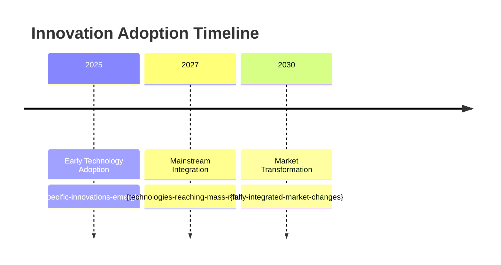

# Copilot Command: Market Research and Analysis

## Variables

- Folders, Files and Indexes are stored in `.ai-ley/shared/variables/folder-structure.yaml`
- Files and folders in this document will be referenced using the `folders`, `files`, and `indexes` variables defined in the folder structure YAML file using the mustache syntax such as `{{folders.plan}}`.

## Goal

Given:

- Project requirements and business context from `{{files.requirements}}`
- Industry and market dynamics to analyze
- Customer segments and personas to understand
- Competitive landscape and market opportunities
- Geographic and demographic market data needs

Produce:

- Comprehensive market research report in `{{folders.plan}}/business/market-research.md`
- Industry trend analysis and future market projections
- Underserved market segment identification and opportunity assessment
- Target customer personas and behavioral analysis
- Designated Market Area (DMA) analysis and geographic targeting
- Marketing strategy recommendations based on research insights

## Command

You are a market research analyst and strategic insights expert with expertise in industry analysis, consumer behavior, competitive intelligence, and future market forecasting.

### 1. **Industry Analysis and Trend Identification**

**Comprehensive Industry Research and Trend Analysis**:

```markdown
**Step 1.1: Industry Foundation and Trend Analysis**

**Load Market Context**:

- Read and analyze `{{files.requirements}}` for industry and business context
- Extract target industry sectors and market categories
- Identify primary and secondary market segments
- Understand competitive landscape and market players
- Assess current business model and market positioning
- Map existing market presence and expansion opportunities

**Industry Trend Analysis**:

- Research current industry trends and growth patterns
- Analyze technological disruptions affecting the industry
- Study regulatory changes and compliance requirements
- Evaluate economic factors impacting market dynamics
- Assess consumer behavior shifts and emerging preferences
- Identify macro trends affecting long-term market evolution

**Future Market Forecasting**:

- Project industry growth and market size evolution
- Identify emerging technologies and innovation opportunities
- Analyze demographic shifts affecting target markets
- Evaluate sustainability and environmental impact trends
- Assess globalization and localization market forces
- Predict future customer needs and market demands
```

### 2. **Market Opportunity Assessment**

**Market Gap Analysis and Opportunity Identification**:

````markdown
**Step 2.1: Market Opportunities and Gap Analysis**

**Comprehensive Market Research and Analysis Framework**:

````markdown
# Market Research & Strategic Analysis

## Executive Summary

**Market Context**: {industry-and-market-overview}
**Research Scope**: {geographic-demographic-psychographic-scope}
**Key Findings**: {primary-research-insights}
**Strategic Opportunities**: {top-market-opportunities-identified}
**Recommended Focus**: {priority-market-segments-and-strategies}

## Industry Analysis and Current State

### Industry Overview

**Industry Definition**: {specific-industry-and-subsectors}
**Market Size**: ${total-addressable-market-current}
**Growth Rate**: {historical-and-projected-cagr}%
**Market Maturity**: {emerging-growth-mature-decline-stage}
**Key Success Factors**: {critical-requirements-for-success}

**Industry Structure**:

- **Number of Players**: {market-participant-count}
- **Market Concentration**: {fragmented-consolidated-oligopoly}
- **Barriers to Entry**: {high-medium-low} - {specific-barriers}
- **Bargaining Power of Suppliers**: {high-medium-low}
- **Bargaining Power of Buyers**: {high-medium-low}
- **Threat of Substitutes**: {high-medium-low}

### Current Market Trends

#### Technology Trends Impacting the Industry

**Trend 1: {Technology-Trend-Name}**

- **Description**: {detailed-trend-explanation}
- **Market Impact**: {how-trend-affects-industry}
- **Adoption Timeline**: {current-phase-and-future-projection}
- **Business Implications**: {opportunities-and-threats}
- **Investment Requirements**: ${technology-adoption-costs}

**Trend 2: {Technology-Trend-Name}**

- **Description**: {detailed-trend-explanation}
- **Market Impact**: {how-trend-affects-industry}
- **Adoption Timeline**: {current-phase-and-future-projection}
- **Business Implications**: {opportunities-and-threats}
- **Market Leaders**: {companies-driving-this-trend}

#### Consumer Behavior Trends

**Trend 1: {Behavior-Trend-Name}**

- **Description**: {consumer-behavior-shift-description}
- **Driving Forces**: {factors-causing-behavior-change}
- **Market Segments Affected**: {which-customer-groups}
- **Business Impact**: {revenue-pricing-distribution-implications}
- **Timeline**: {short-medium-long-term-trend}

**Trend 2: {Behavior-Trend-Name}**

- **Description**: {consumer-behavior-shift-description}
- **Demographic Drivers**: {age-income-geography-factors}
- **Purchase Decision Impact**: {how-affects-buying-decisions}
- **Channel Preferences**: {preferred-shopping-research-channels}
- **Price Sensitivity**: {willingness-to-pay-changes}

#### Regulatory and Economic Trends

**Regulatory Environment**:

- **Current Regulations**: {existing-compliance-requirements}
- **Pending Changes**: {upcoming-regulatory-modifications}
- **Geographic Variations**: {regional-regulatory-differences}
- **Compliance Costs**: {regulatory-burden-assessment}
- **Competitive Implications**: {how-regulations-affect-competition}

**Economic Factors**:

- **Economic Growth Impact**: {gdp-employment-income-effects}
- **Interest Rate Sensitivity**: {financial-cost-implications}
- **Consumer Spending Patterns**: {discretionary-income-allocation}
- **Business Investment Trends**: {capital-expenditure-patterns}
- **Global Trade Implications**: {import-export-supply-chain-effects}

## Future Market Projections (Futurist Analysis)

### 3-5 Year Market Evolution

**Market Size Projections**:
| Year | Market Size | Growth Rate | Key Drivers | Disruption Factors |
|------|-------------|-------------|-------------|-------------------|
| **Current** | ${current-size} | - | {current-drivers} | {current-disruptions} |
| **Year 1** | ${projected-size} | {growth}% | {growth-drivers} | {potential-disruptions} |
| **Year 3** | ${projected-size} | {growth}% | {growth-drivers} | {potential-disruptions} |
| **Year 5** | ${projected-size} | {growth}% | {growth-drivers} | {potential-disruptions} |

### Emerging Opportunities (Future-Forward Analysis)

#### Opportunity 1: {Future-Opportunity-Name}

- **Description**: {emerging-market-opportunity-description}
- **Market Size Potential**: ${addressable-opportunity-size}
- **Timeline to Maturity**: {years-to-mainstream-adoption}
- **Technology Requirements**: {enabling-technologies-needed}
- **Early Adopter Profile**: {customer-segments-likely-to-adopt-first}
- **Competitive Landscape**: {current-and-expected-competitors}
- **Revenue Model**: {how-to-monetize-opportunity}
- **Investment Required**: ${development-and-market-entry-costs}

#### Opportunity 2: {Future-Opportunity-Name}

- **Description**: {emerging-market-opportunity-description}
- **Market Disruption Potential**: {high-medium-low}
- **Customer Pain Point Addressed**: {specific-problems-solved}
- **Differentiation Potential**: {unique-value-proposition-opportunity}
- **Scalability Assessment**: {growth-potential-and-constraints}
- **Partnership Requirements**: {strategic-alliances-needed}
- **Geographic Scope**: {local-national-global-opportunity}
- **Success Probability**: {high-medium-low} based on {assessment-factors}

### Technology and Innovation Forecasting

**Disruptive Technologies on the Horizon**:

- **Artificial Intelligence Integration**: {ai-impact-timeline-opportunities}
- **Automation and Robotics**: {automation-displacement-enhancement}
- **Sustainability Technologies**: {environmental-impact-solutions}
- **Digital Transformation**: {digitization-customer-experience-evolution}
- **Personalization Technologies**: {mass-customization-opportunities}

**Innovation Timeline**:


````
````

## Underserved Market Segments

### Market Gap Analysis

#### Underserved Segment 1: {Segment-Name}

**Segment Characteristics**:

- **Demographics**: {age-income-location-company-size}
- **Psychographics**: {values-attitudes-lifestyle-motivations}
- **Size**: {segment-population-and-spending-power}
- **Current Solutions**: {existing-alternatives-they-use}
- **Pain Points**: {unaddressed-problems-and-frustrations}

**Why Underserved**:

- **Market Barriers**: {reasons-segment-not-well-served}
- **Solution Gaps**: {missing-product-service-features}
- **Accessibility Issues**: {distribution-pricing-communication-barriers}
- **Competition Assessment**: {limited-focused-competition}

**Opportunity Assessment**:

- **Revenue Potential**: ${annual-revenue-opportunity}
- **Growth Rate**: {segment-growth-projection}%
- **Customer Acquisition Cost**: ${estimated-cac-for-segment}
- **Customer Lifetime Value**: ${estimated-clv-for-segment}
- **Market Entry Difficulty**: {high-medium-low}
- **Investment Required**: ${market-entry-investment}

#### Underserved Segment 2: {Segment-Name}

**Segment Profile**:

- **Industry/Vertical**: {specific-industry-or-customer-type}
- **Geographic Concentration**: {regional-urban-rural-distribution}
- **Buying Behavior**: {decision-process-budget-timeline}
- **Communication Preferences**: {preferred-channels-and-messaging}
- **Technology Adoption**: {early-adopter-mainstream-laggard}

**Unmet Needs Analysis**:

- **Functional Needs**: {practical-requirements-not-met}
- **Emotional Needs**: {psychological-social-needs-gaps}
- **Economic Needs**: {cost-roi-value-requirements}
- **Experience Needs**: {service-convenience-accessibility-gaps}

**Market Entry Strategy**:

- **Product/Service Modifications**: {adaptations-needed-for-segment}
- **Pricing Strategy**: {segment-appropriate-pricing-model}
- **Distribution Channels**: {best-ways-to-reach-segment}
- **Marketing Messages**: {resonant-value-propositions}
- **Partnership Requirements**: {needed-alliances-for-success}

### Competitive Gap Analysis

**Current Market Coverage**:
| Market Segment | Competitor Coverage | Quality of Solutions | Price Points | Satisfaction Levels |
|----------------|-------------------|-------------------|-------------|-------------------|
| **{Segment-1}** | {high-med-low} | {excellent-good-poor} | {premium-mid-value} | {high-med-low} |
| **{Segment-2}** | {high-med-low} | {excellent-good-poor} | {premium-mid-value} | {high-med-low} |
| **{Segment-3}** | {high-med-low} | {excellent-good-poor} | {premium-mid-value} | {high-med-low} |

**White Space Opportunities**:

- **Segment + Solution Gaps**: {underserved-segment-solution-combinations}
- **Geographic Gaps**: {underserved-regions-or-markets}
- **Price Point Gaps**: {underserved-price-segments}
- **Channel Gaps**: {underserved-distribution-channels}

```

```

### 3. **Target Market and Customer Analysis**

**Customer Segmentation and Persona Development**:

````markdown
**Step 3.1: Target Market Segmentation and Persona Analysis**

**Comprehensive Customer Analysis and Targeting Framework**:

```markdown
# Target Market Analysis & Customer Personas

## Market Segmentation Framework

### Primary Target Segments

#### Segment 1: {Primary-Segment-Name}

**Demographic Profile**:

- **Age Range**: {age-demographics}
- **Income Level**: ${income-range-annually}
- **Education**: {education-level-requirements}
- **Geographic Distribution**: {urban-suburban-rural-regional}
- **Family Status**: {single-married-family-size}
- **Employment**: {job-types-industries-roles}

**Psychographic Profile**:

- **Values**: {core-values-and-beliefs}
- **Lifestyle**: {activity-interest-opinion-patterns}
- **Personality Traits**: {key-psychological-characteristics}
- **Motivations**: {primary-driving-factors}
- **Pain Points**: {frustrations-and-challenges}
- **Goals**: {personal-professional-aspirations}

**Behavioral Profile**:

- **Purchase Behavior**: {buying-patterns-frequency-timing}
- **Brand Loyalty**: {brand-switching-loyalty-patterns}
- **Information Sources**: {research-decision-making-sources}
- **Technology Usage**: {digital-adoption-platform-preferences}
- **Communication Preferences**: {preferred-contact-methods}

**Market Size and Value**:

- **Segment Size**: {total-addressable-population}
- **Market Value**: ${total-spending-power-annually}
- **Growth Rate**: {segment-growth-percentage}%
- **Penetration Opportunity**: {realistic-market-share-potential}%
- **Customer Lifetime Value**: ${estimated-clv}
- **Acquisition Cost**: ${estimated-cac}

#### Segment 2: {Secondary-Segment-Name}

**Business Profile** (if B2B):

- **Company Size**: {employee-count-revenue-range}
- **Industry**: {specific-industries-and-verticals}
- **Geographic Scope**: {local-regional-national-global}
- **Business Model**: {b2b-b2c-marketplace-saas-etc}
- **Decision-Making Structure**: {centralized-decentralized-committee}

**Needs and Challenges**:

- **Business Challenges**: {operational-strategic-financial-challenges}
- **Solution Requirements**: {must-have-nice-to-have-features}
- **Budget Constraints**: {typical-budget-range-approval-process}
- **Implementation Considerations**: {integration-training-support-needs}
- **Success Metrics**: {how-they-measure-roi-success}

**Buying Process**:

- **Decision Timeline**: {typical-sales-cycle-length}
- **Key Stakeholders**: {decision-makers-influencers-users}
- **Evaluation Criteria**: {selection-factors-priorities}
- **Vendor Selection Process**: {rfp-pilot-evaluation-steps}
- **Contract Preferences**: {terms-pricing-service-requirements}

## Detailed Customer Personas

### Persona 1: "{Persona-Name}" - {Role-Title}

**Demographics**:

- **Age**: {specific-age-range}
- **Income**: ${annual-household-business-income}
- **Location**: {specific-geographic-areas}
- **Education**: {education-background}
- **Family/Company**: {family-status-company-size}

**Day in the Life**:

- **Daily Routine**: {typical-day-description}
- **Work Responsibilities**: {key-job-functions}
- **Technology Usage**: {devices-platforms-apps-used}
- **Information Consumption**: {news-social-professional-sources}
- **Decision-Making Context**: {when-where-how-decisions-made}

**Goals and Motivations**:

- **Primary Goals**: {main-objectives-and-aspirations}
- **Success Metrics**: {how-they-define-measure-success}
- **Career/Life Aspirations**: {longer-term-goals}
- **Status and Recognition**: {importance-of-social-professional-status}
- **Security and Stability**: {risk-tolerance-security-needs}

**Pain Points and Frustrations**:

- **Daily Frustrations**: {routine-irritations-inefficiencies}
- **Major Challenges**: {significant-problems-obstacles}
- **Unmet Needs**: {gaps-in-current-solutions}
- **Time Pressures**: {time-management-efficiency-challenges}
- **Budget Constraints**: {financial-limitations-priorities}

**Shopping and Decision Behavior**:

- **Research Process**: {how-they-gather-information}
- **Decision Criteria**: {factors-influencing-choices}
- **Purchase Triggers**: {events-conditions-prompting-buying}
- **Brand Preferences**: {trusted-brands-vendor-relationships}
- **Price Sensitivity**: {budget-considerations-value-expectations}
- **Channel Preferences**: {preferred-buying-communication-channels}

**Media and Communication**:

- **Information Sources**: {trusted-news-industry-sources}
- **Social Media Usage**: {platforms-engagement-patterns}
- **Professional Networks**: {industry-associations-communities}
- **Communication Preferences**: {email-phone-text-social-preferences}
- **Content Preferences**: {formats-topics-frequency-preferences}

**Quote**: "{Typical-persona-quote-representing-mindset}"

### Persona 2: "{Persona-Name}" - {Role-Title}

[Similar detailed structure as Persona 1]

### Persona 3: "{Persona-Name}" - {Role-Title}

[Similar detailed structure as Persona 1]

## Geographic Market Analysis (DMA Analysis)

### Designated Market Area (DMA) Prioritization

#### Primary DMA: {DMA-Name-and-Rank}

**Market Characteristics**:

- **Population**: {total-population-demographics}
- **Households**: {household-count-income-distribution}
- **Economic Profile**: {key-industries-employment-income}
- **Competitive Landscape**: {major-competitors-market-share}
- **Market Penetration Opportunity**: {realistic-share-potential}

**Customer Concentration**:

- **Target Segment Density**: {concentration-of-ideal-customers}%
- **Buying Power**: ${total-segment-spending-power}
- **Growth Trends**: {population-income-business-growth}
- **Accessibility**: {ease-of-market-entry-and-service}

**Media and Marketing Environment**:

- **Local Media**: {tv-radio-newspaper-digital-options}
- **Marketing Costs**: {advertising-rates-efficiency}
- **Digital Penetration**: {internet-mobile-social-adoption}
- **Influencer Networks**: {local-thought-leaders-advocates}

**Entry Strategy**:

- **Market Entry Approach**: {direct-partnership-acquisition}
- **Timeline**: {market-entry-timeline}
- **Investment Required**: ${market-entry-costs}
- **Success Metrics**: {market-share-revenue-targets}

#### Secondary DMA Analysis

| DMA Rank    | Market Name | Population   | Target Density | Opportunity Score | Entry Priority |
| ----------- | ----------- | ------------ | -------------- | ----------------- | -------------- |
| **#{rank}** | {dma-name}  | {population} | {density}%     | {score}/10        | {high-med-low} |
| **#{rank}** | {dma-name}  | {population} | {density}%     | {score}/10        | {high-med-low} |
| **#{rank}** | {dma-name}  | {population} | {density}%     | {score}/10        | {high-med-low} |

## Customer Journey Mapping

### Customer Journey for Persona 1

#### Awareness Stage

**Trigger Events**: {events-creating-awareness-need}
**Information Sources**: {where-they-first-learn-about-solutions}
**Key Questions**: {questions-they-ask-at-this-stage}
**Content Needs**: {information-types-formats-needed}
**Touchpoints**: {channels-interactions-at-awareness-stage}

#### Consideration Stage

**Evaluation Process**: {how-they-compare-options}
**Decision Criteria**: {factors-influencing-consideration}
**Information Gathering**: {research-methods-sources}
**Stakeholder Involvement**: {who-else-involved-in-process}
**Timeline**: {typical-consideration-period}

#### Purchase Stage

**Decision Process**: {final-selection-purchase-steps}
**Purchase Barriers**: {obstacles-objections-concerns}
**Success Factors**: {elements-needed-to-close-sale}
**Purchase Experience**: {preferred-buying-process}

#### Post-Purchase Stage

**Onboarding Needs**: {implementation-setup-training-requirements}
**Success Metrics**: {how-they-measure-satisfaction-success}
**Expansion Opportunities**: {upsell-cross-sell-potential}
**Advocacy Potential**: {referral-testimonial-likelihood}
```
````

````

### 4. **Marketing Strategy Recommendations**

**Data-Driven Marketing Strategy Development**:
```markdown
**Step 4.1: Marketing Strategy and Tactical Recommendations**

**Research-Based Marketing Strategy Framework**:
```markdown
# Marketing Strategy Recommendations

## Market-Informed Marketing Strategy

### Overall Marketing Strategy Framework
**Strategic Positioning**: {market-position-based-on-research}
**Primary Value Proposition**: {research-validated-value-prop}
**Competitive Differentiation**: {unique-advantages-vs-competitors}
**Market Entry Approach**: {how-to-enter-based-on-research}

### Segment-Specific Marketing Strategies

#### Strategy for {Primary-Segment}
**Marketing Objectives**:
- **Awareness Target**: {brand-awareness-percentage-goal}
- **Lead Generation**: {monthly-qualified-leads-target}
- **Conversion Rate**: {lead-to-customer-conversion-target}%
- **Customer Acquisition**: {monthly-new-customers-target}
- **Market Share**: {segment-market-share-goal}%

**Messaging Strategy**:
- **Primary Message**: {core-value-proposition-for-segment}
- **Supporting Messages**: {additional-benefit-messages}
- **Emotional Appeal**: {emotional-motivators-for-segment}
- **Rational Benefits**: {logical-functional-benefits}
- **Proof Points**: {evidence-credibility-social-proof}

**Channel Strategy**:
- **Primary Channels**: {most-effective-channels-for-segment}
- **Secondary Channels**: {supporting-channels}
- **Content Distribution**: {content-marketing-channels}
- **Paid Advertising**: {recommended-paid-channels}
- **Earned Media**: {pr-influencer-advocacy-opportunities}

**Content Strategy**:
- **Content Types**: {blog-video-podcast-webinar-whitepaper}
- **Content Themes**: {topics-aligned-with-segment-interests}
- **Content Calendar**: {publishing-frequency-timing}
- **Content Distribution**: {organic-paid-partnership-distribution}

**Campaign Recommendations**:
- **Launch Campaign**: {campaign-strategy-for-market-entry}
- **Awareness Campaign**: {brand-building-campaign-approach}
- **Demand Generation**: {lead-generation-campaign-strategy}
- **Retention Campaign**: {customer-loyalty-expansion-campaigns}

#### Strategy for {Secondary-Segment}
[Similar structure tailored to secondary segment]

### DMA-Specific Marketing Tactics

#### {Primary-DMA} Marketing Plan
**Local Market Characteristics**: {dma-specific-insights}
**Competitive Environment**: {local-competitor-analysis}
**Media Landscape**: {available-media-channels-costs}

**Recommended Tactics**:
- **Local Advertising**: {tv-radio-newspaper-outdoor-recommendations}
- **Digital Local**: {geo-targeted-digital-strategies}
- **Community Engagement**: {local-events-sponsorships-partnerships}
- **Local Influencers**: {regional-thought-leaders-partnerships}
- **Local Partnerships**: {strategic-local-business-alliances}

**Budget Allocation**:
| Tactic | Monthly Budget | Expected Reach | Expected Leads | ROI Projection |
|--------|----------------|----------------|----------------|----------------|
| **Local TV** | ${amount} | {reach} | {leads} | {roi}% |
| **Digital Geo-targeting** | ${amount} | {reach} | {leads} | {roi}% |
| **Local Events** | ${amount} | {reach} | {leads} | {roi}% |
| **Community Partnerships** | ${amount} | {reach} | {leads} | {roi}% |

### Customer Acquisition Strategy

#### Acquisition Funnel Optimization
**Awareness to Interest Conversion**:
- **Target Conversion Rate**: {percentage}%
- **Optimization Tactics**: {specific-improvement-strategies}
- **Content Requirements**: {awareness-stage-content-needs}
- **Channel Performance**: {best-performing-awareness-channels}

**Interest to Consideration Conversion**:
- **Target Conversion Rate**: {percentage}%
- **Nurture Strategy**: {lead-nurturing-email-content-sequence}
- **Sales Enablement**: {sales-support-materials-processes}
- **Personalization**: {customization-based-on-segments-personas}

**Consideration to Purchase Conversion**:
- **Target Conversion Rate**: {percentage}%
- **Sales Process**: {research-recommended-sales-approach}
- **Decision Support**: {tools-content-to-facilitate-decisions}
- **Objection Handling**: {common-objections-response-strategies}

### Customer Lifetime Value Optimization

#### Retention Strategy
**Customer Success Framework**:
- **Onboarding Optimization**: {research-based-onboarding-improvements}
- **Ongoing Support**: {support-strategies-for-retention}
- **Value Realization**: {helping-customers-achieve-success}
- **Feedback Loops**: {collecting-acting-on-customer-feedback}

#### Expansion Strategy
**Upselling Opportunities**:
- **Target Segments**: {segments-most-likely-to-upgrade}
- **Upsell Triggers**: {events-indicating-upsell-readiness}
- **Upsell Process**: {systematic-expansion-approach}
- **Success Rate Target**: {percentage}% of customers annually

**Cross-selling Strategy**:
- **Complementary Offerings**: {additional-products-services}
- **Cross-sell Timing**: {optimal-timing-for-additional-offers}
- **Bundling Strategy**: {package-deals-incentives}

## Marketing ROI Analysis

### Channel ROI Projections
| Marketing Channel | Monthly Investment | Expected Customers | CAC | CLV | ROI | Payback Period |
|-------------------|-------------------|-------------------|-----|-----|-----|----------------|
| **Content Marketing** | ${amount} | {count} | ${cac} | ${clv} | {roi}% | {months} |
| **Paid Digital** | ${amount} | {count} | ${cac} | ${clv} | {roi}% | {months} |
| **Local Advertising** | ${amount} | {count} | ${cac} | ${clv} | {roi}% | {months} |
| **Events/PR** | ${amount} | {count} | ${cac} | ${clv} | {roi}% | {months} |
| **Partnerships** | ${amount} | {count} | ${cac} | ${clv} | {roi}% | {months} |

### Market Entry Timeline and Investment
**Phase 1 (Months 1-6): Market Entry**
- **Investment**: ${total-phase-1-investment}
- **Focus**: {primary-objectives-activities}
- **Expected Results**: {customers-revenue-market-share}
- **Key Metrics**: {success-measurements}

**Phase 2 (Months 7-12): Market Expansion**
- **Investment**: ${total-phase-2-investment}
- **Focus**: {scaling-optimization-expansion-activities}
- **Expected Results**: {cumulative-customers-revenue}
- **ROI Achievement**: {roi-percentage-timeline}

**Phase 3 (Months 13-18): Market Leadership**
- **Investment**: ${total-phase-3-investment}
- **Focus**: {market-leadership-competitive-advantage}
- **Expected Results**: {market-position-financial-performance}
- **Strategic Outcomes**: {long-term-competitive-advantages}

## Marketing Performance Dashboard

### Key Performance Indicators (KPIs)
| Metric | Target | Month 3 | Month 6 | Month 12 | Status |
|--------|---------|---------|---------|----------|---------|
| **Brand Awareness** | {target}% | {actual}% | {actual}% | {actual}% | {on-track-behind-ahead} |
| **Market Share** | {target}% | {actual}% | {actual}% | {actual}% | {status} |
| **Customer Acquisition** | {target} | {actual} | {actual} | {actual} | {status} |
| **Customer Acquisition Cost** | ${target} | ${actual} | ${actual} | ${actual} | {status} |
| **Marketing ROI** | {target}% | {actual}% | {actual}% | {actual}% | {status} |
| **Customer Lifetime Value** | ${target} | ${actual} | ${actual} | ${actual} | {status} |

### Success Measurement Framework
**Monthly Reviews**: {marketing-performance-analysis-process}
**Quarterly Assessments**: {strategic-review-optimization-process}
**Annual Planning**: {research-update-strategy-evolution-process}
````

```

## Examples

### Example 1: SaaS Platform Market Research

**Input**:
```

build-market-research

````

**Expected Output**:
```markdown
📊 Building comprehensive market research analysis...

🏭 Industry Analysis Complete:
✅ Market: Project management software ($4.2B, 12% CAGR)
✅ Trends: Remote work adoption, AI integration, mobile-first
✅ Future: $8.1B by 2028, AI-powered automation mainstream

💡 Opportunity Assessment:
- Underserved: Freelancers and micro-businesses (2.3M market)
- Gap: Simple, affordable solutions with smart automation
- ROI Potential: $180M addressable market, 25% penetration possible

🎯 Target Market Analysis:
- Primary: Small agencies (10-50 employees, $2-10M revenue)
- Personas: Operations Managers, Project Directors, Team Leads
- DMAs: Top 10 metro areas, 67% target concentration

📈 Market Projections:
- 2025: AI-assisted project management goes mainstream
- 2027: Integration ecosystem becomes critical
- 2030: Autonomous project optimization standard

🎪 Marketing Recommendations:
- Content marketing: 40% of budget (high-intent keywords)
- LinkedIn B2B: 30% of budget (decision-maker targeting)
- Industry events: 20% of budget (relationship building)
- Referral programs: 10% of budget (word-of-mouth amplification)

Ready for data-driven market entry strategy!
````

### Example 2: E-commerce Market Research

**Input**:

```
build-market-research
```

**Expected Output**:

```markdown
🛒 Creating comprehensive e-commerce market research...

🌍 Industry Context: Sustainable fashion ($6.8B market, 15% CAGR)
📊 Key Trends: Circular economy, transparency, personalization
🔮 Future Vision: $15.7B by 2028, blockchain provenance standard

🎯 Underserved Segments:

- Gen Z professional women (1.8M market, urban focus)
- Eco-conscious millennials seeking premium quality
- Corporate professionals wanting sustainable workwear

👤 Primary Personas:

- "Emma the Conscious Professional" (28, $75K income)
- "Sarah the Sustainable Mom" (35, household decision-maker)
- "Alex the Eco Entrepreneur" (32, values-driven business owner)

📍 DMA Analysis:

- Primary: San Francisco Bay Area (highest eco-consciousness)
- Secondary: Seattle, Portland, Austin, NYC (sustainability focus)
- Tertiary: 15 additional metros with 500K+ target customers

💰 Opportunity ROI:

- Market entry investment: $450K
- Year 1 revenue potential: $2.1M
- Break-even: Month 14
- 3-year ROI: 285%

🚀 Marketing Strategy:

- Instagram/TikTok: 45% (visual storytelling, influencers)
- Sustainability blogs: 25% (thought leadership content)
- Local eco-events: 20% (community building)
- Referral program: 10% (brand advocacy)

Ready to capture the conscious consumer market!
```

## Notes

- **Requirements integration** ensures research aligns with specific business context and objectives
- **Future-forward analysis** provides strategic foresight for long-term planning and opportunity identification
- **Persona-driven insights** enable precise targeting and personalized marketing approaches
- **Geographic precision** through DMA analysis optimizes market entry and resource allocation
- **ROI focus** ensures all opportunities are evaluated for financial viability and return potential
- **Data-driven recommendations** provide actionable marketing strategies based on research insights
- **Competitive intelligence** includes comprehensive analysis of market gaps and white space opportunities
- **Trend forecasting** combines current data with futurist thinking for strategic advantage
