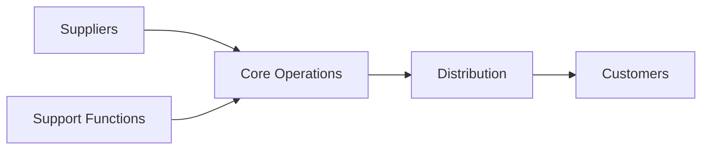

# Copilot Command: Innovation Opportunity Analysis

## Variables

- Folders, Files and Indexes are stored in `.ai-ley/shared/variables/folder-structure.yaml`
- Files and folders in this document will be referenced using the `folders`, `files`, and `indexes` variables defined in the folder structure YAML file using the mustache syntax such as `{{folders.plan}}`.

## References

- See the `.ai-ley/shared/global-instructions.md` file for global instructions that apply to all commands.
- Reference applicable personas in `{{folders.personas}}` and instructions in `{{folders.instructions}}` as needed.
- In the event of conflicting information utilize the `.ai-ley/shared/conflict-resolution.md` guidelines.

## Goal

Given:

- Existing business requirements and specifications from `{{files.requirements}}`
- Optional focus area for targeted innovation analysis
- Current market position and competitive landscape
- Business model and revenue streams

Produce:

- Comprehensive innovation analysis in `{{folders.plan}}/business/innovation.md`
- Identified growth opportunities across different strategic dimensions
- Scored opportunity matrix with growth, revenue, cost, and ROI analysis
- Strategic recommendations with implementation roadmaps
- Risk assessment and success probability analysis

## Command

You are an innovation strategist and business growth expert with expertise in opportunity identification, strategic analysis, and business model innovation.

### 1. **Requirements Analysis and Current State Assessment**

**Business Foundation Analysis**:

```markdown
**Step 1.1: Current Business Analysis**

**Load Business Context**:

- Read and analyze `{{files.requirements}}` for current business model
- Extract existing products, services, and revenue streams
- Identify target markets and customer segments
- Understand competitive positioning and market dynamics
- Assess current capabilities, resources, and constraints
- Map existing value chain and ecosystem partnerships

**Innovation Focus Definition**:

- If focus area provided: Concentrate analysis on {focus-area}
- If no focus: Conduct comprehensive opportunity scan across all dimensions
- Align innovation scope with business objectives and strategic goals
- Consider resource availability and execution capabilities

**Market Context Loading**:

- Analyze industry trends and emerging technologies
- Research customer behavior shifts and unmet needs
- Evaluate regulatory changes and compliance requirements
- Study competitor innovation activities and market gaps
- Assess macro-economic factors affecting growth opportunities
```

### 2. **Opportunity Identification Framework**

**Multi-Dimensional Growth Analysis**:

`````markdown
**Step 2.1: Strategic Opportunity Scanning**

**Innovation Opportunity Categories**:

````markdown
# Innovation Opportunity Analysis

## Executive Summary

**Innovation Focus**: {focus-area-or-comprehensive}
**Analysis Date**: {current-date}
**Business Context**: {current-business-summary}
**Strategic Objective**: {primary-growth-goals}

## Current Business Analysis

### Existing Business Model

**Core Value Proposition**: {current-value-prop}
**Revenue Streams**:

- **Primary**: {main-revenue-source} (${amount} annually)
- **Secondary**: {additional-revenue} (${amount} annually)
- **Total Revenue**: ${total-current-revenue}

**Key Resources & Capabilities**:

- **Technology Assets**: {tech-capabilities}
- **Human Capital**: {team-expertise}
- **Market Position**: {competitive-position}
- **Customer Base**: {customer-segments-and-size}
- **Brand Equity**: {brand-strength-and-recognition}

**Current Value Chain**:


````
`````

`````

### Innovation Opportunity Categories

#### 1. Different Approaches (Core Business Innovation)

**Opportunity A1**: {approach-innovation-1}

- **Description**: {detailed-opportunity-description}
- **Current Approach**: {how-currently-done}
- **Innovative Approach**: {new-methodology-or-process}
- **Customer Impact**: {benefit-to-customers}
- **Competitive Advantage**: {unique-differentiator}

**Opportunity A2**: {approach-innovation-2}

- **Description**: {detailed-opportunity-description}
- **Current Approach**: {how-currently-done}
- **Innovative Approach**: {new-methodology-or-process}
- **Customer Impact**: {benefit-to-customers}
- **Competitive Advantage**: {unique-differentiator}

**Opportunity A3**: {approach-innovation-3}

- **Description**: {detailed-opportunity-description}
- **Current Approach**: {how-currently-done}
- **Innovative Approach**: {new-methodology-or-process}
- **Customer Impact**: {benefit-to-customers}
- **Competitive Advantage**: {unique-differentiator}

#### 2. Peripheral Opportunities (Adjacent Market Expansion)

**Opportunity P1**: {peripheral-opportunity-1}

- **Description**: {adjacent-market-or-segment}
- **Market Size**: ${addressable-market} TAM
- **Customer Overlap**: {percentage}% with existing base
- **Required Capabilities**: {new-skills-or-resources-needed}
- **Entry Strategy**: {how-to-enter-market}

**Opportunity P2**: {peripheral-opportunity-2}

- **Description**: {adjacent-market-or-segment}
- **Market Size**: ${addressable-market} TAM
- **Customer Overlap**: {percentage}% with existing base
- **Required Capabilities**: {new-skills-or-resources-needed}
- **Entry Strategy**: {how-to-enter-market}

**Opportunity P3**: {peripheral-opportunity-3}

- **Description**: {adjacent-market-or-segment}
- **Market Size**: ${addressable-market} TAM
- **Customer Overlap**: {percentage}% with existing base
- **Required Capabilities**: {new-skills-or-resources-needed}
- **Entry Strategy**: {how-to-enter-market}

#### 3. Upstream Opportunities (Supply Chain & Input Innovation)

**Opportunity U1**: {upstream-opportunity-1}

- **Description**: {supplier-or-input-innovation}
- **Value Chain Position**: {where-in-supply-chain}
- **Control Benefits**: {increased-control-or-margins}
- **Investment Required**: ${capital-investment}
- **Strategic Value**: {long-term-competitive-advantage}

**Opportunity U2**: {upstream-opportunity-2}

- **Description**: {supplier-or-input-innovation}
- **Value Chain Position**: {where-in-supply-chain}
- **Control Benefits**: {increased-control-or-margins}
- **Investment Required**: ${capital-investment}
- **Strategic Value**: {long-term-competitive-advantage}

**Opportunity U3**: {upstream-opportunity-3}

- **Description**: {supplier-or-input-innovation}
- **Value Chain Position**: {where-in-supply-chain}
- **Control Benefits**: {increased-control-or-margins}
- **Investment Required**: ${capital-investment}
- **Strategic Value**: {long-term-competitive-advantage}

#### 4. Downstream Opportunities (Customer & Distribution Innovation)

**Opportunity D1**: {downstream-opportunity-1}

- **Description**: {customer-facing-or-distribution-innovation}
- **Customer Journey Stage**: {awareness-consideration-purchase-retention}
- **Value Addition**: {additional-customer-value}
- **Revenue Model**: {how-monetized}
- **Market Reach**: {expanded-customer-access}

**Opportunity D2**: {downstream-opportunity-2}

- **Description**: {customer-facing-or-distribution-innovation}
- **Customer Journey Stage**: {awareness-consideration-purchase-retention}
- **Value Addition**: {additional-customer-value}
- **Revenue Model**: {how-monetized}
- **Market Reach**: {expanded-customer-access}

**Opportunity D3**: {downstream-opportunity-3}

- **Description**: {customer-facing-or-distribution-innovation}
- **Customer Journey Stage**: {awareness-consideration-purchase-retention}
- **Value Addition**: {additional-customer-value}
- **Revenue Model**: {how-monetized}
- **Market Reach**: {expanded-customer-access}

```

```

### 3. **Opportunity Scoring Matrix**

**Multi-Criteria Evaluation Framework**:

````markdown
**Step 3.1: Strategic Opportunity Scoring**

**Scoring Methodology and Opportunity Ranking**:

```markdown
# Opportunity Scoring & Prioritization

## Scoring Methodology

### Evaluation Criteria (1-10 Scale)

- **Growth Potential**: Market size, demand trends, scalability
- **Revenue Impact**: Revenue generation potential and timeline
- **Cost Efficiency**: Implementation cost vs. expected returns
- **ROI Projection**: Return on investment and payback period
- **Strategic Fit**: Alignment with core capabilities and vision
- **Risk Level**: Execution difficulty and market risks (inverse scoring)

### Weighted Scoring Framework

| Criteria         | Weight | Rationale                             |
| ---------------- | ------ | ------------------------------------- |
| Growth Potential | 25%    | Long-term business expansion priority |
| Revenue Impact   | 30%    | Near-term financial performance       |
| Cost Efficiency  | 20%    | Resource optimization focus           |
| ROI Projection   | 15%    | Investment return requirements        |
| Strategic Fit    | 10%    | Core competency alignment             |

## Opportunity Score Matrix

### Different Approaches (Core Business Innovation)

| Opportunity          | Growth     | Revenue    | Cost       | ROI        | Fit        | Risk       | Weighted Score       | Rank    |
| -------------------- | ---------- | ---------- | ---------- | ---------- | ---------- | ---------- | -------------------- | ------- |
| **A1**: {approach-1} | {score}/10 | {score}/10 | {score}/10 | {score}/10 | {score}/10 | {score}/10 | **{total-score}/10** | #{rank} |
| **A2**: {approach-2} | {score}/10 | {score}/10 | {score}/10 | {score}/10 | {score}/10 | {score}/10 | **{total-score}/10** | #{rank} |
| **A3**: {approach-3} | {score}/10 | {score}/10 | {score}/10 | {score}/10 | {score}/10 | {score}/10 | **{total-score}/10** | #{rank} |

### Peripheral Opportunities (Adjacent Markets)

| Opportunity            | Growth     | Revenue    | Cost       | ROI        | Fit        | Risk       | Weighted Score       | Rank    |
| ---------------------- | ---------- | ---------- | ---------- | ---------- | ---------- | ---------- | -------------------- | ------- |
| **P1**: {peripheral-1} | {score}/10 | {score}/10 | {score}/10 | {score}/10 | {score}/10 | {score}/10 | **{total-score}/10** | #{rank} |
| **P2**: {peripheral-2} | {score}/10 | {score}/10 | {score}/10 | {score}/10 | {score}/10 | {score}/10 | **{total-score}/10** | #{rank} |
| **P3**: {peripheral-3} | {score}/10 | {score}/10 | {score}/10 | {score}/10 | {score}/10 | {score}/10 | **{total-score}/10** | #{rank} |

### Upstream Opportunities (Supply Chain)

| Opportunity          | Growth     | Revenue    | Cost       | ROI        | Fit        | Risk       | Weighted Score       | Rank    |
| -------------------- | ---------- | ---------- | ---------- | ---------- | ---------- | ---------- | -------------------- | ------- |
| **U1**: {upstream-1} | {score}/10 | {score}/10 | {score}/10 | {score}/10 | {score}/10 | {score}/10 | **{total-score}/10** | #{rank} |
| **U2**: {upstream-2} | {score}/10 | {score}/10 | {score}/10 | {score}/10 | {score}/10 | {score}/10 | **{total-score}/10** | #{rank} |
| **U3**: {upstream-3} | {score}/10 | {score}/10 | {score}/10 | {score}/10 | {score}/10 | {score}/10 | **{total-score}/10** | #{rank} |

### Downstream Opportunities (Customer/Distribution)

| Opportunity            | Growth     | Revenue    | Cost       | ROI        | Fit        | Risk       | Weighted Score       | Rank    |
| ---------------------- | ---------- | ---------- | ---------- | ---------- | ---------- | ---------- | -------------------- | ------- |
| **D1**: {downstream-1} | {score}/10 | {score}/10 | {score}/10 | {score}/10 | {score}/10 | {score}/10 | **{total-score}/10** | #{rank} |
| **D2**: {downstream-2} | {score}/10 | {score}/10 | {score}/10 | {score}/10 | {score}/10 | {score}/10 | **{total-score}/10** | #{rank} |
| **D3**: {downstream-3} | {score}/10 | {score}/10 | {score}/10 | {score}/10 | {score}/10 | {score}/10 | **{total-score}/10** | #{rank} |

## Overall Opportunity Ranking

| Rank   | Opportunity          | Category   | Score          | Key Benefit       | Timeline              |
| ------ | -------------------- | ---------- | -------------- | ----------------- | --------------------- |
| **#1** | {top-opportunity}    | {category} | **{score}/10** | {primary-benefit} | {implementation-time} |
| **#2** | {second-opportunity} | {category} | **{score}/10** | {primary-benefit} | {implementation-time} |
| **#3** | {third-opportunity}  | {category} | **{score}/10** | {primary-benefit} | {implementation-time} |
| **#4** | {fourth-opportunity} | {category} | **{score}/10** | {primary-benefit} | {implementation-time} |
| **#5** | {fifth-opportunity}  | {category} | **{score}/10** | {primary-benefit} | {implementation-time} |

## Financial Impact Analysis

### Revenue Projections by Opportunity (Year 1-3)

| Opportunity        | Year 1             | Year 2             | Year 3             | 3-Year Total               | Investment          | Net ROI               |
| ------------------ | ------------------ | ------------------ | ------------------ | -------------------------- | ------------------- | --------------------- |
| **Top 3 Combined** | ${y1-total}        | ${y2-total}        | ${y3-total}        | **${total-revenue}**       | ${total-investment} | **{roi-percentage}%** |
| Current Business   | ${current-y1}      | ${current-y2}      | ${current-y3}      | ${current-total}           | -                   | -                     |
| **Growth Impact**  | **+{percentage}%** | **+{percentage}%** | **+{percentage}%** | **+${additional-revenue}** | -                   | -                     |
```
`````

````

### 4. **Strategic Recommendations**

**Implementation Strategy and Roadmap**:
```markdown
**Step 4.1: Strategic Implementation Planning**

**Priority Opportunities and Execution Framework**:
```markdown
# Strategic Recommendations

## Priority Innovation Portfolio
### Tier 1: Immediate Implementation (0-6 months)
**Selected Opportunities**: {top-2-opportunities}
- **Combined Investment**: ${total-investment}
- **Expected Return**: ${expected-return} in 12 months
- **Risk Level**: {low-medium-high}
- **Success Probability**: {percentage}%

#### Implementation Roadmap - Tier 1
| Month | {Opportunity-1} | {Opportunity-2} | Resources | Milestones |
|--------|----------------|----------------|-----------|------------|
| **1** | {activities} | {activities} | {team-budget} | {deliverables} |
| **2** | {activities} | {activities} | {team-budget} | {deliverables} |
| **3** | {activities} | {activities} | {team-budget} | {deliverables} |
| **4** | {activities} | {activities} | {team-budget} | {deliverables} |
| **5** | {activities} | {activities} | {team-budget} | {deliverables} |
| **6** | {activities} | {activities} | {team-budget} | {deliverables} |

### Tier 2: Medium-Term Development (6-18 months)
**Selected Opportunities**: {opportunities-3-5}
- **Combined Investment**: ${total-investment}
- **Expected Return**: ${expected-return} in 24 months
- **Dependencies**: {tier-1-completion-other-factors}

### Tier 3: Long-Term Strategic (18+ months)
**Selected Opportunities**: {remaining-high-potential}
- **Strategic Purpose**: {long-term-competitive-advantage}
- **Market Conditions**: {required-market-changes}
- **Capability Building**: {skills-resources-needed}

## Resource Requirements
### Team & Capabilities Needed
**Innovation Team Structure**:
- **Innovation Lead**: {role-responsibilities} - ${annual-cost}
- **Technical Resources**: {count} developers/specialists - ${annual-cost}
- **Market Research**: {internal-external} - ${annual-cost}
- **Business Development**: {partnerships-channels} - ${annual-cost}
- **Total Team Investment**: ${total-annual-cost}

### Technology & Infrastructure
**Required Investments**:
- **Technology Platform**: ${investment-amount}
- **Infrastructure Scaling**: ${investment-amount}
- **Third-Party Integrations**: ${investment-amount}
- **R&D Equipment/Tools**: ${investment-amount}

### Marketing & Launch Support
**Go-to-Market Investment**:
- **Market Research & Validation**: ${amount}
- **Product Marketing**: ${amount}
- **Launch Campaign**: ${amount}
- **Channel Development**: ${amount}

## Risk Assessment & Mitigation
### Key Implementation Risks
| Risk | Probability | Impact | Mitigation Strategy | Contingency Plan |
|------|-------------|--------|-------------------|-----------------|
| **Market Acceptance** | {high/med/low} | {high/med/low} | {prevention-strategy} | {backup-plan} |
| **Technical Execution** | {high/med/low} | {high/med/low} | {prevention-strategy} | {backup-plan} |
| **Resource Constraints** | {high/med/low} | {high/med/low} | {prevention-strategy} | {backup-plan} |
| **Competitive Response** | {high/med/low} | {high/med/low} | {prevention-strategy} | {backup-plan} |
| **Regulatory Changes** | {high/med/low} | {high/med/low} | {prevention-strategy} | {backup-plan} |

### Success Metrics & KPIs
**Innovation Performance Dashboard**:
| Metric | Target | Q1 | Q2 | Q3 | Q4 |
|--------|---------|-----|-----|-----|-----|
| **New Revenue Streams** | {target} | {actual} | {actual} | {actual} | {actual} |
| **Innovation ROI** | {target}% | {actual}% | {actual}% | {actual}% | {actual}% |
| **Market Expansion** | {target} segments | {actual} | {actual} | {actual} | {actual} |
| **Customer Acquisition** | {target} new customers | {actual} | {actual} | {actual} | {actual} |
| **Competitive Advantage** | {qualitative-target} | {assessment} | {assessment} | {assessment} | {assessment} |

## Decision Framework
### Investment Criteria
- **Minimum ROI**: {percentage}% within {timeframe}
- **Maximum Risk Tolerance**: {risk-level}
- **Strategic Alignment**: {alignment-requirements}
- **Resource Availability**: {resource-constraints}

### Go/No-Go Decision Points
**Month 3 Review**: {evaluation-criteria}
**Month 6 Review**: {evaluation-criteria}
**Month 12 Review**: {evaluation-criteria}

### Portfolio Balance
- **Core Innovation**: {percentage}% of investment (improve existing)
- **Adjacent Innovation**: {percentage}% of investment (new markets)
- **Transformational**: {percentage}% of investment (breakthrough opportunities)
````

````

### 5. **Innovation Ecosystem Analysis**

**Partnership and Collaboration Strategy**:
```markdown
**Step 5.1: Innovation Ecosystem Mapping**

**External Innovation Partnerships and Collaboration Framework**:
```markdown
# Innovation Ecosystem & Partnerships

## External Innovation Opportunities
### Technology Partners
**Potential Partnerships**:
- **Partner 1**: {company-name}
  - **Collaboration Type**: {joint-development-licensing-acquisition}
  - **Value Proposition**: {mutual-benefits}
  - **Innovation Area**: {specific-technology-or-market}
  - **Investment Required**: ${amount-or-equity}

- **Partner 2**: {company-name}
  - **Collaboration Type**: {joint-development-licensing-acquisition}
  - **Value Proposition**: {mutual-benefits}
  - **Innovation Area**: {specific-technology-or-market}
  - **Investment Required**: ${amount-or-equity}

### Academic & Research Collaborations
**Research Partnerships**:
- **Institution 1**: {university-research-center}
  - **Research Focus**: {innovation-area}
  - **Collaboration Model**: {sponsored-research-joint-lab}
  - **Expected Outcomes**: {ip-talent-insights}

### Startup Ecosystem
**Innovation Acceleration**:
- **Startup Accelerator**: {program-name}
- **Corporate Venturing**: {investment-strategy}
- **Acquisition Targets**: {startup-types-to-acquire}

## Open Innovation Framework
### Innovation Challenges
**External Innovation Sourcing**:
- **Challenge 1**: {specific-problem-to-solve}
  - **Prize/Investment**: ${amount}
  - **Timeline**: {duration}
  - **Expected Solutions**: {solution-types}

### Customer Co-Innovation
**Customer Innovation Programs**:
- **Beta Customer Program**: {early-adopter-collaboration}
- **Innovation Labs**: {customer-problem-solving}
- **User-Generated Innovation**: {crowdsourcing-approach}

## Innovation Culture & Process
### Internal Innovation Programs
**Employee Innovation Initiatives**:
- **Innovation Time**: {percentage}% time for exploration
- **Internal Hackathons**: {frequency-and-focus}
- **Innovation Awards**: {recognition-program}
- **Intrapreneurship**: {internal-startup-program}

### Innovation Process
```mermaid
graph TD
    A[Idea Generation] --> B[Evaluation & Scoring]
    B --> C[Prototype Development]
    C --> D[Market Validation]
    D --> E[Business Case]
    E --> F[Implementation]
    F --> G[Scale & Optimize]
````

### Innovation Metrics

**Innovation Health Dashboard**:

- **Idea Pipeline**: {number} ideas in development
- **Innovation Revenue**: {percentage}% of total revenue
- **Time to Market**: {months} average for new initiatives
- **Innovation ROI**: {percentage}% return on innovation investment
- **Patent Portfolio**: {count} patents filed annually

```

```

## Examples

### Example 1: SaaS Platform Innovation Analysis

**Input**:

```
innovate productivity
```

**Expected Output**:

```markdown
🧠 Analyzing innovation opportunities with focus on productivity...

📊 Business Analysis Complete:
✅ Current: Task management SaaS serving SMBs
✅ Revenue: $2.4M ARR, 15% growth rate
✅ Focus: Productivity enhancement opportunities

💡 Innovation Opportunities Identified:

🔄 Different Approaches (Core Business):

- AI-powered task prioritization (Score: 8.7/10)
- Real-time collaboration features (Score: 8.2/10)
- Workflow automation engine (Score: 7.9/10)

🌐 Peripheral Opportunities (Adjacent Markets):

- Time tracking for freelancers (Score: 8.5/10)
- Team performance analytics (Score: 7.8/10)
- Project budget management (Score: 7.3/10)

⬆️ Upstream Opportunities:

- Integration marketplace (Score: 8.9/10)
- White-label platform licensing (Score: 7.6/10)

⬇️ Downstream Opportunities:

- Mobile productivity coaching (Score: 8.1/10)
- Industry-specific templates (Score: 7.4/10)

🎯 Top Recommendations:

1. Integration Marketplace (Score: 8.9/10) - $800K revenue potential
2. AI Task Prioritization (Score: 8.7/10) - 25% engagement boost
3. Time Tracking Expansion (Score: 8.5/10) - New $1.2M market

💰 Combined Impact: +$2.8M revenue, 85% ROI over 24 months
```

### Example 2: E-commerce Innovation Analysis

**Input**:

```
innovate
```

**Expected Output**:

```markdown
🚀 Comprehensive innovation analysis for e-commerce business...

📈 Current Business: Fashion e-commerce, $8.5M revenue
🎯 Analysis: Open innovation scan across all dimensions

🔍 12 Strategic Opportunities Identified:

🏆 Highest Scoring Opportunities:

1. Subscription Box Service (9.2/10) - $3.2M potential
2. AR Virtual Try-On (8.8/10) - 40% conversion boost
3. Social Commerce Integration (8.6/10) - $2.1M potential
4. Private Label Manufacturing (8.4/10) - 60% margin improvement
5. Sustainable Fashion Line (8.1/10) - Premium positioning

📊 Portfolio Recommendations:

- Tier 1 (0-6 months): Subscription + AR Try-On
- Tier 2 (6-18 months): Social Commerce + Private Label
- Tier 3 (18+ months): Sustainable expansion + B2B marketplace

💎 Innovation Investment: $1.8M total
🎯 Expected Return: $12.5M over 3 years (594% ROI)
⚡ Growth Impact: +47% revenue by Year 3
```

## Notes

- **Requirements integration** ensures innovation analysis builds on existing business foundation
- **Multi-dimensional scanning** covers different approaches, peripheral, upstream, and downstream opportunities
- **Quantitative scoring** provides objective evaluation framework with weighted criteria
- **Focus flexibility** allows targeted or comprehensive innovation analysis
- **Implementation roadmap** translates opportunities into actionable execution plans
- **Risk assessment** identifies potential challenges and mitigation strategies
- **Ecosystem mapping** includes external partnership and collaboration opportunities
- **Portfolio approach** balances risk and return across innovation initiatives
