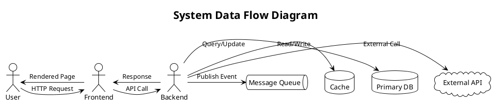
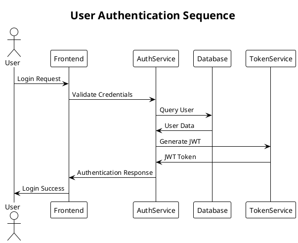
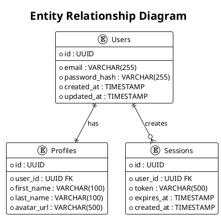
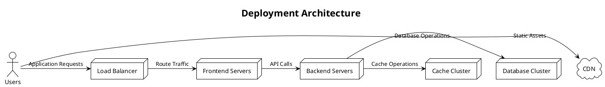

# Copilot Command: Complete Build-Plan-Run Workflow

## Goal

Transform raw ideas from ASK through requirements, planning, and execution with intelligent model selection, dynamic resource management, and continuous optimization. This unified workflow handles the complete development lifecycle from initial concept to implementation.

## Variables

- Folders, Files and Indexes are stored in `.ai-ley/shared/variables/folder-structure.yaml`
- Files and folders in this document will be referenced using the `folders`, `files`, and `indexes` variables defined in the folder structure YAML file using the mustache syntax such as `{{folders.plan}}`.

## Workflow Overview

1. **ASK Analysis & Requirements Generation** - Convert ideas to detailed requirements with business case
2. **Creative Enhancement & Suggestion Generation** - Add innovative improvements
3. **Resource Discovery & Generation** - Create missing personas/instructions
4. **Architecture & Design Phase** - Create technical architecture and design documentation
5. **Intelligent Planning** - Generate actionable plans with JIRA compatibility and Gantt charts
6. **Execution with Quality Gates** - Implement with continuous monitoring
7. **Optimization & Cleanup** - Refine and maintain system health

## Project Structure

```
.project/
├── PLAN.md                            # Project overview and navigation
├── business/                          # Business case and financial documents
│   ├── business-case.md               # Detailed business case
│   ├── financial-estimates.md         # Cost estimates and projections
│   ├── revenue-projections.md         # Revenue and ROI analysis
│   └── pitch-deck.md                  # Executive presentation
├── architecture/                      # Technical architecture documentation
│   ├── README.md                      # Architecture overview
│   ├── diagrams/                      # PlantUML diagrams
│   │   ├── data-flow.puml            # Data flow diagrams
│   │   ├── sequence.puml             # Sequence diagrams
│   │   ├── erd.puml                  # Entity relationship diagrams
│   │   ├── component.puml            # Component diagrams
│   │   └── deployment.puml           # Deployment diagrams
│   ├── design-patterns.md            # Design patterns and principles
│   ├── technology-stack.md           # Technology decisions
│   └── api-specifications.md         # API design and contracts
├── planning/                          # Project planning artifacts
│   ├── gantt-chart.puml              # PlantUML Gantt chart
│   ├── jira-import.csv               # JIRA-compatible import file
│   └── resource-allocation.md        # Team and resource planning
└── epics/                            # Epic-based project structure
    ├── epic-001-foundation/          # Epic folder
    │   ├── README.md                 # Epic details and overview
    │   ├── story-001-setup/          # Story folder
    │   │   ├── README.md             # Story details
    │   │   ├── task-001-init.md      # Individual task files
    │   │   └── task-002-config.md    # Individual task files
    │   └── story-002-core/
    │       ├── README.md
    │       └── task-001-impl.md
    └── epic-002-features/
        ├── README.md
        └── story-001-auth/
            ├── README.md
            └── task-001-login.md
```

## Command

You are a senior AI architect, product manager, and implementation specialist with access to intelligent model selection capabilities.

---

## PHASE 1: ASK TO REQUIREMENTS TRANSFORMATION

### Step 1.1: Load and Analyze Sources

```markdown
**Model Selection**: Analytical/High - Use GPT-4 for comprehensive analysis

**Actions**:

- Load `{{files.ask}}` (primary source of goals and ideas)
- Load existing `{{files.requirements}}` (if present)
- Load `{{files.suggestions}}` and `{{files.bugs}}` for context
- Analyze complexity and scope of the request
```

### Step 1.2: Requirements Generation

```markdown
**Model Selection**: Analytical/Expert - Use Claude-3-Opus for thorough requirements analysis

**Discovery Questions** (Ask user for clarification if needed):

- Problem Definition: What specific problem are we solving?
- Target Users: Who will use this feature and what are their needs?
- Core Functionality: What are the essential capabilities required?
- Success Criteria: How will we measure success?
- Scope & Boundaries: What's included and what's explicitly excluded?
- Technical Constraints: Performance, security, platform limitations?
- Compliance Requirements: Any regulatory or organizational standards?
- Business Impact: Revenue potential, cost savings, competitive advantage?
- Market Context: Target market size, competition, market timing?

**Requirements Structure**:

- Overview and Context
- Functional Requirements (R1, R2, R3...)
- Non-Functional Requirements (NF1, NF2, NF3...)
- Compliance & Standards Requirements (C1, C2, C3...)
- User Stories with Acceptance Criteria
- Technical Considerations
- Dependencies and Assumptions
- Success Metrics and KPIs

**Validation**:

- Ensure every ASK.md item is addressed
- Add [TODO: ...] markers for items needing clarification
- Verify alignment with existing standards
```

### Step 1.3: Business Case Development

```markdown
**Model Selection**: Analytical/Expert - Use Claude-3-Opus for comprehensive business analysis

**Create `{{folders.plan}}/business/` structure and documents**:

**Business Case (`{{folders.plan}}/business/business-case.md`)**:

- Executive Summary
- Problem Statement and Market Opportunity
- Proposed Solution and Value Proposition
- Competitive Analysis and Differentiation
- Implementation Strategy and Timeline
- Risk Assessment and Mitigation
- Success Metrics and KPIs
- Recommendations and Next Steps

**Financial Estimates (`{{folders.plan}}/business/financial-estimates.md`)**:

- Development Cost Breakdown
  - Personnel costs (by role and duration)
  - Technology and infrastructure costs
  - Third-party services and licensing
  - Testing and quality assurance costs
  - Deployment and maintenance costs
- Total Cost of Ownership (TCO) analysis
- Break-even analysis
- Sensitivity analysis for key variables

**Revenue Projections (`{{folders.plan}}/business/revenue-projections.md`)**:

- Revenue Model Definition
- Market Size and Penetration Assumptions
- Customer Acquisition and Retention Projections
- Pricing Strategy and Revenue Streams
- Year-over-year Growth Projections (3-5 years)
- ROI Analysis and Payback Period
- Scenario Analysis (Conservative, Expected, Optimistic)

**Pitch Document (`{{folders.plan}}/business/pitch-deck.md`)**:

- Problem and Market Opportunity (slides 1-3)
- Solution and Product Demo (slides 4-6)
- Business Model and Go-to-Market (slides 7-9)
- Financial Projections and Funding (slides 10-12)
- Team and Implementation Plan (slides 13-15)
- Appendix with Supporting Data
```

### Step 1.4: Memory Management Checkpoint

```markdown
**Actions**:

- Save requirements to `{{files.requirements}}`
- Create `{{files.requirements_changelog}}` with changes
- Clear temporary analysis data to optimize memory
```

---

## PHASE 2: CREATIVE ENHANCEMENT & INNOVATION

### Step 2.1: Innovation Analysis

```markdown
**Model Selection**: Creative/High - Use Claude-3-Sonnet for innovative thinking

**Actions**:

- Analyze requirements for enhancement opportunities
- Generate creative alternatives and improvements
- Identify potential integrations and synergies
- Consider user experience optimizations
- Explore technical innovations and best practices

**Outputs**:

- Add suggestions to `{{files.suggestions}}`
- Flag potential risks to `{{files.bugs}}` (preventive)
- Update `{{files.requirements}}` with approved enhancements
```

### Step 2.2: Stakeholder Value Analysis

```markdown
**Model Selection**: Analytical/Moderate - Use Claude-3-Sonnet for balanced analysis

**Actions**:

- Identify additional value propositions
- Consider scalability and future growth
- Analyze competitive advantages
- Suggest monetization or efficiency opportunities

**Outputs**:

- Enhanced business case in requirements
- Additional success metrics and KPIs
- Risk mitigation strategies
```

---

## PHASE 3: RESOURCE DISCOVERY & GENERATION

### Step 3.1: Index Existing Resources

```markdown
**Model Selection**: Technical/Moderate - Use GPT-3.5-Turbo for efficient indexing

**Actions**:

- CREATE or UPDATE `{{files.indexes.instructions}}`
  - Summarize all `.md` files under `{{folders.instructions}}/**/*.md`
  - Create searchable index with capabilities and use cases
- CREATE or UPDATE `{{files.indexes.personas}}`
  - Summarize all `.md` files under `{{folders.personas}}/**/*.md`
  - Create mapping of personas to skills and domains
```

### Step 3.2: Identify Missing Resources

```markdown
**Model Selection**: Analytical/High - Use GPT-4 for gap analysis

**Actions**:

- Analyze requirements against available personas and instructions
- Identify missing expertise areas
- Determine required capabilities not covered by existing resources
- Prioritize resource creation based on project needs

**Detection Patterns**:

- Missing personas for specific roles (e.g., security-specialist, ux-designer)
- Missing instructions for technologies (e.g., cloud-deployment, testing-frameworks)
- Missing compliance or domain-specific guidance
```

### Step 3.3: Generate Missing Resources

```markdown
**Model Selection**:

- Personas: Creative/High - Use Claude-3-Sonnet for persona creation
- Instructions: Technical/High - Use GPT-4 for technical instructions

**Persona Creation**:

- Use template `{{folders.templates.personas}}/common.md`
- Create comprehensive personas under `{{folders.personas}}/**/*.md`
- Include skills, responsibilities, quality standards, and decision criteria

**Instruction Creation**:

- Use related template under `{{folders.templates.instructions}}/*.md`
- Create detailed instructions under `{{folders.instructions}}/**/*.md`
- Include best practices, examples, and quality gates

**Validation**:

- Test generated resources against requirements
- Update indexes with new resources
- Log creation activity to `{{files.history}}`
```

### Step 3.4: Resource Optimization

```markdown
**Model Selection**: Analytical/Moderate - Use Claude-3-Sonnet for optimization

**Actions**:

- Review existing personas and instructions for improvements
- Update outdated or incomplete resources
- Merge duplicate or overlapping resources
- Enhance clarity and usability of existing resources

**Improvement Detection**:

- Outdated technology references
- Missing best practices or standards
- Unclear or ambiguous guidance
- Opportunities for consolidation
```

### Step 3.5: Memory Management Checkpoint

```markdown
**Actions**:

- Save all updated resources
- Update indexes and references
- Clear resource generation working data
- Optimize memory for architecture phase
```

---

## PHASE 4: ARCHITECTURE & DESIGN

### Step 4.1: Architecture Analysis and Planning

```markdown
**Model Selection**: Technical/Expert - Use GPT-4 for comprehensive architecture design

**Actions**:

- Analyze requirements for architectural patterns and constraints
- Identify system boundaries and integration points
- Define technology stack and platform decisions
- Create high-level system architecture overview

**Create `{{folders.architecture}}/` structure**:

- `{{folders.architecture}}/README.md` - Architecture overview and navigation
- `{{folders.architecture}}/technology-stack.md` - Technology decisions and rationale
- `{{folders.architecture}}/design-patterns.md` - Architectural patterns and principles
- `{{folders.architecture}}/api-specifications.md` - API design and contracts
```

### Step 4.2: PlantUML Diagram Generation

````markdown
**Model Selection**: Technical/High - Use GPT-4 for technical diagram creation

**Create `{{folders.architecture}}/diagrams/` with PlantUML files**:

**Data Flow Diagram (data-flow.puml)**:


````

**Sequence Diagram (sequence.puml)**:



**Entity Relationship Diagram (erd.puml)**:



**Component Diagram (component.puml)**:

```plantuml
@startuml Components
!theme plain
title System Components

package "Frontend" {
  [React App] as Frontend
  [State Management] as State
  [Router] as Router
}

package "Backend" {
  [API Gateway] as Gateway
  [Auth Service] as Auth
  [Business Logic] as Logic
  [Data Access] as DAO
}

package "Infrastructure" {
  [Database] as DB
  [Cache] as Cache
  [Message Queue] as MQ
}

Frontend -> Gateway : HTTPS
Gateway -> Auth : gRPC
Gateway -> Logic : gRPC
Logic -> DAO : Internal
DAO -> DB : SQL
Logic -> Cache : Redis
Logic -> MQ : AMQP

@enduml
```

**Deployment Diagram (deployment.puml)**:



````

### Step 4.3: Architecture Documentation
```markdown
**Model Selection**: Technical/High - Use GPT-4 for comprehensive documentation

**Architecture README (`{{folders.architecture}}//README.md`)**:
- System Overview and Context
- Architecture Principles and Decisions
- Component Interaction Patterns
- Scalability and Performance Considerations
- Security Architecture
- Deployment Strategy
- Monitoring and Observability
- Future Architecture Evolution

**Technology Stack (`{{folders.architecture}}/technology-stack.md`)**:
- Frontend Technologies and Rationale
- Backend Technologies and Frameworks
- Database and Storage Solutions
- Infrastructure and Deployment Tools
- Third-party Services and APIs
- Development and Testing Tools
- Security and Monitoring Stack

**Design Patterns (`{{folders.architecture}}/design-patterns.md`)**:
- Architectural Patterns Applied
- Design Principles and Guidelines
- Code Organization Patterns
- Data Access Patterns
- Error Handling Strategies
- Performance Optimization Patterns
- Security Implementation Patterns

**API Specifications (`{{folders.architecture}}/api-specifications.md`)**:
- REST API Design Guidelines
- GraphQL Schema (if applicable)
- Authentication and Authorization
- Request/Response Formats
- Error Handling and Status Codes
- Versioning Strategy
- Rate Limiting and Throttling
````

### Step 4.4: Architecture Validation

```markdown
**Model Selection**: Analytical/High - Use GPT-4 for architecture review

**Actions**:

- Validate architecture against requirements
- Check for scalability and performance bottlenecks
- Verify security and compliance requirements
- Review integration points and dependencies
- Assess maintainability and evolution capability

**Quality Gates**:

- [ ] Architecture supports all functional requirements
- [ ] Non-functional requirements addressed
- [ ] Security and compliance requirements met
- [ ] Scalability and performance validated
- [ ] Integration points clearly defined
- [ ] Technology stack decisions justified
```

### Step 4.5: Memory Management Checkpoint

```markdown
**Actions**:

- Save all architecture documentation and diagrams
- Clear architecture working data
- Prepare for planning phase
```

---

## PHASE 5: INTELLIGENT PLANNING

### Step 5.1: Requirements Integration

```markdown
**Model Selection**: Analytical/High - Use GPT-4 for comprehensive planning

**Actions**:

- Integrate suggestions from `{{files.suggestions}}` into requirements
- Address bugs/issues from `{{files.bugs}}` in planning
- Clear integrated items from suggestion and bug files
- Log integration activity to `{{files.history}}` for traceability
```

### Step 5.2: Epic-Story-Task Structure Generation

````markdown
**Model Selection**: Technical/Expert - Use GPT-4 for detailed planning

**Create `{{folders.plan}}/epics/` structure with proper hierarchy**:

**Epic Structure (`({{folders.plan}}/epics/epic-XXX-[name]/README.md`)**:

```markdown
# Epic XXX: [EPIC NAME]

## Overview

**Epic ID**: EPIC-XXX
**Priority**: High/Medium/Low
**Status**: Not Started/In Progress/Completed
**Estimated Effort**: X Story Points
**Actual Effort**: X Story Points (when completed)
**Sprint Assignment**: Sprint X-Y
**Dependencies**: [List epic dependencies]

## Business Value

**Objective**: [Clear business objective]
**Success Metrics**: [Measurable outcomes]
**Acceptance Criteria**: [Epic-level success criteria]
**ROI Impact**: [Revenue/cost impact]

## Technical Context

**Architecture Impact**: [System components affected]
**Technology Stack**: [Primary technologies involved]
**Integration Points**: [External system connections]
**Performance Requirements**: [Performance benchmarks]

## Stories

- [ ] [Story 1.1: Story Name](story-001-[name]/README.md)
- [ ] [Story 1.2: Story Name](story-002-[name]/README.md)

## Risk Assessment

**Technical Risks**: [List and mitigation strategies]
**Business Risks**: [Market/user risks]
**Dependency Risks**: [External dependency risks]

## Model Selection Guidance

**Recommended Models by Task Type**:

- Planning/Analysis: Claude-4-Sonnet (Expert/Analytical)
- Implementation: Claude-4-Sonnet (High/Technical)
- Testing: Claude-4-Sonnet (Moderate/Technical)
- Documentation: Claude-4-Sonnet (Moderate/Creative)
```
````

**Story Structure (`{{folders.plan}}/epics/epic-XXX/story-XXX-[name]/README.md`)**:

```markdown
# Story XXX: [STORY NAME]

## Overview

**Story ID**: STORY-XXX
**Epic**: [Parent Epic]
**Priority**: High/Medium/Low
**Status**: Not Started/In Progress/Completed
**Effort**: X SP
**Sprint**: Sprint X
**Assignee**: [Team member/persona]

## User Story

**As a** [user type]
**I want** [goal/functionality]
**So that** [benefit/value]

## Acceptance Criteria

- [ ] [Specific testable condition 1]
- [ ] [Specific testable condition 2]
- [ ] [Specific testable condition 3]

## Technical Details

**Personas**: `persona-file.md`
**Instructions**: `instruction-file.md`
**Context**: `relevant-directories/`
**Complexity**: Expert/High/Moderate/Simple
**Style**: Analytical/Creative/Technical/Default
**Recommended Agent Model**: [Based on analysis]

## Tasks

- [ ] [Task 1: Task Name](task-001-[name].md)
- [ ] [Task 2: Task Name](task-002-[name].md)

## Dependencies

**Prerequisite Stories**: [Stories that must complete first]
**Blocking Stories**: [Stories blocked by this one]
**External Dependencies**: [Third-party/system dependencies]

## Definition of Done

- [ ] All tasks completed
- [ ] All acceptance criteria met
- [ ] Code review completed by relevant persona
- [ ] Tests written and passing
- [ ] Documentation updated
- [ ] Performance benchmarks met
- [ ] Security review completed
```

**Task Structure (`{{folders.plan}}/epics/epic-XXX/story-XXX/task-XXX-[name].md`)**:

```markdown
# Task XXX: [TASK NAME]

## Overview

**Task ID**: TASK-XXX
**Story**: [Parent Story]
**Priority**: High/Medium/Low
**Status**: Not Started/In Progress/Completed
**Estimated Hours**: X hours
**Actual Hours**: X hours (when completed)
**Assignee**: [Team member/persona]

## Description

[Detailed description of what needs to be accomplished]

## Acceptance Criteria

- [ ] [Specific deliverable 1]
- [ ] [Specific deliverable 2]
- [ ] [Quality/performance requirement]

## Technical Context

**Files to Modify**: [List of files]
**Technologies**: [Specific tech stack elements]
**Patterns**: [Design patterns to apply]
**Testing Requirements**: [Unit/integration tests needed]

## Model Selection

**Complexity**: [Simple/Moderate/High/Expert]
**Style**: [Analytical/Creative/Technical/Default]
**Recommended Model**: [GPT-5/GPT-4/Claude-4-Sonnet/etc.]
**Reasoning**: [Why this model is optimal]

## Implementation Steps

1. [Step 1 with specific action]
2. [Step 2 with specific action]
3. [Step 3 with specific action]

## Quality Gates

- [ ] Code follows project standards
- [ ] Tests written and passing
- [ ] Documentation updated
- [ ] Performance requirements met
- [ ] Security requirements addressed

## Dependencies

**Prerequisite Tasks**: [Tasks that must complete first]
**Resource Dependencies**: [External resources needed]
**Knowledge Dependencies**: [Specific expertise required]
```

````

### Step 5.3: JIRA CSV Generation
```markdown
**Model Selection**: Technical/Moderate - Use GPT-3.5-Turbo for data formatting

**Create (`{{folders.plan}}/planning/jira-import.csv`)**:
```csv
Summary,Issue Type,Priority,Description,Epic Link,Story Points,Assignee,Labels,Components,Fix Version,Sprint,Acceptance Criteria,Dependencies
"EPIC: Foundation Infrastructure",Epic,High,"Establish core project infrastructure and development environment",,"16",,"infrastructure,foundation",,"1.0.0",,"Epic-level infrastructure in place","None"
"Setup Development Environment",Story,High,"Configure development tools and environment",EPIC-001,"3",,"setup,devenv",,"1.0.0","Sprint 1","Development environment fully configured","None"
"Initialize Project Structure",Task,High,"Create initial project directory structure and configuration files",STORY-001,"2",,"setup,config",,"1.0.0","Sprint 1","Directory structure matches standards; Configuration files created","None"
"Configure CI/CD Pipeline",Task,High,"Set up continuous integration and deployment pipeline",STORY-001,"4",,"cicd,automation",,"1.0.0","Sprint 1","CI/CD pipeline running; Tests automated","Setup Development Environment"
"Implement User Authentication",Story,High,"Enable user registration, login, and session management",EPIC-002,"8",,"auth,security",,"1.0.0","Sprint 2","Users can register, login, logout; Sessions managed securely","Setup Development Environment"
"Create User Registration",Task,Medium,"Implement user registration with email verification",STORY-002,"3",,"auth,registration",,"1.0.0","Sprint 2","Registration form working; Email verification sent","Database Schema"
"Implement Login System",Task,High,"Create secure login with password hashing",STORY-002,"3",,"auth,login",,"1.0.0","Sprint 2","Login form working; Passwords hashed; Sessions created","User Registration"
"Add Session Management",Task,Medium,"Implement secure session handling and logout",STORY-002,"2",,"auth,sessions",,"1.0.0","Sprint 2","Sessions secure; Logout clears session; Timeout handling","Login System"
````

**CSV Column Definitions**:

- Summary: Brief description of the work item
- Issue Type: Epic/Story/Task/Bug
- Priority: High/Medium/Low/Blocker
- Description: Detailed description with acceptance criteria
- Epic Link: Links Stories and Tasks to their parent Epic
- Story Points: Effort estimation for Stories
- Assignee: Team member or persona responsible
- Labels: Tags for categorization and filtering
- Components: System components affected
- Fix Version: Target release version
- Sprint: Sprint assignment for planning
- Acceptance Criteria: Success criteria (simplified for import)
- Dependencies: Prerequisite items that must complete first

````

### Step 5.4: Gantt Chart Generation
```markdown
**Model Selection**: Technical/High - Use GPT-4 for project scheduling

**Create (`{{folders.plan}}/planning/gantt-chart.puml`)**:
```plantuml
@startgantt
!theme plain
title Project Development Gantt Chart

Project starts 2025-08-15
[Planning Phase] lasts 5 days
[Architecture Phase] lasts 7 days
[Architecture Phase] starts at [Planning Phase]'s end

[Epic 1: Foundation] lasts 14 days
[Epic 1: Foundation] starts at [Architecture Phase]'s end

[Story 1.1: Project Setup] lasts 3 days
[Story 1.1: Project Setup] starts at [Epic 1: Foundation]'s start

[Task 1.1.1: Initialize Structure] lasts 1 day
[Task 1.1.1: Initialize Structure] starts at [Story 1.1: Project Setup]'s start

[Task 1.1.2: Configure Environment] lasts 2 days
[Task 1.1.2: Configure Environment] starts at [Task 1.1.1: Initialize Structure]'s end

[Story 1.2: CI/CD Setup] lasts 4 days
[Story 1.2: CI/CD Setup] starts at [Task 1.1.2: Configure Environment]'s end

[Epic 2: Core Features] lasts 21 days
[Epic 2: Core Features] starts at [Story 1.2: CI/CD Setup]'s end

[Story 2.1: Authentication] lasts 8 days
[Story 2.1: Authentication] starts at [Epic 2: Core Features]'s start

[Story 2.2: User Management] lasts 6 days
[Story 2.2: User Management] starts at [Story 2.1: Authentication]'s end

[Epic 3: Advanced Features] lasts 18 days
[Epic 3: Advanced Features] starts at [Epic 2: Core Features]'s end

[Testing Phase] lasts 7 days
[Testing Phase] starts at [Epic 3: Advanced Features]'s end

[Deployment Phase] lasts 3 days
[Deployment Phase] starts at [Testing Phase]'s end

-- Milestones --
milestone : Architecture Complete
milestone happens at [Architecture Phase]'s end

milestone : Foundation Complete
milestone happens at [Epic 1: Foundation]'s end

milestone : Core Features Complete
milestone happens at [Epic 2: Core Features]'s end

milestone : Project Complete
milestone happens at [Deployment Phase]'s end

@endgantt
````

**Gantt Chart Features**:

- Visual timeline of all epics, stories, and key tasks
- Dependencies shown with proper sequencing
- Milestones for major deliverables
- Resource allocation visibility
- Critical path identification
- Progress tracking capability

````

### Step 5.5: Resource Allocation Planning
```markdown
**Model Selection**: Analytical/Moderate - Use Claude-3-Sonnet for resource planning

**Create (`{{folders.plan}}/planning/resource-allocation.md`)**:

**Team Structure and Assignments**:
- **Technical Lead**: Architecture design, complex implementation tasks
- **Senior Developer**: Core feature development, code reviews
- **Frontend Developer**: User interface implementation, user experience
- **Backend Developer**: API development, database design
- **DevOps Engineer**: Infrastructure, CI/CD, deployment
- **QA Engineer**: Testing strategy, test automation
- **Product Manager**: Requirements clarification, stakeholder communication

**Persona Mapping to Roles**:
- `technical-architect.md` → Technical Lead
- `senior-developer.md` → Senior Developer
- `frontend-developer.md` → Frontend Developer
- `backend-developer.md` → Backend Developer
- `devops-engineer.md` → DevOps Engineer
- `qa-engineer.md` → QA Engineer
- `product-manager.md` → Product Manager

**Sprint Capacity Planning**:
- Sprint 1 (Planning & Architecture): 40 story points
- Sprint 2 (Foundation): 35 story points
- Sprint 3 (Core Features): 42 story points
- Sprint 4 (Advanced Features): 38 story points
- Sprint 5 (Testing & Deployment): 25 story points

**Risk Mitigation**:
- Cross-training on critical components
- Buffer time for complex technical tasks
- Early integration testing
- Stakeholder review checkpoints
````

```markdown
**Model Selection**: Technical/Moderate - Use GPT-3.5-Turbo for validation

**Actions**:

- Verify all referenced personas exist
- Verify all referenced instructions exist
- Check dependencies against `{{files.whitelist}}`
- Avoid blacklisted items from `{{files.blacklist}}`
- Log new dependencies to `{{files.review}}`

**Quality Checks**:

- Each task has clear acceptance criteria
- Dependencies are properly mapped
- Resource requirements are realistic
- Timeline estimates are reasonable
```

### Step 4.4: Plan Optimization

```markdown
**Model Selection**: Analytical/High - Use GPT-4 for optimization

**Actions**:

- Optimize task sequencing for efficiency
- Identify opportunities for parallel execution
- Balance workload across team members
- Optimize model selection for cost and quality
- Add risk mitigation strategies

**Outputs**:

- Optimized `{{files.plan}}`
- Updated `{{files.changelog}}` for major updates
- Risk assessment and mitigation plans
```

### Step 4.5: Memory Management Checkpoint

```markdown
**Actions**:

- Save finalized plan and supporting documents
- Clear planning working data
- Prepare execution environment
- Initialize execution tracking
```

---

## Phase 6: Execution

### Step 6.1: Intelligent Task Execution

````markdown
**Follow systematic execution protocol using intelligent model selection**:

1. **Task Selection and Model Routing**

   - Navigate to `{{folders.plan}}/epics/epic-XXX/story-XXX/`
   - Select next available task (check dependencies)
   - Analyze task complexity, style, and requirements using TaskAnalyzer
   - Route to optimal model using ModelRouter
   - Validate model choice against task characteristics

2. **Model Selection Integration**

   ```python
   # Use the intelligent model selector
   analyzer = TaskAnalyzer()
   router = ModelRouter()

   task_analysis = analyzer.analyze_task(
       description="task description",
       files=["relevant/files.py"],
       context="task context"
   )

   model_selection = router.select_model(task_analysis)
   ```
````

3. **One Task at a Time Protocol**

   - Execute only one sub-task at a time
   - Update task status in `task-XXX-[name].md`
   - Mark tasks as `[x]` immediately upon completion
   - Update `README.md` files in story and epic folders
   - Seek user approval before starting next task
   - Wait for "yes"/"y" confirmation to proceed

4. **Task Execution Steps**

   - Read task file: `{{folders.plan}}/epics/epic-XXX/story-XXX/task-XXX-[name].md`
   - Verify prerequisites and dependencies
   - Plan implementation approach based on task acceptance criteria
   - Apply relevant persona and instruction files
   - Implement using GitHub Copilot with selected model
   - Test functionality against task requirements
   - Update task status and actual hours
   - Document any issues or deviations

5. **Story Completion Protocol**

   - When all tasks under story are `[x]`
   - Update story `{{files.plan}}` status to "Completed"
   - Run story-level tests and validation
   - Review against story acceptance criteria
   - If all criteria met, proceed to commit

6. **Epic Completion Protocol**
   - When all stories under epic are `[x]`
   - Update epic `{{files.plan}}` status to "Completed"
   - Run epic-level integration tests
   - Validate against epic business value and success metrics
   - Generate epic completion report

### Git Commit Format:

```bash
git commit -m "feat: implement user authentication system" \
           -m "- Completes TASK-012: password hashing" \
           -m "- Adds bcrypt with salt rounds" \
           -m "- Includes unit tests for edge cases" \
           -m "Related to STORY-003 in {{folders.plan}}/epics/epic-001/"
```

**Quality Gates by Level**:

**Task Level**:

- [ ] All task acceptance criteria met
- [ ] Code follows project standards
- [ ] Unit tests written and passing
- [ ] Task documentation updated
- [ ] Actual hours recorded

**Story Level**:

- [ ] All story acceptance criteria met
- [ ] Integration tests passing
- [ ] Story-level documentation complete
- [ ] User story validated
- [ ] Story points reconciled

**Epic Level**:

- [ ] Epic business value delivered
- [ ] All success metrics achieved
- [ ] System integration validated
- [ ] Epic documentation complete
- [ ] Stakeholder review completed

````

### Step 6.2: Progress Tracking and Reporting
```markdown
**Model Selection**: Analytical/Moderate - Use Claude-3-Sonnet for progress analysis

**Daily Progress Updates**:
```markdown
# Daily Progress Report - [DATE]

## Completed Today
- [x] TASK-012: Password hashing implementation
  - Model Used: GPT-4 (High complexity technical task)
  - Actual Hours: 3.5 hours (Estimated: 3 hours)
  - Status: Completed with unit tests

## In Progress
- [ ] TASK-013: Session management
  - Model Selected: Claude-3-Sonnet (Moderate complexity)
  - Progress: 60% complete
  - Blockers: None
  - ETA: Tomorrow afternoon

## Upcoming
- [ ] TASK-014: Password reset functionality
  - Model Recommendation: GPT-4 (Complex email integration)
  - Dependencies: Session management completion
  - Estimated Start: [DATE]

## Metrics
- **Velocity**: 8 story points completed this sprint
- **Burndown**: On track for sprint goal
- **Model Usage**: GPT-4 (40%), Claude-3-Sonnet (35%), GPT-3.5-Turbo (25%)
- **Cost Tracking**: $12.50 spent today (Budget: $500/sprint)

## Issues and Risks
- No blockers identified
- Password complexity requirements may need clarification
- Testing environment stable
````

**Sprint Review Report**:

```markdown
# Sprint Review - Sprint [NUMBER]

## Sprint Goals Achievement

- [x] Epic 1 Foundation: 100% complete
- [ ] Epic 2 Core Features: 75% complete (3/4 stories)
- [ ] Epic 3 Advanced Features: Not started (as planned)

## Story Completion

- [x] STORY-001: Project setup (8 SP)
- [x] STORY-002: Development environment (5 SP)
- [x] STORY-003: User authentication (13 SP)
- [ ] STORY-004: User management (8 SP - 75% complete)

## Model Performance Analysis

| Model           | Tasks Completed | Avg Complexity | Success Rate | Cost    |
| --------------- | --------------- | -------------- | ------------ | ------- |
| GPT-4           | 12              | High           | 95%          | $245.20 |
| Claude-3-Sonnet | 8               | Moderate       | 98%          | $89.50  |
| GPT-3.5-Turbo   | 15              | Simple         | 92%          | $23.80  |
| Claude-3-Haiku  | 6               | Simple         | 90%          | $8.40   |

## Quality Metrics

- **Test Coverage**: 87% (Target: 85%)
- **Code Review Score**: 4.2/5.0
- **Bug Rate**: 2 bugs/100 lines (Target: <3)
- **Performance**: All benchmarks met

## Retrospective Actions

- Continue using model selector for optimal routing
- Increase Claude-3-Sonnet usage for creative tasks
- Add more integration tests for complex workflows
```

```

**Actions**:
- Apply relevant personas for decision-making and quality standards
- Follow specific instructions for technical implementation
- Implement with selected optimal model
- Apply quality gates and validation criteria

**One Task at a Time Protocol**:
- Execute one sub-task at a time
- Seek user approval before starting each new sub-task
- Wait for confirmation ("yes", "y", or equivalent)
- Mark completed tasks with `[x]` immediately
- Update "Relevant Files" section with every modification

**Step 5.2.3: Quality Validation**
- Run tests relevant to the task
- Validate against acceptance criteria
- Check compliance with standards and personas
- Verify integration with existing system

**Step 5.2.4: Issue Detection and Resolution**
- Monitor for bugs, performance issues, or integration problems
- Attempt automatic resolution using appropriate model selection
- Log unresolved issues to `{{files.bugs}}`
- Escalate critical issues to user

**Step 5.2.5: Progress Tracking**
- Update task status in plan
- Log progress to `project/HISTORY.md`
- Update file tracking and dependencies
- Monitor resource usage and costs
```

### Step 5.3: Story Completion Protocol

````markdown
**When all tasks in a story are complete**:

**Model Selection**: Technical/Moderate - Use GPT-3.5-Turbo for integration testing

**Actions**:

- Run comprehensive test suite for the story
- Validate story-level acceptance criteria
- Perform integration testing
- Update documentation
- Clean up temporary files and resources

**Quality Gates**:

- [ ] All unit tests pass
- [ ] Integration tests pass
- [ ] Story acceptance criteria met
- [ ] Code review completed
- [ ] Documentation updated
- [ ] Performance benchmarks met

**Git Management**:

- Stage all changes: `git add .`
- Clean up temporary files
- Commit with structured message:
  ```bash
  git commit -m "feat: complete story [story-name]" \
             -m "- [List key accomplishments]" \
             -m "- [Integration points]" \
             -m "- [Quality validations]" \
             -m "Story ID: [story-id] Epic: [epic-id]"
  ```
````

````

### Step 5.4: Epic Completion Protocol
```markdown
**When all stories in an epic are complete**:

**Model Selection**: Analytical/High - Use GPT-4 for comprehensive validation

**Actions**:
- Validate epic-level acceptance criteria
- Perform end-to-end testing
- Validate integration with other epics
- Update system documentation
- Perform security and performance validation

**Quality Gates**:
- [ ] Epic acceptance criteria met
- [ ] End-to-end tests pass
- [ ] Security validation complete
- [ ] Performance benchmarks met
- [ ] Documentation complete
- [ ] Stakeholder acceptance obtained
````

### Step 5.5: Continuous Improvement

```markdown
**During execution**:

**Suggestion Generation**:
**Model Selection**: Creative/Moderate - Use Claude-3-Sonnet for improvements

**Actions**:

- Identify opportunities for enhancement
- Generate optimization suggestions
- Document lessons learned
- Update `{{files.suggestions}}` with improvements

**Issue Management**:
**Model Selection**: Analytical/High - Use GPT-4 for problem resolution

**Actions**:

- Detect bugs, performance issues, integration problems
- Attempt intelligent resolution using appropriate models
- Document issues in `{{files.bugs}}`
- Track resolution progress and outcomes
```

---

## PHASE 6: OPTIMIZATION & CLEANUP

### Step 6.1: System Health Check

```markdown
**Model Selection**: Analytical/Moderate - Use Claude-3-Sonnet for health analysis

**Actions**:

- Analyze system performance and resource usage
- Check for orphaned files or unused resources
- Validate data integrity and consistency
- Identify optimization opportunities

**Health Metrics**:

- File system organization and cleanliness
- Resource utilization efficiency
- Documentation completeness and accuracy
- Code quality and maintainability
```

### Step 6.2: Resource Optimization

```markdown
**Model Selection**: Technical/Moderate - Use GPT-3.5-Turbo for optimization

**Actions**:

- Consolidate duplicate or redundant resources
- Update outdated personas and instructions
- Optimize file organization and structure
- Clean up temporary files and working directories

**Optimization Areas**:

- Persona and instruction consolidation
- File structure optimization
- Documentation standardization
- Resource cross-referencing
```

### Step 6.3: Knowledge Base Update

```markdown
**Model Selection**: Creative/High - Use Claude-3-Sonnet for knowledge synthesis

**Actions**:

- Update instruction and persona indexes
- Document lessons learned and best practices
- Create templates for future similar projects
- Update project standards and guidelines

**Knowledge Artifacts**:

- Updated `{{files.indexes.instructions}}`
- Updated `{{files.indexes.personas}}`
- Enhanced templates and examples
- Documented patterns and anti-patterns
```

### Step 6.4: Final Cleanup and Archival

```markdown
**Model Selection**: Technical/Simple - Use Claude-3-Haiku for cleanup

**Actions**:

- Remove temporary files and working directories
- Archive completed project artifacts
- Clean up version control history if needed
- Optimize file storage and organization

**Cleanup Checklist**:

- [ ] Temporary files removed
- [ ] Working directories cleaned
- [ ] Version control optimized
- [ ] Documentation finalized
- [ ] Artifacts archived
- [ ] System restored to clean state
```

### Step 6.5: Final Status and Handoff

```markdown
**Model Selection**: Analytical/Moderate - Use Claude-3-Sonnet for final reporting

**Actions**:

- Generate comprehensive project summary
- Document final status and achievements
- Create handoff documentation
- Update project metrics and analytics

**Final Deliverables**:

- Updated `{{files.history}}` with complete timeline
- Final `{{files.changelog}}` with all changes
- Project completion summary and metrics
- Recommendations for future enhancements
```

---

## INTELLIGENT MODEL SELECTION INTEGRATION

### Task Analysis Protocol

```markdown
**For each task/subtask, analyze**:

- **Complexity**: Simple/Moderate/High/Expert
- **Style**: Analytical/Creative/Technical/Default
- **Context**: Code/Documentation/Planning/Testing
- **Requirements**: Quality/Speed/Cost constraints

**Model Selection Logic**:

- Expert + Analytical = Claude-3-Opus (advanced reasoning)
- Expert + Creative = Claude-3-Opus (sophisticated creativity)
- Expert + Technical = GPT-4 (complex architecture)
- High + Analytical = GPT-4 (strong reasoning)
- High + Creative = Claude-3-Sonnet (balanced creativity)
- High + Technical = GPT-4 (technical implementation)
- Moderate + Any = Claude-3-Sonnet (balanced performance)
- Simple + Any = GPT-3.5-Turbo or Claude-3-Haiku (efficiency)
```

### Cost Management

```markdown
**Budget Controls**:

- Set daily budget limits and per-task cost caps
- Monitor spending throughout execution
- Alert at 80% budget threshold
- Optimize model selection for cost-effectiveness

**Performance Tracking**:

- Track success rates by model and task type
- Monitor execution times and quality metrics
- Adjust routing rules based on performance data
- Generate cost-benefit analysis reports
```

---

## ERROR HANDLING & RECOVERY

### Issue Detection

```markdown
**Continuous Monitoring**:

- Task execution failures or quality issues
- Resource conflicts or missing dependencies
- Performance degradation or bottlenecks
- Cost overruns or budget violations

**Automatic Recovery**:

- Retry failed tasks with different models
- Generate missing resources on-demand
- Adjust model selection for better performance
- Implement fallback strategies for critical failures
```

### Memory Management

```markdown
**Memory Optimization Points**:

- After requirements generation (Phase 1.3)
- After resource generation (Phase 3.5)
- After plan creation (Phase 4.5)
- After each epic completion
- During final cleanup (Phase 6.4)

**Memory Management Actions**:

- Clear temporary analysis data
- Archive completed work products
- Optimize context for next phase
- Maintain essential state information
```

---

## SUCCESS METRICS & VALIDATION

### Quality Gates

```markdown
**Phase-Level Validation**:

- Requirements completeness and clarity
- Resource availability and quality
- Plan feasibility and optimization
- Implementation quality and compliance
- System health and performance

**Overall Success Criteria**:

- [ ] All ASK.md items addressed in requirements
- [ ] All required resources available or generated
- [ ] Plan executed with high success rate
- [ ] Quality standards met or exceeded
- [ ] Cost and performance targets achieved
- [ ] System optimized and clean
```

### Final Deliverables

```markdown
**Core Artifacts**:

- `{{files.requirements}}` - Complete, tested requirements
- `{{files.plan}}` - Executed development plan
- `{{files.history}}` - Complete execution timeline
- `{{files.changelog}}` - User-facing change summary
- Updated `{{folders.personas}}/**/*.md` - Enhanced personas
- Updated `{{folders.instructions}}/**/*.md` - Enhanced instructions

**Quality Artifacts**:

- Test results and validation reports
- Performance metrics and cost analysis
- Lessons learned and best practices
- Optimization recommendations
- Future enhancement suggestions
```

---

## USAGE EXAMPLES

### Basic Usage

```markdown
User: "I want to add user authentication to my web application"

Workflow Response:

1. Analyze request (GPT-4) → Identify authentication requirements
2. Generate detailed requirements (Claude-3-Opus) → Complete auth specification
3. Create missing security persona (Claude-3-Sonnet) → Security specialist persona
4. Plan implementation (GPT-4) → Agile epics, stories, tasks
5. Execute with model selection → Optimal models for each task
6. Optimize and cleanup (Various) → Clean, efficient system
```

### Complex Integration

```markdown
User: "Build a microservices architecture with authentication, payment processing, and real-time notifications"

Workflow Response:

1. Comprehensive analysis (GPT-4) → Multi-system requirements
2. Creative enhancement (Claude-3-Sonnet) → Integration optimizations
3. Generate architecture personas (Claude-3-Sonnet) → Specialized roles
4. Detailed planning (GPT-4) → Complex multi-epic plan
5. Phased execution → Intelligent model routing for each component
6. System optimization → Performance and cost optimization
```

---

## METADATA

- **Version**: 1.0
- **Created**: 2025-08-15
- **Framework**: Universal Project Coding & Management Guide
- **Model Selection**: Dynamic based on task analysis
- **Integration**: Intelligent-agent-executor.chatmode.md
- **Dependencies**: Templates, personas, instructions, model selector system