# 📚 UML Flows Repository

This directory contains PlantUML workflow files organized into different categories for the AI-LEY Workflow Builder.

## 📁 Directory Structure

```
uml-flows/
├── templates/          # Community-contributed workflow templates
│   ├── deployment-pipeline.puml
│   ├── data-backup.puml
│   └── monitoring-setup.puml
├── examples/           # Simple example workflows for learning
│   ├── simple-website-deploy.puml
│   ├── hello-world.puml
│   └── file-organization.puml
└── user/              # User-created workflows (auto-generated)
    └── my-custom-workflow.puml
```

## 🏷️ Workflow Categories

### 🚀 **Deployment & CI/CD**

- `deployment-pipeline.puml` - Full CI/CD pipeline with testing and rollback
- `simple-deploy.puml` - Basic deployment workflow
- `docker-deploy.puml` - Container-based deployment

### 💾 **Data Management**

- `data-backup.puml` - Automated backup procedures
- `data-migration.puml` - Database migration workflows
- `cleanup-tasks.puml` - Maintenance and cleanup routines

### 🔧 **Development**

- `code-review.puml` - Automated code review process
- `testing-pipeline.puml` - Comprehensive testing workflows
- `dependency-update.puml` - Automated dependency management

### 🌐 **Web & API**

- `api-testing.puml` - API endpoint testing workflows
- `website-deploy.puml` - Static website deployment
- `performance-test.puml` - Load testing procedures

### 📊 **Monitoring & Alerts**

- `health-check.puml` - System health monitoring
- `log-analysis.puml` - Automated log processing
- `alert-management.puml` - Incident response workflows

## 🎨 PlantUML Syntax Reference

### Basic Activity Elements

```plantuml
start                    # Workflow start
:Action description;     # Action step
stop                     # Workflow end
```

### Decision Points

```plantuml
if (condition?) then (yes)
  :Action if true;
else (no)
  :Action if false;
endif
```

### Parallel Execution

```plantuml
fork
  :Parallel task 1;
fork again
  :Parallel task 2;
end fork
```

### Notes with Execution Details

```plantuml
:Deploy application;
note right
  Command: npm run deploy
  Timeout: 300s
  Directory: /project/root
end note
```

## 🔧 Execution Configuration

Each workflow can include execution details in PlantUML notes:

- **Command**: Shell command to execute
- **Directory**: Working directory for the command
- **Timeout**: Maximum execution time in seconds
- **Environment**: Environment variables to set
- **API**: REST API endpoint to call
- **Expected**: Expected output or status code

## 📝 Workflow Metadata

Include metadata in PlantUML comments:

```plantuml
' Description: What this workflow does
' Author: Who created it
' Tags: keyword1, keyword2, keyword3
' Version: 1.0
' Updated: 2025-09-07
```

## 🤝 Contributing Workflows

### Creating New Templates

1. Design your workflow in the visual builder
2. Test thoroughly with various scenarios
3. Add clear documentation and metadata
4. Save to the appropriate category folder
5. Submit a pull request with examples

### Template Quality Guidelines

- **Clear naming**: Use descriptive, searchable names
- **Comprehensive notes**: Include all execution details
- **Error handling**: Consider failure scenarios
- **Documentation**: Add description and usage examples
- **Security**: Avoid hardcoded credentials or dangerous commands

### Example Template Structure

```plantuml
@startuml WorkflowName
title "🎯 Clear Descriptive Title"

' Description: What problem this workflow solves
' Author: Your Name or Organization
' Tags: category, technology, use-case
' Prerequisites: What's needed to run this
' Version: 1.0

start
:📋 First step with clear emoji;
note right
  Command: actual command to run
  Directory: /working/directory
  Timeout: 60s
end note

if (🔍 Check condition?) then (success)
  :✅ Success action;
else (failure)
  :❌ Handle failure;
  :🚨 Alert appropriate team;
endif

:📊 Generate report;
note right
  API: POST /api/reports
  Format: JSON
end note

stop
@enduml
```



## 🚀 Usage in Workflow Builder

1. **Browse Templates**: View available workflows by category
2. **Load Template**: Import any .puml file into the visual builder
3. **Customize**: Modify steps using drag-and-drop interface
4. **Execute**: Run workflows with real-time progress tracking
5. **Save**: Export your customized workflows back to .puml files

## 📚 Learning Resources

- **PlantUML Official Guide**: https://plantuml.com/activity-diagram-beta
- **VS Code PlantUML Extension**: For editing .puml files directly
- **Community Examples**: Study existing templates for patterns
- **Video Tutorials**: [Coming Soon] Step-by-step workflow creation

---

**Ready to automate your processes?** Start with the examples, customize a template, or create your own workflow from scratch! 🎨
